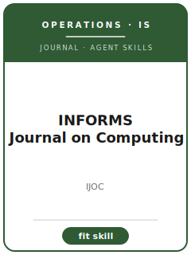

# INFORMS Journal on Computing Skills

<p align="center"></p>

[English](README.md) | 简体中文

面向 **INFORMS Journal on Computing（IJOC）** 投稿的 12 个 agent skills。本包围绕 operations research and computing, algorithms, optimization, machine learning, simulation, and computational decision systems 设计，帮助稿件区别于 Operations Research, Management Science, Manufacturing & Service Operations Management, and ACM/IEEE computing venues，并强调 computational OR contribution with transparent algorithms, benchmarks, and reproducibility。

**官方依据核验日期：2026-06**（投稿前需复核易变细节）：见 [`resources/official-source-map.md`](resources/official-source-map.md)。

## 为什么需要单独的技能栈？

| IJOC 约束 | 对稿件的要求 |
|-------------------|--------------|
| 范围 | 主张必须服务于 operations research and computing, algorithms, optimization, machine learning, simulation, and computational decision systems |
| 同门边界 | 说明为什么不是 Operations Research, Management Science, Manufacturing & Service Operations Management, and ACM/IEEE computing venues |
| 证据标准 | 设计、模型、综述或质性证据必须匹配 computational OR contribution with transparent algorithms, benchmarks, and reproducibility |
| 来源纪律 | 当前流程事实必须有来源，或明确标记 待核实 |

## 快速开始

```text
/plugin marketplace add ./INFORMS-Journal-on-Computing-Skills
/plugin install informs-journal-on-computing-skills
```

手动使用：先打开 [`skills/ijoc-workflow/SKILL.md`](skills/ijoc-workflow/SKILL.md)。

## 默认工作流

```text
ijoc-workflow → ijoc-topic-selection → ijoc-theory-development → ijoc-literature-positioning → ijoc-methods → ijoc-data-analysis → ijoc-contribution-framing → ijoc-tables-figures → ijoc-writing-style → ijoc-submission → ijoc-review-process → ijoc-rebuttal
```

## 技能列表

| # | Skill | 作用 |
|---|-------|------|
| 1 | [`ijoc-workflow`](skills/ijoc-workflow/SKILL.md) | 面向 IJOC 稿件的 Workflow Router |
| 2 | [`ijoc-topic-selection`](skills/ijoc-topic-selection/SKILL.md) | 面向 IJOC 稿件的 Topic Selection |
| 3 | [`ijoc-theory-development`](skills/ijoc-theory-development/SKILL.md) | 面向 IJOC 稿件的 Theory Development |
| 4 | [`ijoc-literature-positioning`](skills/ijoc-literature-positioning/SKILL.md) | 面向 IJOC 稿件的 Literature Positioning |
| 5 | [`ijoc-methods`](skills/ijoc-methods/SKILL.md) | 面向 IJOC 稿件的 Methods |
| 6 | [`ijoc-data-analysis`](skills/ijoc-data-analysis/SKILL.md) | 面向 IJOC 稿件的 Data Analysis |
| 7 | [`ijoc-contribution-framing`](skills/ijoc-contribution-framing/SKILL.md) | 面向 IJOC 稿件的 Contribution Framing |
| 8 | [`ijoc-tables-figures`](skills/ijoc-tables-figures/SKILL.md) | 面向 IJOC 稿件的 Tables and Figures |
| 9 | [`ijoc-writing-style`](skills/ijoc-writing-style/SKILL.md) | 面向 IJOC 稿件的 Writing Style |
| 10 | [`ijoc-submission`](skills/ijoc-submission/SKILL.md) | 面向 IJOC 稿件的 Submission Preflight |
| 11 | [`ijoc-review-process`](skills/ijoc-review-process/SKILL.md) | 面向 IJOC 稿件的 Review Process |
| 12 | [`ijoc-rebuttal`](skills/ijoc-rebuttal/SKILL.md) | 面向 IJOC 稿件的 Rebuttal Strategy |

## 资源

- [`resources/README.md`](resources/README.md) — 资源索引
- [`resources/official-source-map.md`](resources/official-source-map.md) — 官方 URL 与易变信息
- [`resources/external_tools.md`](resources/external_tools.md) — 数据库、方法与软件工具
- [`resources/worked-examples/01-introduction.md`](resources/worked-examples/01-introduction.md) — 虚构引言改写示例
- [`resources/exemplars/library.md`](resources/exemplars/library.md) — 真实论文槽位与来源纪律
- [`resources/code/`](resources/code/) — 适用时使用的实证代码脚手架

## 许可

MIT (c) 2026 Bryce Wang。见 [LICENSE](LICENSE)。
