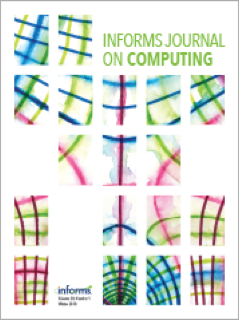

<!-- AJS-ROOT-JOURNAL-ENTRY -->
# INFORMS Journal on Computing

> Publishes research at the intersection of operations research and computer science, including algorithms, modeling, and computational methods for decision-making.

| At a glance | |
|---|---|
| **Field** | Operations research / computing |
| **Publisher** | INFORMS |
| **Founded** | 1989 |
| **ISSN** | 1091-9856 (print) · 1526-5528 (online) |
| **Frequency** | Bimonthly |
| **Standing** | UTD24 |
| **Official** | [pubsonline.informs.org](https://pubsonline.informs.org/journal/ijoc) |
| **Checked** | 2026-06-17 |

**▶ Use the skill — [`informs-journal-on-computing`](../English-SocialScience-Journal-Skills/skills/informs-journal-on-computing/):** venue fit, framing, the method-and-evidence bar, house style, and desk-reject heuristics.

Part of the **[English Social-Science Journal Skills](../English-SocialScience-Journal-Skills/)** bundle. Always re-check the live author guidelines on the official site before submitting.

---

<!-- Machine-readable canonical pointer — do not remove or alter (validated by tools/audit_repo.py). -->

- Canonical skill: [English-SocialScience-Journal-Skills/skills/informs-journal-on-computing/](../English-SocialScience-Journal-Skills/skills/informs-journal-on-computing/)
- Skill name: `informs-journal-on-computing`
- Bundle: [English-SocialScience-Journal-Skills/](../English-SocialScience-Journal-Skills/)

This folder intentionally does not contain a `SKILL.md`; the installable skill stays inside the bundle so plugin paths and skill counts remain stable.
