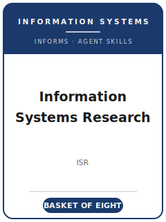

# Information Systems Research (ISR) Skills

<p align="center">
  
</p>

[](LICENSE)
[](https://pubsonline.informs.org/journal/isre)
[](https://pubsonline.informs.org/journal/isre)
[](https://github.com/anthropics/claude-code)

English | [简体中文](README.zh-CN.md)

Agent skill stack for manuscripts targeted at **Information Systems Research (ISR)** — the INFORMS quarterly at the intersection of technology, organizations, economics, and society, and a member of the IS field's **Senior Scholars' Basket of Eight**.

This repository is opinionated. It is **not** a generic "IS writing" toolbox. It is an **ISR-specific** stack built around ISR's defining identity: a **sociotechnical** and **intradisciplinary** mission that houses **both** rigorous behavioral/empirical research **and** analytical economic, econometric, and design-science modeling as **co-equal** first-class genres under one cover. It covers fit-driven topic selection, behavioral or analytical mechanism building, literature positioning that **bridges IS silos**, multimethod research design and analysis, the mandatory ~500-word contribution statement, INFORMS house-style exhibits and prose, ScholarOne submission with required editor/reviewer nominations, the Senior-Editor-led review process, and R&R rebuttals.

> Durable norms first. Current page limits, nomination counts, review model, ORCID requirement, and Open Option fee were refreshed from official INFORMS pages on 2026-06-20. Always re-check the live ISR submission guidelines before uploading.

---

## Why a Separate ISR Skill Stack?

ISR imposes constraints that differ materially from single-paradigm or generic management journals:

| Constraint              | Information Systems Research (ISR)                                   | Implication                                                       |
|-------------------------|---------------------------------------------------------------------|------------------------------------------------------------------|
| Discipline              | IS at the tech–organization–economy–society intersection            | IT-as-wallpaper / generic reference-discipline papers are off-fit |
| Core identity           | **Sociotechnical** and **intradisciplinary** ("bridging IS silos")  | Single-paradigm contributions are weaker than silo-bridging ones  |
| Genres                  | Behavioral empirical **and** analytical/economic & design-science, **co-equal** | The skill must serve modeling and behavioral work equally |
| IT artifact             | Must do load-bearing theoretical work                               | If any tool would do, it is not yet an IS contribution            |
| Length                  | **32 pages of text**, **38 pages total**; overflow → electronic companion | Tighter than many peers; proofs/items go online                   |
| Abstract                | **300 words** maximum                                               | Lead with the contribution                                        |
| Review                  | **Double-anonymized**; **Senior-Editor-led** with an EIC fit gate   | Reviewers advise; the SE decides                                  |
| Cover letter            | **~500-word contribution statement** (since June 1, 2023) + **editor/reviewer nominations** | Boilerplate or missing statements are returned                    |
| Format                  | Double-spaced, ≥11-pt, 1-inch margins; INFORMS author-date style    | Verify current specifics                                          |
| Publisher               | **INFORMS** (OR/economics lineage), quarterly                        | An OR/economics heritage uncommon among behavioral journals       |

Generic "scientific writing" or "social-science methods" packs do not address these constraints.

---

## Quick Start

### Option A — Claude Code Plugin (recommended)

```bash
/plugin marketplace add https://github.com/brycewang-stanford/isr-skills
/plugin install isr-skills
/reload-plugins
```

### Option B — Manual Copy

```bash
git clone https://github.com/brycewang-stanford/isr-skills.git
cd isr-skills

mkdir -p ~/.claude/skills && cp -R skills/isr-* ~/.claude/skills/
# or
mkdir -p ~/.codex/skills && cp -R skills/isr-* ~/.codex/skills/
```

### First Prompt

```
Use isr-workflow to tell me which skill I should use next for my ISR manuscript.
```

---

## Default Workflow

```text
isr-topic-selection
        ▼
isr-theory-development
        ▼
isr-literature-positioning
        ▼
isr-methods
        ▼
isr-data-analysis
        ▼
isr-contribution-framing
        ▼
isr-tables-figures
        ▼
isr-writing-style        (polish)
        ▼
isr-submission
        ▼
isr-review-process
        ▼
isr-rebuttal
```

`isr-workflow` is the router — it tells you which skill to use next based on where you are, and on whether your paper is behavioral, analytical, design-science, or multimethod.

---

## Skills

| Skill                        | Purpose                                                                          |
|------------------------------|----------------------------------------------------------------------------------|
| `isr-workflow`               | Router — decides which sub-skill to invoke next; knows ISR's co-equal genres     |
| `isr-topic-selection`        | Sociotechnical/intradisciplinary fit test + genre choice (vs MISQ/JMIS/MS)        |
| `isr-theory-development`     | Behavioral hypotheses **or** analytical propositions, centered on the IT artifact |
| `isr-literature-positioning` | Joining an IS conversation; bridging behavioral/economic/design-science silos     |
| `isr-methods`                | Matching genre (behavioral/analytical/DSR/multimethod) to the question            |
| `isr-data-analysis`          | Identification & validity (empirical), proof discipline (analytical), DSR evaluation |
| `isr-contribution-framing`   | Explicit contribution to IS + the mandatory ~500-word contribution statement      |
| `isr-tables-figures`         | INFORMS-style exhibits; main-text vs electronic-companion split under the page cap |
| `isr-writing-style`          | Front-loaded contribution, intuition-before-algebra, INFORMS author-date style    |
| `isr-submission`             | ScholarOne preflight: anonymization, contribution statement, editor nominations   |
| `isr-review-process`         | The EIC fit gate and Senior-Editor-led process; reading a decision letter         |
| `isr-rebuttal`               | Multi-round R&R revision and point-by-point response to the SE                     |

### Resources

- [`resources/external_tools.md`](resources/external_tools.md) — IS data sources (platform/trace data, Compustat/CiTDB, Qualtrics/Prolific) and software for both genres (Mathematica/MATLAB/Gurobi for analytical; Stata/R/Mplus/SmartPLS for empirical; DSR evaluation harnesses)
- [`resources/official-source-map.md`](resources/official-source-map.md) — every encoded current fact and its official INFORMS/ISR URL, refreshed 2026-06-20

---

## Differences vs. MISQ / JMIS / Management Science

| Dimension          | ISR                                          | MISQ                              | JMIS                          | Management Science                 |
|--------------------|----------------------------------------------|-----------------------------------|-------------------------------|------------------------------------|
| Field              | IS (sociotechnical, intradisciplinary)       | IS                                | IS                            | Broad management / OR              |
| Genre identity     | Behavioral **and** analytical/DSR, co-equal  | Stronger **design-science** identity | IS, distinct conventions    | Management/OR, not IS-specific     |
| Publisher          | INFORMS                                       | MISRC / U. Minnesota              | Taylor & Francis              | INFORMS                            |
| Fee note           | INFORMS Open Option $3,000 after acceptance   | —                                 | —                             | $79 original-submission fee (2025) |

If your contribution is a built artifact seeking the design-science genre's home, weigh **MISQ**; if the IS angle is incidental to a generic OR/economics core, weigh **Management Science**.

---

## Related

- [awesome-journal-skills](https://github.com/brycewang-stanford/awesome-journal-skills) — index of journal-specific skill packs

---

## License

MIT
