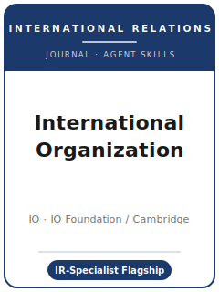

# 《国际组织》（IO）技能包

<p align="center">
  
</p>

[](LICENSE)
[](https://www.cambridge.org/core/journals/international-organization)
[](https://www.cambridge.org/core/journals/international-organization/information/about-this-journal)
[](https://github.com/anthropics/claude-code)

[English](README.md) | 简体中文

面向 **《国际组织》（International Organization, IO）** 投稿的 Agent 技能栈。IO 被公认为
**国际关系（IR）领域的旗舰期刊**，创刊于 **1947 年**，由 **剑桥大学出版社代表国际组织基金会（IO
Foundation）** 出版。IO 发表关于国际政治的 **可推广理论（generalizable theories）**，以及检验这些理论的
经验与形式化研究，覆盖 **国际制度与国际法、合作与冲突、国际政治经济学（IPE）、安全、外交政策、国际关系
理论**——定量、形式化（博弈论）与定性方法兼收并蓄。

本仓库是**有主见的**。它**不是**通用社会科学写作工具箱，**也不是**把通用政治学包（APSR / AJPS / JOP）
改个名字套用过来。它是 **国际关系专属** 技能栈：**国际的或跨境的现象必须是主要的原因或结果**，贡献必须是
一个**可迁移的国际政治理论**，并且论文必须通过 IO 独特的 **终审接受前的验证**——IO 编辑部工作人员会
**重跑你的定量结果、核验你的形式化模型证明**，材料最终存入 Harvard Dataverse 上的 **IO Dataverse**。

---

## IO 是什么，为何需要专属技能栈？

IO 的重心不同于全学科旗舰刊，也不同于通用的领域定量刊：

| 约束 | IO | 含义 |
|------|------|------|
| 所有者 / 出版方 | **IO 基金会** / **剑桥大学出版社** | 通过 **Editorial Manager** 投稿 |
| 范围 | **国际关系专属**——制度、冲突/合作、IPE、安全、IR 理论 | 国际层面必须是**主要原因或结果** |
| 看重 | 关于国际政治的**可推广理论** | 单案例/单一 IGO 的描述性研究不合适 |
| 方法 | 定量、**形式化（博弈论）**、定性——各按其标准评判 | 形式化证明是一等公民（且会被核验） |
| 评审模式 | **双向匿名（double-blind）** | 匿名化；引用自己的工作用**第三人称** |
| 篇幅 | **研究论文 ≤ 14,000 词**；**研究札记 ≤ 8,000**；**评论文章 ≤ 10,000** | 字数含表/图/注；**不含**参考文献 |
| 补充材料 | **一般不应超过约 20 页**，尤其初次投稿时 | 把稳健性表格与证明细节移出正文 |
| 投稿文件 | **摘要、字数、致谢单独提交** | 它们不埋在稿件正文里 |
| **透明度** | **条件接受时提交数据/代码；终审接受前 IO 工作人员核验结果 + 证明** | 从第一天起就打造可重跑材料包 + 可核验证明 |

易变的具体信息（现任编辑与任期、确切摘要上限、费用/APC、政策措辞、文章类型）会变化——未直接核实项在
[`resources/official-source-map.md`](resources/official-source-map.md) 中标记 **待核实**。
**请以官方页面为准。**

### 标志性差异：终审接受前的验证

许多期刊只要一份复现材料包；IO 在**发表前会重跑材料并核验证明**。作者**初次投稿不提交数据**（与双向匿名
评审一致）。在**条件接受（conditional acceptance）**时，编辑部索取数据与命令文件；**IO 工作人员重跑定量
结果并核验形式化模型的证明**，编辑**在所有报告分析的全部结果都被确认之前不会发出终审接受**。终审接受时，
材料存入 Harvard Dataverse 上的 **IO Dataverse**（并生成 **DOI** 写入文章），参考文献前须有一份
**数据可得性声明（Data Availability Statement）**；定性研究**强烈建议**存入
**定性数据仓库（QDR）**。

### IO 与 APSR / AJPS / JOP 有何不同

- **APSR / AJPS / JOP 是通用** 政治学刊；**IO 是国际关系专属刊。** 你的论文必须是对 **国际关系** 的贡献，
  而不是把国际数据贴到一篇国内政治论文上。
- **理论是硬通货。** IO 明确寻求关于国际政治的 **可推广理论**——形式化、理性主义、建构主义或经验取向——
  而非数据堆砌。
- **形式化工作也会被核验。** IO 工作人员在终审接受前核验 **形式化模型的证明**，不只是重跑定量代码。

### 三种文章类型

- **Research Article（研究论文）**——完整原创 IR 研究，可推广理论 + 证据，**≤ 14,000 词**。
- **Research Note（研究札记）**——一个精炼的 IR 贡献（决定性检验、聚焦的再评估、测量或理论推进），
  **≤ 8,000 词**。不是被注水的研究论文。
- **Essay（评论文章）**——概念性、议程设定或论争性文章，**≤ 10,000 词**（确切定位请在官方页面核实——待核实）。

---

## 快速开始

### 方式 A — Claude Code 插件（推荐）

```bash
/plugin marketplace add https://github.com/brycewang-stanford/io-skills
/plugin install io-skills
/reload-plugins
```

### 方式 B — 手动复制

```bash
git clone https://github.com/brycewang-stanford/io-skills.git
cd io-skills

mkdir -p ~/.claude/skills && cp -R skills/io-* ~/.claude/skills/
# 或
mkdir -p ~/.codex/skills && cp -R skills/io-* ~/.codex/skills/
```

### 第一条提示

```
用 io-workflow 告诉我，我的 IO 稿件下一步该用哪个技能。
```

---

## 默认工作流

```text
io-topic-selection
        ▼
io-literature-positioning
        ▼
io-theory-building
        ▼
io-research-design
        ▼
io-data-analysis
        ▼
io-tables-figures
        ▼
io-writing-style          （润色）
        ▼
io-transparency-and-data-policy
        ▼
io-review-process
        ▼
io-submission
        ▼
io-rebuttal
```

`io-workflow` 是路由器——根据你所处阶段告诉你下一步用哪个技能。它的首要任务是确认论文是一个 **国际关系
贡献**（国际现象是主要原因或结果）且具有 **可推广理论**。请在**分析过程中**就启动
`io-transparency-and-data-policy`，而非等到接受时：IO 工作人员会在 **终审接受前重跑你的结果并核验证明**，
未脚本化的分析或含糊其辞的证明在截止压力下无法补救。

---

## 技能列表

| 技能 | 用途 |
|------|------|
| `io-workflow` | 路由器——决定下一步调用哪个子技能；确认 IR 契合度 |
| `io-topic-selection` | IR 契合度；国际层面作为主要原因/结果；选对文章类型 |
| `io-literature-positioning` | 进入 IR 论争，跨理性主义/建构主义/IPE/安全各传统对话 |
| `io-theory-building` | 打造可推广的 IR 理论（形式化、理性主义、建构主义） |
| `io-research-design` | 为设计辩护——二元/TSCS 因果推断、案例、实验、形式化 |
| `io-data-analysis` | 分析规范、二元数据推断、稳健性、从第一行就可复现 |
| `io-tables-figures` | 自洽、可复现的图表；明确标注分析单位/层面 |
| `io-writing-style` | 字数上限、双向匿名第三人称自引、短作者—年份脚注 |
| `io-transparency-and-data-policy` | 终审接受前可验证的材料包 + IO Dataverse + DAS（标志技能） |
| `io-review-process` | 双向匿名评审、IR 专家审稿、终审接受前验证 |
| `io-submission` | Editorial Manager 投稿前检查（匿名、字数口径、摘要单列、ORCID） |
| `io-rebuttal` | 面向不同范式审稿人 + 编辑的 R&R 回应，保持匿名且可验证 |

### 资源

- [`resources/external_tools.md`](resources/external_tools.md) — IR 数据源（COW / UCDP-PRIO / ACLED / 联大投票 / DESTA / AidData / V-Dem）+ R / Stata / Python 与二元/网络/形式化/CAQDAS 工具
- [`resources/official-source-map.md`](resources/official-source-map.md) — 每条事实背后的 IO / 剑桥 / Harvard Dataverse 官方 URL，未核实项标 待核实

---

## 本仓库不做什么

- 不替你写出可直接投稿的稿件
- 不模拟任何特定编辑或评审人的口味
- 不臆断易变元数据（现任编辑与任期、确切摘要上限、费用/APC、政策措辞、文章类型）——请以官方页面为准；未核实项标 待核实
- 不替你跑过 IO 的验证——IO 工作人员会重跑你的结果并核验证明；本包只负责准备可重跑的材料包与可核验的证明附录
- 不替你判断你的问题是否真的是国际关系贡献——那是研究者的判断

---

## 相关

- [awesome-journal-skills](https://github.com/brycewang-stanford/awesome-journal-skills) — 期刊专属技能包索引
- [International Organization（剑桥 Core）](https://www.cambridge.org/core/journals/international-organization) — 出版方主页、投稿指南、政策
- [International Organization (IO) Journal Dataverse](https://dataverse.harvard.edu/dataverse/IOJ) — Harvard Dataverse 上的复现材料

---

## 许可

MIT
