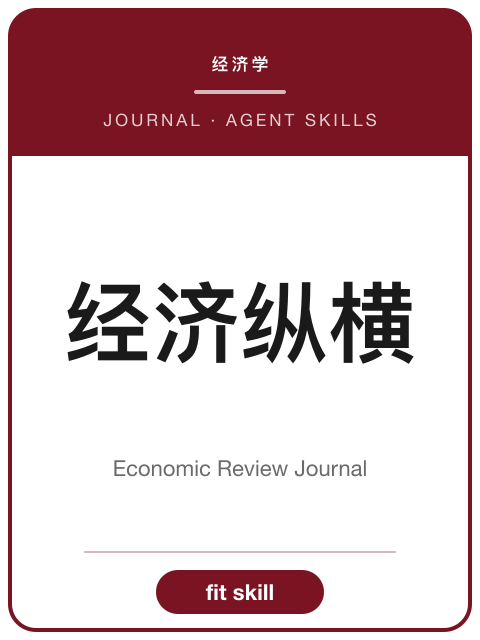

<!-- AJS-ROOT-JOURNAL-ENTRY -->
# 《经济纵横》

> 马克思主义政治经济学与改革热点研究期刊。

| 期刊概览 | |
|---|---|
| **学科** | 经济学 |
| **主办/出版** | 吉林省社会科学院、吉林省社会科学界联合会主办 |
| **创刊** | 1985 |
| **ISSN** | 1007-7685 · CN 22-1054/F |
| **周期** | 月刊 |
| **收录/地位** | CSSCI · 北大中文核心 |
| **官网** | [jjzh.cbpt.cnki.net](https://jjzh.cbpt.cnki.net/) |
| **核验日期** | 2026-06-17 |

**▶ 调用 skill —— [`economic-aspects`](../Chinese-SocialScience-Journal-Skills/skills/economic-aspects/)：** 选题契合度、框架、方法与证据门槛、写作体例与拒稿雷区。

属于 **[中文社会科学期刊 Skills](../Chinese-SocialScience-Journal-Skills/)** 合集。投稿前请以官网最新《投稿须知》为准。

---

<!-- 机器可读的规范指针——请勿删除或改动（由 tools/audit_repo.py 校验）。 -->

- Canonical skill: [Chinese-SocialScience-Journal-Skills/skills/economic-aspects/](../Chinese-SocialScience-Journal-Skills/skills/economic-aspects/)
- Skill name: `economic-aspects`
- Bundle: [Chinese-SocialScience-Journal-Skills/](../Chinese-SocialScience-Journal-Skills/)

此目录刻意不包含 `SKILL.md`；真正可安装的 skill 保留在 bundle 内，确保插件路径和 skill 计数保持稳定。
