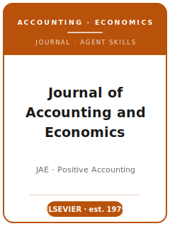

# 《会计与经济学杂志》(JAE) Skills

<p align="center">
  
</p>

[](LICENSE)
[](https://www.sciencedirect.com/journal/journal-of-accounting-and-economics)
[](https://www.sciencedirect.com/journal/journal-of-accounting-and-economics)
[](https://github.com/anthropics/claude-code)

[English](README.md) | 简体中文

面向 **《会计与经济学杂志》(Journal of Accounting and Economics, JAE)** 投稿的 Agent 技能栈 —— JAE 是 Elsevier 于 **1979 年**由 Ross L. Watts 与 Jerold L. Zimmerman 创办的、**实证（基于经济学的）会计研究**的大本营。

本仓库是有立场的。它**不是**通用的"会计写作"工具箱，而是围绕 JAE 核心标准打造的 **JAE 专用**技能栈：一篇文章必须**运用经济学理论来解释会计现象**，并以大样本档案数据加以检验，或构建解析式经济模型。覆盖范围包括：会计在企业内部的作用、会计数字在资本市场中的信息含量、会计在财务契约与代理关系监督中的作用、会计准则的形成，以及公司信息披露与会计职业的监管 —— 同时涵盖以识别（identification）为核心的研究设计、符合 Elsevier 体例的图表、Editorial Manager 投稿流程、双盲评审，以及 R&R 答复。

> 仅描述持久规范。编辑名单、投稿费、Highlights/关键词/JEL 要求及数据共享政策都会变化 —— 请务必以 ScienceDirect 上 JAE 官方 Guide for Authors 与 Elsevier 政策页为准。

---

## 为什么需要单独的 JAE 技能栈？

相比行为学、规范性或通用管理学期刊，JAE 的约束有本质差异：

| 约束维度       | 《会计与经济学杂志》(JAE)                                  | 含义                                                       |
|----------------|------------------------------------------------------------|------------------------------------------------------------|
| 学科           | 实证（基于经济学的）会计 —— Watts-Zimmerman 传统           | 规范性、行为学或实务导向的文章不契合                        |
| 核心标准       | 运用经济学理论解释会计现象                                  | 仅有 Compustat 相关性会被视为"捞数据"                       |
| 理论           | 代理、信息经济学、契约、政治成本等机制                      | 无理论的"A 与 B 相关"是拒稿信号                             |
| 方法           | 大样本档案计量 + 解析式建模                                 | 实验室实验与设计科学不契合                                  |
| 识别           | 自然实验、DiD、IV、RD；公司/年份固定效应；双向聚类          | 把混合 OLS 当因果会被惩罚                                   |
| 贡献           | 改变了对会计经济学的哪一点理解？                            | "首次研究 X"不算贡献                                        |
| 体例           | Elsevier 著者-年份(Harvard)；编号章节；强制 Highlights      | 数字编号(Vancouver)引用、缺 JEL 码无法通过投稿前检查        |
| 流程           | Editorial Manager；收费投稿；双盲；编辑终审                  | 不契合的文章会被桌拒 / 经文章转移服务改投                   |
| 数据政策       | **自愿**共享(Elsevier 政策)，**不**强制存档                | 不同于 JAR/JFE，无需复现包                                  |

通用的"科研写作"或"社科方法"技能包无法覆盖这些约束。

---

## 快速开始

### 方式 A —— Claude Code 插件（推荐）

```bash
/plugin marketplace add https://github.com/brycewang-stanford/jae-skills
/plugin install jae-skills
/reload-plugins
```

### 方式 B —— 手动复制

```bash
git clone https://github.com/brycewang-stanford/jae-skills.git
cd jae-skills

mkdir -p ~/.claude/skills && cp -R skills/jae-* ~/.claude/skills/
# 或
mkdir -p ~/.codex/skills && cp -R skills/jae-* ~/.codex/skills/
```

### 第一条指令

```
用 jae-workflow 告诉我，我这篇 JAE 稿子下一步该用哪个 skill。
```

---

## 默认工作流

```text
jae-topic-selection（选题）
        ▼
jae-theory-development（理论与预测）
        ▼
jae-literature-positioning（文献定位）
        ▼
jae-methods（研究设计与识别）
        ▼
jae-data-analysis（数据分析与推断）
        ▼
jae-contribution-framing（经济学贡献提炼）
        ▼
jae-tables-figures（图表）
        ▼
jae-writing-style（文风打磨）
        ▼
jae-submission（投稿前自检）
        ▼
jae-review-process（理解评审流程）
        ▼
jae-rebuttal（R&R 答复）
```

`jae-workflow` 是路由器 —— 它根据你当前所处的阶段告诉你下一步该用哪个 skill。

---

## 技能列表

| Skill                       | 用途                                                                  |
|-----------------------------|-----------------------------------------------------------------------|
| `jae-workflow`              | 路由器 —— 决定下一步调用哪个子技能                                     |
| `jae-topic-selection`       | 基于经济学的选题 + JAE 契合度判断（对比 JAR/TAR/RAST/JFE）             |
| `jae-theory-development`    | 代理/信息/契约机制；先验的（a priori）预测                             |
| `jae-literature-positioning`| 加入实证会计的学术对话；用"问题化"取代"找空白"                         |
| `jae-methods`               | 识别策略设计（自然实验、DiD、IV、RD）或解析建模                        |
| `jae-data-analysis`         | 样本构建漏斗、公司/年份固定效应、双向聚类、稳健性                      |
| `jae-contribution-framing`  | 明确的经济学贡献陈述 + 讨论部分                                        |
| `jae-tables-figures`        | 变量定义、描述统计、回归表、事件研究/DiD 图                            |
| `jae-writing-style`         | 经济学论文文风、Elsevier 著者-年份、Highlights/关键词/JEL              |
| `jae-submission`            | Editorial Manager 投稿前自检（匿名化、费用、Highlights、JEL）          |
| `jae-review-process`        | JAE 评审/决定如何运作；JAE 年会特刊通道                                |
| `jae-rebuttal`              | R&R 修改与逐条答复信                                                   |

### 资源

- [`resources/official-source-map.md`](resources/official-source-map.md) —— 本包用到的每条 JAE 事实、对应官方 URL、live-check 边界及刷新日期(2026-06-20)
- [`resources/external_tools.md`](resources/external_tools.md) —— 实证会计数据源（通过 WRDS 的 Compustat / CRSP / I/B/E/S / Execucomp / DealScan / Audit Analytics）、计量软件（Stata `reghdfe`/`ivreg2`/`csdid`、SAS、R `fixest`）与 Elsevier/LaTeX 写作工具

---

## 与 JAR / TAR / RAST / JFE 的差异

| 维度       | JAE                          | JAR                 | TAR                          | JFE（金融）             |
|------------|------------------------------|---------------------|------------------------------|-------------------------|
| 核心定位   | 实证（基于经济学的）会计     | 顶级档案会计三大刊  | AAA 旗舰，方法面广           | 金融经济学              |
| 标志方法   | 档案计量 + 建模              | 档案、识别          | 实验/解析/档案               | 资产定价/公司金融档案   |
| 复现政策   | **自愿**（不强制）           | **强制**代码/数据   | 不一                         | **强制** Mendeley 存档  |
| 投稿费     | 收费投稿；以 JAE 当前金额为准 | 不一                | 不一                         | 不一                    |
| 编辑模式   | 精简编辑终审模式；姓名需现场核对 | 主编 + AE          | 资深 + 领域编辑              | 主编 + AE               |

如果你的文章是规范性的、行为实验的，或会计内容很少，那么 JAE 是错误的投稿对象。

---

## 相关链接

- [awesome-journal-skills](https://github.com/brycewang-stanford/awesome-journal-skills) —— 期刊专用技能包索引

---

## 许可证

MIT
