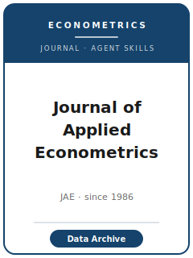

# 应用计量经济学杂志技能包（Journal of Applied Econometrics Skills）

<p align="center">
  
</p>

[](LICENSE)
[](https://onlinelibrary.wiley.com/journal/10991255)
[](https://onlinelibrary.wiley.com/journal/10991255)
[](https://github.com/anthropics/claude-code)

[English](README.md) | 简体中文

面向 **《应用计量经济学杂志》（Journal of Applied Econometrics, JAE）** 投稿的智能体技能包。该刊由 **John Wiley & Sons** 出版，创刊于 **1986 年**（ISSN 0883-7252 / 1099-1255，每年 7 期），现任主编为 **Barbara Rossi**。JAE 的定位是 **实证、可复现** 的经济学研究——**将计量技术应用并发展于真实数据**，论文关注的是 *应用*，而非纯计量理论。

本仓库立场鲜明：它**不是**通用的计量写作工具箱，而是围绕 JAE 的核心特征——**可复现性**——构建的 **JAE 专属** 技能栈。你报告的每一个结果，都应当能从你存入著名的 **JAE 数据存档（JAE Data Archive）** 的纯文本数据与代码中重新生成。

官方依据核验日期：2026-06-01。URL、访问日期与 `待核实` 项见 [`resources/official-source-map.md`](resources/official-source-map.md)。

---

## 为什么需要专门的 JAE 技能栈？

JAE 的约束与综合性顶刊（QJE）或纯理论刊（Econometrica）有本质差异：

| 约束 | JAE | 含义 |
|------|-----|------|
| 范围 | 应用计量——将技术用于**真实数据** | 纯理论证明类论文不对口 |
| 标志 | **可复现性**：结果须能由所存代码/数据再生成 | 不可复现的结果无从谈起 |
| 数据政策 | 录用后**强制存入 JAE 数据存档**（保密数据除外） | 从第一天起就规划可存档的数据与代码 |
| 存档格式 | 纯 **ASCII / CSV** + readme；**单独的 `.dta` / SAS 不被接受** | 一切导出为文本，切勿只交裸 `.dta` |
| 篇幅 | **硬性 35 页** 正文上限；在线附录**不计入** | 细节放入篇幅不限的在线补充材料 |
| 摘要 | **100 字以内 summary，不含引用**；最多 **6 个关键词** | 冗长、带引用的摘要不合规范 |
| 参考文献 | **任意一致的格式**（"Free Format"） | 不强制统一引用体例 |
| 评审 | **单盲**；主编（Editor-in-Chief）拥有最终录用/拒稿权 | 作者不匿名，评审人匿名 |
| 投稿上限 | 同一作者同时在审 **≤ 3 篇** | 错峰安排你的投稿管线 |
| 特别栏目 | 专设 **Replication Article（复现论文）** 通道 | 复现（成功与否）均可在此发表 |

通用"科研写作"技能包无法覆盖上述约束。易变信息（主编、APC 金额、确切措辞）会变化——请在 **官方期刊页面** 核实（部分 Wiley 页面对自动抓取做了拦截；本包将此类事实标注为 `待核实`）。

---

## 快速开始

### 方式 A —— Claude Code 插件（推荐）

```bash
/plugin marketplace add https://github.com/brycewang-stanford/jape-skills
/plugin install jape-skills
/reload-plugins
```

### 方式 B —— 手动复制

```bash
git clone https://github.com/brycewang-stanford/jape-skills.git
cd jape-skills

mkdir -p ~/.claude/skills && cp -R skills/jape-* ~/.claude/skills/
# 或
mkdir -p ~/.codex/skills && cp -R skills/jape-* ~/.codex/skills/
```

---

## 十二个技能

| 技能 | 职责 |
|------|------|
| `jape-workflow` | JAE 投稿全流程地图 |
| `jape-topic-selection` | 这是否属于 JAE 的*应用*（非纯理论）计量定位？ |
| `jape-literature-positioning` | 对标应用计量先例与 JAE 自身文献 |
| `jape-contribution-framing` | 将贡献框定为"应用 + 可复现证据" |
| `jape-identification-strategy` | 基于真实数据的可信实证设计与假设辩护 |
| `jape-data-analysis` | 可复现的估计、稳健推断、面向存档的分析 |
| `jape-tables-figures` | 35 页内的图表；细节下放至在线附录 |
| `jape-writing-style` | 100 字 summary、6 个关键词、章节结构、利益冲突声明 |
| `jape-replication-and-data-policy` | 可存档的复现包：纯 ASCII/CSV + readme + 程序 |
| `jape-review-process` | 单盲评审、主编权限、评审人关注点 |
| `jape-submission` | Editorial Express 投稿前检查；Free Format；三篇上限 |
| `jape-rebuttal` | R&R 阶段回应单盲评审人 |

---

## 本包内置的 JAE 标志性规范

- **JAE 数据存档（始于 1994 年，现托管于 ZBW）：** 录用论文须存入完整的非保密数据，并（通常）提供能复现每个结果的程序。
- **纯文本规则：** 存档数据须为带 readme 的 ASCII/CSV；裸 Stata `.dta` / SAS 数据集不被接受。
- **硬性 35 页正文** + 不计入上限的篇幅不限在线附录。
- **100 字、不含引用的 summary**；最多 6 个关键词。
- 经 **Editorial Express** 的 **引用体例不限** 的 "Free Format" 投稿。
- **单盲** 评审，**主编** 最终拍板；同一作者同时在审 **≤ 3 篇**。
- 专设 **复现论文（Replication Article）** 栏目。

每条事实的来源与访问日期见：[`resources/official-source-map.md`](resources/official-source-map.md)。

---

## 维护说明

- 给出投稿级建议前，请重新打开 live Wiley author instructions 核验。
- `待核实` 项（确切 OA APC 金额、完整的 co-editor 名单）不能写成确定事实。
- fee、editor、data policy、review model 与 formatting rules 都可能变化——务必复核。

---

## 许可证

MIT —— 见 [LICENSE](LICENSE)。

> 本项目与《应用计量经济学杂志》、John Wiley & Sons 及 JAE 数据存档均无隶属或背书关系。投稿前请务必在官方期刊与存档页面核实最新要求。
