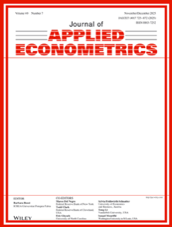

<!-- AJS-ROOT-JOURNAL-ENTRY -->
# Journal of Applied Econometrics

> Dedicated to applying econometric methods to economic problems, emphasizing applications in measurement, estimation, testing, and forecasting.

| At a glance | |
|---|---|
| **Field** | Applied econometrics |
| **Publisher** | John Wiley & Sons |
| **Founded** | 1986 |
| **ISSN** | 0883-7252 (print) · 1099-1255 (online) |
| **Frequency** | 7 issues/year |
| **Official** | [onlinelibrary.wiley.com](https://onlinelibrary.wiley.com/journal/10991255) |
| **Checked** | 2026-06-17 |

**▶ Use the skill — [`journal-of-applied-econometrics`](../English-SocialScience-Journal-Skills/skills/journal-of-applied-econometrics/):** venue fit, framing, the method-and-evidence bar, house style, and desk-reject heuristics.

Part of the **[English Social-Science Journal Skills](../English-SocialScience-Journal-Skills/)** bundle. Always re-check the live author guidelines on the official site before submitting.

---

<!-- Machine-readable canonical pointer — do not remove or alter (validated by tools/audit_repo.py). -->

- Canonical skill: [English-SocialScience-Journal-Skills/skills/journal-of-applied-econometrics/](../English-SocialScience-Journal-Skills/skills/journal-of-applied-econometrics/)
- Skill name: `journal-of-applied-econometrics`
- Bundle: [English-SocialScience-Journal-Skills/](../English-SocialScience-Journal-Skills/)

This folder intentionally does not contain a `SKILL.md`; the installable skill stays inside the bundle so plugin paths and skill counts remain stable.
