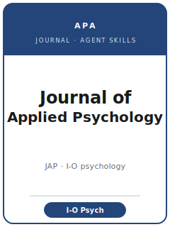

# Journal of Applied Psychology Skills

<p align="center">
  
</p>

[](LICENSE)
[](https://www.apa.org/pubs/journals/apl)
[](https://www.apa.org/pubs/journals/apl)
[](https://github.com/anthropics/claude-code)

English | [简体中文](README.zh-CN.md)

Agent skill stack for manuscripts targeted at the **Journal of Applied Psychology (JAP)** — the
**American Psychological Association (APA) flagship of industrial-organizational (I-O) and applied
psychology**, founded in **1917**. JAP publishes work on work motivation, leadership, personnel
selection and assessment, teams, job attitudes and well-being, organizational justice, training, and
turnover, with a strong **micro/individual and measurement** emphasis.

This repository is opinionated. It is **not** a generic psychology-writing toolbox and it is **not** a
relabeled social-science pack. It is **JAP-specific**: a **dual gate** of genuine **I-O theoretical
contribution** *and* **measurement/design rigor** (construct validity, common-method-variance control,
multilevel/nested data), the house quantitative toolkit (lab and field experiments, multi-wave field
studies, **SEM**, **HLM**, mediation/moderation, **meta-analysis**), **masked (anonymized) review**,
**APA 7th-edition** style, and the journal's **TOP** open-science framework (data, materials, and code
availability; preregistration weighed).

---

## What Is the Journal of Applied Psychology, and Why a Dedicated Stack?

Its constraints differ from a general empirical-psychology or management journal:

| Constraint            | Journal of Applied Psychology                                                  | Implication                                                       |
|-----------------------|--------------------------------------------------------------------------------|------------------------------------------------------------------|
| The bar               | **Theoretical contribution to I-O science _and_ measurement/design rigor**     | Rigor alone, or theory alone, is a common reject                 |
| Evidence              | Lab/field experiments, multi-wave field studies, SEM, HLM, meta-analysis       | Cross-sectional single-source self-report rarely suffices        |
| Measurement           | **Construct validity, reliability, invariance, CMV control**                   | Report measurement before structure                              |
| Levels                | Individual / team / organization; **multilevel and cross-level** models        | Model the nesting (ICC/r_wg); level of analysis is theory        |
| Publisher / owner     | **American Psychological Association (APA)**                                    | Submitted via **Editorial Manager** (`/apl`); masked review      |
| Style                 | **APA 7th edition**; structured abstract                                       | Effect sizes + CIs, fit indices, exact p-values                  |
| Open science          | **TOP framework** (since 1 Nov 2021): data/materials/code + statement          | Plan deposits + DOIs before submission; disclose dataset reuse   |
| Preregistration       | **Weighed** in evaluation                                                       | Preregister well; report it honestly                             |
| Article types         | Feature Article · Research Report · theory-development · review · qualitative · meta-analysis | Pick the right one up front                          |

Volatile specifics (editor, length caps, abstract limit, exact TOP level/wording, accepted types)
change — items not directly confirmed are marked **待核实** in
[`resources/official-source-map.md`](resources/official-source-map.md). **Verify on the official page.**

Official basis checked **2026-06** (检索于 2026-06；以官网为准).

---

## Quick Start

### Option A — Claude Code Plugin (recommended)

```bash
/plugin marketplace add https://github.com/brycewang-stanford/journal-of-applied-psychology-skills
/plugin install journal-of-applied-psychology-skills
/reload-plugins
```

### Option B — Manual Copy

```bash
git clone https://github.com/brycewang-stanford/journal-of-applied-psychology-skills.git
cd journal-of-applied-psychology-skills

mkdir -p ~/.claude/skills && cp -R skills/joap-* ~/.claude/skills/
# or
mkdir -p ~/.codex/skills && cp -R skills/joap-* ~/.codex/skills/
```

### First Prompt

```
Use joap-workflow to tell me which skill I should use next for my Journal of Applied Psychology manuscript.
```

---

## Default Workflow

```text
joap-topic-selection
        ▼
joap-theory-and-hypotheses     (lock the mechanism + levels first)
        ▼
joap-literature-positioning
        ▼
joap-study-design              (measurement, CMV, nesting; preregister here)
        ▼
joap-data-analysis             (SEM / HLM / mediation / meta-analysis)
        ▼
joap-tables-figures
        ▼
joap-writing-style             (APA 7th; contribution-forward)
        ▼
joap-open-science-and-transparency
        ▼
joap-review-process
        ▼
joap-submission
        ▼
joap-rebuttal
```

`joap-workflow` is the router. Theory comes **before** literature positioning here on purpose — JAP
wants the mechanism and level of analysis fixed first, then the literature marshaled to show why it is
new. For meta-analyses and theory-development articles the spine shifts (pull `data-analysis` or
`theory-and-hypotheses` forward).

---

## Skills

| Skill                                  | Purpose                                                                       |
|----------------------------------------|-------------------------------------------------------------------------------|
| `joap-workflow`                        | Router — decides which sub-skill to invoke next                               |
| `joap-topic-selection`                 | Dual-gate fit (I-O theory + rigor); choose the article type                    |
| `joap-theory-and-hypotheses`           | I-O mechanism, level of analysis, directional + confirmatory hypotheses        |
| `joap-literature-positioning`          | Stake the contribution vs. the closest prior work; sibling-venue boundary      |
| `joap-study-design`                    | Construct validity, CMV remedies, multilevel/nested design, power              |
| `joap-data-analysis`                   | SEM/CFA, HLM, mediation with bootstrap CIs, meta-analysis, full disclosure     |
| `joap-tables-figures`                  | APA 7th Table 1, path/CFA diagrams, multilevel tables, forest/funnel plots      |
| `joap-writing-style`                   | APA 7th style; contribution-forward arc; structured abstract                   |
| `joap-open-science-and-transparency`   | TOP data/materials/code, data-availability statement, DOIs, prior-use          |
| `joap-review-process`                  | Masked review; the dual gate; action-editor model; desk-reject patterns        |
| `joap-submission`                      | Editorial Manager preflight (style, masking, transparency, exhibits)           |
| `joap-rebuttal`                        | R&R response-letter strategy for multiple reviewers + the action editor         |

### Resources

- [`resources/external_tools.md`](resources/external_tools.md) — SEM/HLM/meta-analysis software (`lavaan`, Mplus, `lme4`, `metafor`/`psychmeta`), CMV and invariance tools, preregistration (OSF), repositories (OSF/ICPSR/Dataverse/Zenodo), `papaja`
- [`resources/official-source-map.md`](resources/official-source-map.md) — official APA URLs behind every fact, with 待核实 markers
- [`resources/worked-examples/01-introduction.md`](resources/worked-examples/01-introduction.md) — a before→after JAP introduction (fictional teaching paper)
- [`resources/exemplars/library.md`](resources/exemplars/library.md) — real, web-verified JAP papers by method × topic, with a sibling-journal guard

---

## Differences vs. Sibling Journals

| Venue | Center of gravity | How JAP differs |
|-------|-------------------|-----------------|
| **Personnel Psychology** | personnel selection, assessment, validation | JAP leads with a theoretical mechanism, not a validation study |
| **Academy of Management Journal (AMJ)** | macro/meso management, organizational outcomes | JAP is micro/individual + measurement-focused |
| **OBHDP** | judgment, decision processes, experimental micro-OB | JAP emphasizes I-O theory + field generalizability + measurement |
| **Journal of Organizational Behavior (JOB)** | broad OB, overlapping micro topics | JAP holds a stronger measurement/quantitative-rigor bar |

---

## What This Repo Does Not Do

- It does not write a submittable manuscript for you
- It does not simulate any specific editor's or reviewer's taste
- It does not assert volatile metadata (current editor, length caps, exact TOP level) — verify on the official page; unverified items are marked 待核实
- It does not decide whether your theoretical contribution is novel enough — that is the researcher's call

---

## Related

- [awesome-journal-skills](https://github.com/brycewang-stanford/awesome-journal-skills) — Index of journal-specific skill packs
- [Journal of Applied Psychology (APA)](https://www.apa.org/pubs/journals/apl) — scope, submission guidelines, open-science policy
- [APA Editorial Manager (apl)](https://www.editorialmanager.com/apl/) — submission portal

---

## License

MIT
