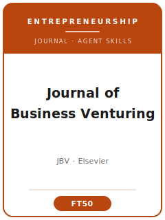

# 《创业学杂志》(Journal of Business Venturing, JBV) 技能包

<p align="center">
  
</p>

[](LICENSE)
[](https://www.sciencedirect.com/journal/journal-of-business-venturing)
[](https://www.sciencedirect.com/journal/journal-of-business-venturing)
[](https://github.com/anthropics/claude-code)

[English](README.md) | 简体中文

面向投稿 **《创业学杂志》(Journal of Business Venturing, JBV)** 的智能体技能包 —— JBV 是**创业与新创企业创建**领域的 FT50 旗舰期刊，由 **爱思唯尔(Elsevier)** 出版（印刷版 ISSN 0883-9026，在线版 ISSN 1873-2003）。当前 ScienceDirect 元数据列出 **Sophie Bacq** 与 **Simon Parker** 为共同主编。

本仓库立场鲜明，**不是**通用的"管理学写作"工具箱，而是**专为 JBV** 打造的技能栈，围绕 JBV 的核心门槛构建：论文必须照亮**各种形态的创业现象(entrepreneurial phenomenon)**，并对创业理论做出明确贡献 —— 创业必须是**核心**，而非顺带的实证场景。技能覆盖：现象驱动的选题、跨学科理论发展(经济学、心理学、社会学)、在创业对话中的文献定位、方法多元的研究设计与分析(新创企业数据计量、实验、质性过程研究、混合方法)、理论贡献的框定、爱思唯尔体例的图表与文风、在双盲评审下经 Editorial Manager 投稿、领域/处理编辑评审流程，以及 R&R 答复信。

> 仅沉淀持久规范。编辑团队、领域编辑分工、开放获取费(APC)、指标和政策都会变化 —— 请始终以 ScienceDirect 官方《作者指南》、编辑委员会页、开放获取页与 Editorial Manager 门户为准。`resources/official-source-map.md` 已于 2026-06-20 刷新。

---

## 为什么需要独立的 JBV 技能栈?

JBV 的约束与一般管理学或经济学期刊有实质差异：

| 约束维度       | 《创业学杂志》(JBV)                                          | 含义                                                       |
|----------------|-------------------------------------------------------------|------------------------------------------------------------|
| 研究领域       | 创业 / 新创企业创建必须是**核心**                            | 没有创业内核的、识别再干净的组织研究也不契合               |
| 学科视角       | 自觉的**跨学科**(经济学、心理学、社会学)                     | 学科广度是期望，而非加分项                                 |
| 贡献形式       | 欢迎"理论、**叙事与诠释**(narratives and interpretations)"   | 不只限于严格的假设-演绎(hypothetico-deductive)范式         |
| 方法论         | 多元但**理论优先** —— 方法须服务于问题                       | 只秀方法、不推进理论，面临直接拒稿风险                     |
| 稿件分流       | 共同主编之下由**领域/处理编辑**组织评审                      | 与相关创业领域的契合度影响分流与结果                       |
| 评审           | **双盲(double-anonymized)**；至少两位审稿人                  | 须彻底匿名(去除姓名、单位、致谢)                           |
| 投稿系统       | 爱思唯尔 **Editorial Manager**；首投引用格式灵活             | 单独标题页 + 匿名稿件；可同时投 Data in Brief / MethodsX   |
| 声明           | 须同时提供**竞争性利益声明**与**生成式 AI 使用声明**         | 投稿时两者均为强制                                         |
| 数据           | 爱思唯尔 **Option C** 研究数据政策                           | 存储/引用/链接数据，或说明为何无法共享                     |

通用的"科技写作"或"社会科学方法"技能包无法覆盖这些约束。

---

## 快速开始

### 方式 A — Claude Code 插件(推荐)

```bash
/plugin marketplace add https://github.com/brycewang-stanford/jbv-skills
/plugin install jbv-skills
/reload-plugins
```

### 方式 B — 手动复制

```bash
git clone https://github.com/brycewang-stanford/jbv-skills.git
cd jbv-skills

mkdir -p ~/.claude/skills && cp -R skills/jbv-* ~/.claude/skills/
# 或
mkdir -p ~/.codex/skills && cp -R skills/jbv-* ~/.codex/skills/
```

### 第一条提示词

```
用 jbv-workflow 告诉我，我的 JBV 稿件下一步该用哪个技能。
```

---

## 默认工作流

```text
jbv-topic-selection
        ▼
jbv-theory-development
        ▼
jbv-literature-positioning
        ▼
jbv-methods
        ▼
jbv-data-analysis
        ▼
jbv-contribution-framing
        ▼
jbv-tables-figures
        ▼
jbv-writing-style        (润色)
        ▼
jbv-submission
        ▼
jbv-review-process
        ▼
jbv-rebuttal
```

`jbv-workflow` 是路由器 —— 根据你所处的阶段，告诉你下一步该用哪个技能。

---

## 技能列表

| 技能                        | 用途                                                                 |
|-----------------------------|----------------------------------------------------------------------|
| `jbv-workflow`              | 路由器 —— 决定下一步调用哪个子技能                                    |
| `jbv-topic-selection`       | 现象驱动的创业选题 + JBV 契合度检验(与一般管理学期刊区分)             |
| `jbv-theory-development`    | 跨学科机制(经济/心理/社会学)；欢迎叙事性理论化                        |
| `jbv-literature-positioning`| 加入创业对话；以问题化(problematization)替代找空白                    |
| `jbv-methods`               | 将设计(创业面板/实验/质性/混合)与问题匹配                             |
| `jbv-data-analysis`         | 生存/选择/面板估计、样本流失、内生性、稳健性                          |
| `jbv-contribution-framing`  | 对创业理论的明确贡献 + 边界条件                                       |
| `jbv-tables-figures`        | 创业数据表、过程模型、交互效应图(爱思唯尔体例)                        |
| `jbv-writing-style`         | 现象前置的论证、主动语态、爱思唯尔作者-年份引用体例                   |
| `jbv-submission`            | Editorial Manager 投稿预检 + 匿名、声明、同步投稿                     |
| `jbv-review-process`        | JBV 领域编辑评审/决议如何运作；读懂决议信                             |
| `jbv-rebuttal`              | 多轮 R&R 修改与逐条答复信                                             |

### 资源

- [`resources/official-source-map.md`](resources/official-source-map.md) —— 每条所用事实 + 官方 URL + 访问日期；2026-06-20 已刷新
- [`resources/external_tools.md`](resources/external_tools.md) —— 创业数据源(GEM / PSED / Kauffman / PitchBook / Crunchbase / Kickstarter)与分析软件(Stata 生存/面板、R `fixest`/`survival`、NVivo、fsQCA、G*Power)

---

## JBV 的独特之处

- **现象驱动的使命** —— 论文必须照亮创业现象；创业是贡献本身，而非场景。这把 JBV 与"接受任何识别干净的组织研究"的一般管理学期刊区分开来。
- **天然跨学科** —— 立足经济学、心理学与社会学，并欢迎人类学、地理学、历史学及多个职能领域。
- **领域/处理编辑分流** —— 稿件由当前共同主编体系下的领域编辑组织评审；与相关创业领域的契合度很关键。
- **理论、叙事与诠释** —— JBV 在假设检验之外，也推崇有趣的叙事性与诠释性理论化。
- **FT50 / 学科定义级旗舰** —— 理论门槛高；偏题或理论化不足的稿件常被直接拒稿(desk reject)。
- **内置同步投稿** —— Data in Brief / MethodsX 附件可在 Editorial Manager 流程中一并提交。

---

## 相关

- [awesome-journal-skills](https://github.com/brycewang-stanford/awesome-journal-skills) —— 期刊专属技能包索引
- Academy-of-Management-Journal-Skills —— AMJ(顶级*实证*管理学期刊)

---

## 许可证

MIT
