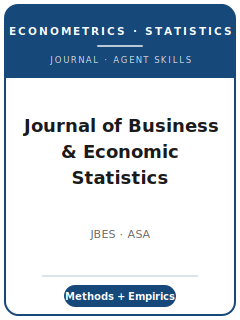

# Journal of Business & Economic Statistics Skills

<p align="center">
  
</p>

[](LICENSE)
[](https://www.tandfonline.com/journals/ubes20)
[](https://www.amstat.org/)
[](https://github.com/anthropics/claude-code)

English | [简体中文](README.zh-CN.md)

Agent skill stack for manuscripts targeted at the **Journal of Business & Economic Statistics (JBES)** — a methodological econometrics-and-statistics journal (established 1983) published by **Taylor & Francis on behalf of the American Statistical Association (ASA)**.

This repository is opinionated. It is **not** a generic econometrics-writing toolbox. It is a **JBES-specific** stack built around the journal's defining demand — **methods with empirics**: a new or improved statistical/econometric method (machine-learning and data-science adaptations and computational improvements explicitly welcomed) that carries **clear empirical relevance** and usually a **substantive empirical application**. Pure theory without empirical motivation, or pure applications without methodological novelty, are off-scope.

> **Check live T&F instructions before filing.** The source map was refreshed on 2026-06-20. The pack
> hard-codes stable official facts (scope, ASA ownership, current Joint Editors, and ASA reproducibility
> expectations) but does **not** hard-code submission platform, fee, length/abstract limits, review model,
> or formatting rules that require the live T&F author-instruction page.

---

## Why a Separate JBES Skill Stack?

JBES imposes constraints that differ materially from a general-interest economics journal or a pure-statistics journal:

| Constraint | JBES | Implication |
|---|---|---|
| Core demand | A method **and** an application, together | One-legged papers (pure theory / pure application) are off-scope |
| Method scope | New/improved methods, incl. **ML / data science** & computation | Off-the-shelf ML with no econometric novelty is off-fit |
| Evidence | **Asymptotics + Monte Carlo + a substantive application** | A derivation with a toy illustration reads as unfinished |
| Owning body | **American Statistical Association (ASA)** | Follows ASA data-sharing/ethics policy, not the AEA Data Editor regime |
| Editors | A rotating panel of **Co-Editors / Joint Editors** (no single EIC) | Cover-letter targeting differs from single-EIC journals |
| Data/code | ASA **supplementary-material** + data availability statement | Not the JAE Data Archive (that is a different, Wiley journal) |
| Access model | Taylor & Francis **Open Select** (hybrid OA) | Optional APC only if you choose OA |
| Tradition | Invited **discussion papers** + comments/rejoinders | Some contributions are pitched as discussion papers |

Generic "scientific writing" or "econ writing" skill packs do not address these constraints.

---

## Quick Start

### Option A — Claude Code Plugin (recommended)

```bash
/plugin marketplace add https://github.com/brycewang-stanford/jbes-skills
/plugin install jbes-skills
/reload-plugins
```

### Option B — Manual Copy

```bash
git clone https://github.com/brycewang-stanford/jbes-skills.git
cd jbes-skills

mkdir -p ~/.claude/skills && cp -R skills/jbes-* ~/.claude/skills/
# or
mkdir -p ~/.codex/skills && cp -R skills/jbes-* ~/.codex/skills/
```

### First Prompt

```
Use jbes-workflow to tell me which skill I should use next for my JBES manuscript.
```

---

## Default Workflow

```text
jbes-topic-selection
        ▼
jbes-literature-positioning
        ▼
jbes-contribution-framing
        ▼
jbes-identification-strategy
        ▼
jbes-data-analysis
        ▼
jbes-tables-figures
        ▼
jbes-writing-style        (polish)
        ▼
jbes-replication-and-data-policy
        ▼
jbes-review-process
        ▼
jbes-submission
        ▼
jbes-rebuttal
```

`jbes-workflow` is the router — it tells you which skill to use next based on where you are.

---

## Skills

| Skill | Purpose |
|---|---|
| `jbes-workflow` | Router — decides which sub-skill to invoke next |
| `jbes-topic-selection` | The methods-with-empirics fit test (novelty × relevance) |
| `jbes-literature-positioning` | Stake the method against prior econometrics/statistics art |
| `jbes-contribution-framing` | One-sentence contribution: method advance + empirical consequence |
| `jbes-identification-strategy` | Assumptions, regularity conditions, asymptotics, Monte Carlo design |
| `jbes-data-analysis` | Monte Carlo evidence + the substantive empirical application |
| `jbes-tables-figures` | Make size / power / coverage legible to both communities |
| `jbes-writing-style` | Method-first, application-anchored prose and theorem statements |
| `jbes-replication-and-data-policy` | Reproducible code+data supplement under ASA policy |
| `jbes-review-process` | The multi-Co-Editor path and discussion-paper tradition |
| `jbes-submission` | Preflight for live T&F submission facts and ASA supplement readiness |
| `jbes-rebuttal` | R&R response-letter strategy for a methods paper |

### Resources

- [`resources/external_tools.md`](resources/external_tools.md) — simulation engines, method-family libraries (Stata / R / Python), application data (FRED / CRSP / IPUMS), and reproducibility tooling
- [`resources/official-source-map.md`](resources/official-source-map.md) — current official-source map, refreshed 2026-06-20, with submission-only facts intentionally not encoded until the live T&F page is opened

---

## Differences vs. Adjacent Stacks

| Dimension | JBES | General economics journal | Pure statistics journal |
|---|---|---|---|
| Lead with | A method **with** an application | An empirical/theoretical finding | A theorem |
| Empirical application | Required (part of scope) | Is the paper | Often optional |
| Methodological novelty | Required | Often absent | Required |
| Data/ethics regime | ASA policy | AEA Data Editor (econ) | Journal-specific |

---

## What This Repo Does Not Do

- It does not write a submittable manuscript for you
- It does not simulate any specific Co-Editor's or referee's taste
- It does not assert submission-only metadata (platform, exact fee, length limits, review model, formatting rules) unless the live T&F author instructions have been opened
- It does not judge whether your method is genuinely novel — that is the researcher's call

---

## Related

- [awesome-journal-skills](https://github.com/brycewang-stanford/awesome-journal-skills) — Index of journal-specific skill packs
- [Journal of Business & Economic Statistics (official)](https://www.tandfonline.com/journals/ubes20) — Taylor & Francis, for the ASA
- [ASA data-sharing & reproducibility policy](https://www.amstat.org/publications/q-and-as/asa-journal-policies-on-data-sharing-and-reproducibility)

---

## License

MIT
