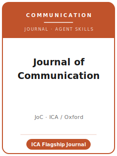

# 《传播学刊》（JoC）技能包

<p align="center">
  
</p>

[](LICENSE)
[](https://academic.oup.com/joc)
[](https://www.icahdq.org/)
[](https://github.com/anthropics/claude-code)

[English](README.md) | 简体中文

面向 **《传播学刊》（Journal of Communication, JoC）** 投稿的 Agent 技能栈。JoC 是
**国际传播学会（ICA）的旗舰期刊**，由 **牛津大学出版社（OUP）** 出版。它发表
**整个传播学领域** 的顶尖研究：传播理论与方法论、媒介效果、政治传播、健康传播、
计算/文本即数据传播，以及人际/组织传播——定量、计算、定性与批判/诠释取向兼收并蓄。

本仓库是**有主见的**。它**不是**通用社会科学写作工具箱，**也不是**把心理学或政治学包改个名字套用到
传播学。它是 **JoC 专属** 技能栈：一个对**整个传播学研究都有普遍意义**的问题、一个能**跨越自身子领域
与具体平台**对话的论证、一个能在各自方法论标准下站得住的研究设计、**双向匿名**的稿件准备，以及一份
随写随建的 **数据可得性声明（Data Availability Statement）** 与可复现/开放科学徽章材料。

---

## JoC 是什么，为何需要专属技能栈？

JoC 的约束不同于领域刊或方法刊：

| 约束 | JoC | 含义 |
|------|-----|------|
| 范围 | **整个传播学领域** | 论文必须超越单一子领域或平台才有意义 |
| 看重 | **普遍意义** + 清晰的理论贡献 | 仅限某一平台的窄结果不合适 |
| 方法 | 定量/计算/定性/批判——各按其标准评判 | 不要把同一模板硬套到所有论文 |
| 出版方 / 所有者 | **牛津大学出版社** / **ICA** | 通过 **Manuscript Central**（ScholarOne）投稿 |
| 评审模式 | **双向匿名** | 主文档**与**补充材料均须匿名化 |
| 费用 | 未列**投稿费**；接受后有混合 OA 的 APC | 不要预算投稿费 |
| 篇幅 | 主文档 **≤ 35 页**（含参考文献/表/图）；**摘要 ≤ 150 词** | 以页数而非词数计，且全部计入 |
| 体例 | **APA 第 7 版**；Word（.docx），12 号 Times New Roman，双倍行距 | 非泛用 Chicago/LaTeX；自引用第三人称 |
| 透明度 | **必须有数据可得性声明**；可申请开放科学徽章 | 边写边建声明与材料 |
| 特色格式 | **JoC Forum**（3,000–6,000 词）与论文、专刊并行 | 投稿前选对格式 |

易变的具体信息（编辑与任期、确切篇幅上限、费用/APC、政策措辞）会变化——未直接核实项在
[`resources/official-source-map.md`](resources/official-source-map.md) 中标记 **待核实**。
**请以官方页面为准。**

### 投稿格式

- **Original research articles（原创研究论文）**——领域主力研究形式；主文档 **≤ 35 页**，
  含摘要、正文、参考文献、表、图与尾注。
- **JoC Forum**——更短、以论证驱动的贡献，**3,000–6,000 词**（remit 见 待核实）。
- **Special issues（专刊）**——通过征稿组织的不定期主题专辑。
- **Open Science Badges（开放科学徽章）**——可为**开放数据**、**开放材料**、**预注册**赢得徽章。

---

## 快速开始

### 方式 A — Claude Code 插件（推荐）

```bash
/plugin marketplace add https://github.com/brycewang-stanford/joc-skills
/plugin install joc-skills
/reload-plugins
```

### 方式 B — 手动复制

```bash
git clone https://github.com/brycewang-stanford/joc-skills.git
cd joc-skills

mkdir -p ~/.claude/skills && cp -R skills/joc-* ~/.claude/skills/
# 或
mkdir -p ~/.codex/skills && cp -R skills/joc-* ~/.codex/skills/
```

### 第一条提示

```
用 joc-workflow 告诉我，我的《传播学刊》稿件下一步该用哪个技能。
```

---

## 默认工作流

```text
joc-topic-selection
        ▼
joc-literature-positioning
        ▼
joc-theory-building
        ▼
joc-research-design
        ▼
joc-data-analysis
        ▼
joc-tables-figures
        ▼
joc-writing-style          （润色）
        ▼
joc-open-science-and-transparency
        ▼
joc-review-process
        ▼
joc-submission
        ▼
joc-rebuttal
```

`joc-workflow` 是路由器——根据你所处阶段告诉你下一步用哪个技能。若设计是**前瞻性**的，尽早走
`joc-open-science-and-transparency` 进行**预注册**并规划开放科学徽章材料；若贡献短小、以论证为主，
可考虑 **JoC Forum** 格式。

---

## 技能列表

| 技能 | 用途 |
|------|------|
| `joc-workflow` | 路由器——决定下一步调用哪个子技能 |
| `joc-topic-selection` | 跨传播学的普遍意义契合；在论文与 Forum 间取舍 |
| `joc-literature-positioning` | 跨越子领域/平台对话；回应 JoC 读者期待的文献 |
| `joc-theory-building` | 把论证打造成可迁移的传播理论贡献 |
| `joc-research-design` | 为设计辩护——实验、调查、内容分析、计算、定性 |
| `joc-data-analysis` | 分析规范、不确定性、稳健性、信度、三角互证 |
| `joc-tables-figures` | 在页数预算内、APA 体例下可读、自洽的图表 |
| `joc-writing-style` | APA 第 7 版；在 35 页 / 150 词摘要内触达整个领域 |
| `joc-open-science-and-transparency` | 数据可得性声明；开放科学徽章；预注册；豁免情形 |
| `joc-review-process` | 双向匿名评审、筛查、格式选择、决定类别 |
| `joc-submission` | Manuscript Central 投稿前检查（匿名化、页数、摘要、Word/APA） |
| `joc-rebuttal` | 面向多位评审 + 编辑的 R&R 回应信策略 |

### 资源

- [`resources/external_tools.md`](resources/external_tools.md) — 传播学数据源（ANES / CES / Pew / HINTS / GDELT / Media Cloud）+ R / SPSS-PROCESS / Mplus / Python 与定性/CAQDAS 工具
- [`resources/official-source-map.md`](resources/official-source-map.md) — 每条事实背后的 OUP / ICA 官方 URL，未核实项标 待核实

---

## 本仓库不做什么

- 不替你写出可直接投稿的稿件
- 不模拟任何特定编辑或评审人的口味
- 不臆断易变元数据（现任编辑与任期、确切上限、费用/APC、政策措辞）——请以官方页面为准；未核实项标 待核实
- 不替你判断你的问题是否对传播学具有普遍意义——那是研究者的判断

---

## 相关

- [awesome-journal-skills](https://github.com/brycewang-stanford/awesome-journal-skills) — 期刊专属技能包索引
- [Journal of Communication（牛津 Oxford Academic）](https://academic.oup.com/joc) — 出版方主页
- [International Communication Association](https://www.icahdq.org/) — 所有者学会

---

## 许可

MIT
