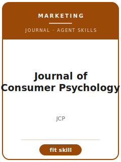

# Journal of Consumer Psychology Skills

<p align="center"></p>

[English](README.md) | 简体中文

面向 **Journal of Consumer Psychology（JCP）** 投稿的 12 个 agent skills。本包围绕 consumer psychology, judgment and decision-making, persuasion, emotion, identity, and consumption behavior 设计，帮助稿件区别于 Journal of Consumer Research, Journal of Marketing Research, Marketing Science, and Psychological Science，并强调 psychological mechanism evidence tied to consumer behavior and marketing theory。

**官方依据核验日期：2026-06**（投稿前需复核易变细节）：见 [`resources/official-source-map.md`](resources/official-source-map.md)。

## 为什么需要单独的技能栈？

| JCP 约束 | 对稿件的要求 |
|-------------------|--------------|
| 范围 | 主张必须服务于 consumer psychology, judgment and decision-making, persuasion, emotion, identity, and consumption behavior |
| 同门边界 | 说明为什么不是 Journal of Consumer Research, Journal of Marketing Research, Marketing Science, and Psychological Science |
| 证据标准 | 设计、模型、综述或质性证据必须匹配 psychological mechanism evidence tied to consumer behavior and marketing theory |
| 来源纪律 | 当前流程事实必须有来源，或明确标记 待核实 |

## 快速开始

```text
/plugin marketplace add ./Journal-of-Consumer-Psychology-Skills
/plugin install jcp-skills
```

手动使用：先打开 [`skills/jcp-workflow/SKILL.md`](skills/jcp-workflow/SKILL.md)。

## 默认工作流

```text
jcp-workflow → jcp-topic-selection → jcp-theory-development → jcp-literature-positioning → jcp-methods → jcp-data-analysis → jcp-contribution-framing → jcp-tables-figures → jcp-writing-style → jcp-submission → jcp-review-process → jcp-rebuttal
```

## 技能列表

| # | Skill | 作用 |
|---|-------|------|
| 1 | [`jcp-workflow`](skills/jcp-workflow/SKILL.md) | 面向 JCP 稿件的 Workflow Router |
| 2 | [`jcp-topic-selection`](skills/jcp-topic-selection/SKILL.md) | 面向 JCP 稿件的 Topic Selection |
| 3 | [`jcp-theory-development`](skills/jcp-theory-development/SKILL.md) | 面向 JCP 稿件的 Theory Development |
| 4 | [`jcp-literature-positioning`](skills/jcp-literature-positioning/SKILL.md) | 面向 JCP 稿件的 Literature Positioning |
| 5 | [`jcp-methods`](skills/jcp-methods/SKILL.md) | 面向 JCP 稿件的 Methods |
| 6 | [`jcp-data-analysis`](skills/jcp-data-analysis/SKILL.md) | 面向 JCP 稿件的 Data Analysis |
| 7 | [`jcp-contribution-framing`](skills/jcp-contribution-framing/SKILL.md) | 面向 JCP 稿件的 Contribution Framing |
| 8 | [`jcp-tables-figures`](skills/jcp-tables-figures/SKILL.md) | 面向 JCP 稿件的 Tables and Figures |
| 9 | [`jcp-writing-style`](skills/jcp-writing-style/SKILL.md) | 面向 JCP 稿件的 Writing Style |
| 10 | [`jcp-submission`](skills/jcp-submission/SKILL.md) | 面向 JCP 稿件的 Submission Preflight |
| 11 | [`jcp-review-process`](skills/jcp-review-process/SKILL.md) | 面向 JCP 稿件的 Review Process |
| 12 | [`jcp-rebuttal`](skills/jcp-rebuttal/SKILL.md) | 面向 JCP 稿件的 Rebuttal Strategy |

## 资源

- [`resources/README.md`](resources/README.md) — 资源索引
- [`resources/official-source-map.md`](resources/official-source-map.md) — 官方 URL 与易变信息
- [`resources/external_tools.md`](resources/external_tools.md) — 数据库、方法与软件工具
- [`resources/worked-examples/01-introduction.md`](resources/worked-examples/01-introduction.md) — 虚构引言改写示例
- [`resources/exemplars/library.md`](resources/exemplars/library.md) — 真实论文槽位与来源纪律
- [`resources/code/`](resources/code/) — 适用时使用的实证代码脚手架

## 许可

MIT (c) 2026 Bryce Wang。见 [LICENSE](LICENSE)。
