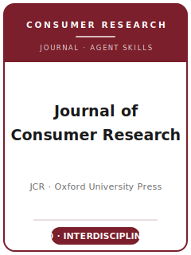

# 《消费者研究杂志》（JCR）技能包

<p align="center">
  
</p>

[](LICENSE)
[](https://consumerresearcher.com/about)
[](https://academic.oup.com/jcr)
[](https://github.com/anthropics/claude-code)

[English](README.md) | 简体中文

面向 **《消费者研究杂志》（Journal of Consumer Research, JCR）** 投稿的智能体技能栈。JCR 是消费者行为研究领域的多学科旗舰期刊，由牛津大学出版社（OUP）代表 Journal of Consumer Research, Inc. 出版。

本仓库立场鲜明，**不是**泛泛的"营销写作"工具箱，而是 **JCR 专用**技能栈，围绕 JCR 的核心门槛构建：必须做出清晰的**概念性贡献**，即*推进、深化或推翻*关于消费的既有理论，并以恰当的经验证据支撑。涵盖消费者行为选题、跨学科理论建构、在心理学/人类学/社会学/经济学之间的文献定位、多研究实验设计与消费者文化理论（CCT）设计、过程证据与可信度、概念贡献陈述、芝加哥体例的图表与文风、ScholarOne 投稿、双向匿名评审，以及多轮 R&R 回应。

> 仅沉淀稳定规范。主编、费用、具体上限与政策会变动——请始终在 consumerresearcher.com 与 OUP 的 JCR 投稿说明中核实。本技能包事实的访问日期为 **2026-06-01**，见 [`resources/official-source-map.md`](resources/official-source-map.md)；未经核实的条目标记为 **待核实**。

---

## 为什么需要独立的 JCR 技能栈？

JCR 的约束与其他营销/行为类期刊有实质差异：

| 约束维度   | 《消费者研究杂志》                                       | 含义                                              |
|------------|----------------------------------------------------------|---------------------------------------------------|
| 学科       | 多学科消费者**行为**（心理/人类学/社会学/经济学）          | 纯建模、纯战略或纯管理类论文不契合                  |
| 核心门槛   | 关于消费的**概念性贡献**                                  | 仅有稳健效应而无理论推进会被视为技术报告            |
| 两类体裁   | 多研究**实验** *与* 解释性 **CCT** 工作                    | 民族志与实验室实验平起平坐、同台竞争                |
| 必备关卡   | 300 词的**消费者相关性与贡献陈述**                         | JCR 专有，独立于 200 词摘要                         |
| 篇幅       | **60 页双倍行距**，图表**嵌入正文且计入篇幅**              | 是页数上限而非字数上限；40 MB 网络附录承载溢出内容  |
| 透明度     | 第 6 步**数据收集声明**、指定仓库、复现代码                | 受邀修改时强制要求；数据保留 7 年                   |
| 体例       | **芝加哥格式手册**（非 APA）；Word                         | 文献请配置为芝加哥而非 APA                          |
| 评审       | **双向匿名**；ScholarOne；发展性、多轮                     | 首轮直接录用几乎闻所未闻                            |
| 费用       | **无**投稿或发表费（OUP 订阅模式）                         | 仅可选的开放获取与彩印费用                          |

泛用的"科学写作"或"营销方法"技能包无法覆盖这些约束。

---

## 快速开始

### 方式 A —— Claude Code 插件（推荐）

```bash
/plugin marketplace add https://github.com/brycewang-stanford/jcr-skills
/plugin install jcr-skills
/reload-plugins
```

### 方式 B —— 手动复制

```bash
git clone https://github.com/brycewang-stanford/jcr-skills.git
cd jcr-skills

mkdir -p ~/.claude/skills && cp -R skills/jcr-* ~/.claude/skills/
# 或
mkdir -p ~/.codex/skills && cp -R skills/jcr-* ~/.codex/skills/
```

### 第一条指令

```
用 jcr-workflow 告诉我，我的 JCR 稿件下一步该用哪个技能。
```

---

## 默认工作流

```text
jcr-topic-selection
        ▼
jcr-theory-development
        ▼
jcr-literature-positioning
        ▼
jcr-methods
        ▼
jcr-data-analysis
        ▼
jcr-contribution-framing
        ▼
jcr-tables-figures
        ▼
jcr-writing-style        （润色）
        ▼
jcr-submission
        ▼
jcr-review-process
        ▼
jcr-rebuttal
```

`jcr-workflow` 是路由器——它根据你当前所处阶段，告诉你下一步该用哪个技能。

---

## 技能列表

| 技能                          | 用途                                                                  |
|-------------------------------|-----------------------------------------------------------------------|
| `jcr-workflow`                | 路由器——决定下一步调用哪个子技能                                       |
| `jcr-topic-selection`         | 消费者行为问题 + JCR 契合度检验（对照 JCP/JMR/JM）                     |
| `jcr-theory-development`      | 心理过程与假设（实验）或扎根理论（CCT）                                |
| `jcr-literature-positioning`  | 加入跨学科对话；以问题化取代找缺口                                     |
| `jcr-methods`                 | 多研究实验、CCT 田野、混合设计、注册报告                               |
| `jcr-data-analysis`           | 过程证据（中介/调节、聚光分析）、CCT 可信度                            |
| `jcr-contribution-framing`    | 概念性贡献 + 300 词消费者相关性陈述                                    |
| `jcr-tables-figures`          | 研究汇总表、过程图、交互/聚光图，芝加哥体例                            |
| `jcr-writing-style`           | 前置论点、跨学科可读的文风；芝加哥体例；匿名化                         |
| `jcr-submission`              | ScholarOne 投稿前检查：匿名化、60 页上限、数据收集声明                 |
| `jcr-review-process`          | JCR 双向匿名评审/决议如何运作；如何读决议信                            |
| `jcr-rebuttal`                | 多轮 R&R 修改与逐条回应信                                             |

### 资源

- [`resources/external_tools.md`](resources/external_tools.md) —— 被试招募（Prolific/CloudResearch/Qualtrics）、分析（R/PROCESS/聚光分析）、CCT 工具（NVivo/ATLAS.ti），以及 JCR 指定仓库（OSF/Harvard Dataverse/QDR/ResearchBox）
- [`resources/official-source-map.md`](resources/official-source-map.md) —— 每条核实事实背后的 JCR/OUP 官方网址（访问日期 2026-06-01）

---

## 与 JCP / JMR / JM 的差异

| 维度        | JCR                                  | JCP                  | JMR                          | JM                       |
|-------------|--------------------------------------|----------------------|------------------------------|--------------------------|
| 范围        | 消费者**行为**，跨学科                | 消费者**心理**       | 广义营销研究                 | 广义营销，偏管理          |
| 核心贡献    | 关于消费的概念性理论                  | 心理过程             | 方法/实质性营销              | 管理 + 实质性             |
| 标志方法    | 多研究实验 **+ CCT**                  | 行为实验             | 实验、建模、调查             | 混合，含建模              |
| 默认体例    | **芝加哥**格式手册                    | 偏 APA               | 各刊自定                     | 各刊自定                 |

如果你的论文是分析建模、战略或管理类营销贡献，没有真正推进消费者理论，请投 **JMR / JM / Marketing Science** 而非 JCR。纯心理过程类论文可考虑 **JCP**。

---

## 相关

- [awesome-journal-skills](https://github.com/brycewang-stanford/awesome-journal-skills) —— 期刊专用技能包索引

---

## 许可证

MIT
