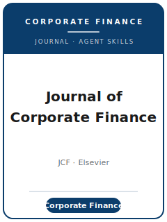

# Journal of Corporate Finance 技能包

<p align="center">
  
</p>

[](LICENSE)
[](https://www.sciencedirect.com/journal/journal-of-corporate-finance)
[](https://www.sciencedirect.com/journal/journal-of-corporate-finance)
[](https://github.com/anthropics/claude-code)

[English](README.md) | 简体中文

面向 **Journal of Corporate Finance（JCF，《公司金融杂志》）** 投稿的 agent 技能栈。JCF 是 **Elsevier（爱思唯尔）** 旗下期刊，发表**实证与理论公司金融**研究：资本/财务结构、公司治理、股利与回购、金融契约、风险管理、创新、并购（M&A）以及国际公司金融，并涵盖公司金融与宏观经济、资产定价、家庭/行为金融、金融科技/区块链、法与金融、金融中介、市场微观结构等交叉领域。

本仓库立场鲜明：它**不是**通用的金融写作工具箱，而是一套**JCF 专属**技能栈——一个可信的公司金融问题、对企业层面数据可辩护的识别策略、严谨的稳健性、自洽的图表、符合 Elsevier Option C 的数据可得性声明，以及针对 JCF 预付费用与活跃 desk-rejection 初筛而调校的流程。

---

## 为什么需要单独的 JCF 技能栈？

JCF 的约束与综合性 top-5 期刊或方法类期刊有实质差异：

| 约束           | JCF                                                          | 含义                                            |
|----------------|-------------------------------------------------------------|-------------------------------------------------|
| 范围           | 实证**与**理论**公司金融**                                  | 纯资产定价或纯会计计量论文不对口                |
| 篇幅           | 全文 **或** “shorter format” 短文；**无固定字数上限**（待核实） | 单一干净结论可走短文形式                        |
| 投稿系统       | 经 ScienceDirect 进入 **Editorial Manager**                | 非 Editorial Express、非 ScholarOne             |
| 费用           | **US$340 不可退**，投稿时预付；desk reject 也不退           | 须列入预算；通过初筛很关键                      |
| 审稿模式       | **单向匿名（single-blind）**；至少两位审稿人                | **不要**对稿件做匿名化处理                      |
| 初筛政策       | **活跃 desk rejection**，不进入全程评审即拒                 | 贡献与识别须在首页即清晰可读                    |
| 摘要           | **≤ 250 词**，不含参考文献；1–7 个关键词                    | 过长或堆砌引用的摘要显得不合规范                |
| 参考文献       | **作者-年份**；首投“your paper, your way”                   | 任意一致风格 + 完整要素 + DOI；修回时再正式排版 |
| 数据政策       | **Elsevier Option C**（数据可得性声明）                     | 无 JFE-Data-Archive 式强制存档（待核实）        |
| 福利           | 投稿即可免费一体化发布 **SSRN** 预印本                      | 可选，带 DOI 的即时公开预印本                   |

通用“科研写作”或“经济学写作”技能包无法覆盖上述约束。可变细节（现任编辑、确切费用、摘要上限、数据政策）会变动——**请以官方 Guide for Authors 为准重新核实**。

---

## 快速开始

### 方式 A — Claude Code 插件（推荐）

```bash
/plugin marketplace add https://github.com/brycewang-stanford/jcf-skills
/plugin install jcf-skills
/reload-plugins
```

### 方式 B — 手动复制

```bash
git clone https://github.com/brycewang-stanford/jcf-skills.git
cd jcf-skills

mkdir -p ~/.claude/skills && cp -R skills/jcf-* ~/.claude/skills/
# 或
mkdir -p ~/.codex/skills && cp -R skills/jcf-* ~/.codex/skills/
```

---

## 12 个技能

| 技能 | 职责 |
|------|------|
| `jcf-workflow` | 编排 JCF 全流程并路由到其余技能 |
| `jcf-topic-selection` | 范围对口；全文 vs. 短文形式 |
| `jcf-literature-positioning` | 定位公司金融文献支脉与边际贡献 |
| `jcf-identification-strategy` | 针对企业内生决策的因果设计（DID/IV/RDD/事件研究/匹配） |
| `jcf-data-analysis` | WRDS 时代面板、固定效应、聚类、稳健性 |
| `jcf-tables-figures` | 自洽的表格与事件研究/CAR 图 |
| `jcf-contribution-framing` | 一句话讲清“新在哪、为何重要”，通过初筛 |
| `jcf-writing-style` | ≤250 词摘要、关键词、作者-年份引用 |
| `jcf-replication-and-data-policy` | Elsevier Option C 数据可得性声明与存档 |
| `jcf-review-process` | 单向匿名模式、两名以上审稿人、声明事项 |
| `jcf-submission` | Editorial Manager 投稿前检查、US$340 费用、声明 |
| `jcf-rebuttal` | 面对分歧审稿意见的逐条 R&R 回复 |

---

## JCF 关键事实（核验于 2026-06-01；请以官方指南为准重新确认）

- **出版商**：Elsevier。**投稿**：经 ScienceDirect “Submit your article” 链接进入 Editorial Manager。
- **费用**：US$340.00 不可退投稿费，投稿时缴纳；desk reject 也不退。
- **审稿**：单向匿名（single-blind）；至少两名审稿人；活跃 desk-rejection 政策。
- **摘要**：≤ 250 词；1–7 个关键词；摘要内不引用文献。
- **参考文献**：作者-年份（Harvard）；首投“your paper, your way”（风格一致即可），修回时按 Elsevier 正式排版。
- **数据**：Elsevier “Research Data” Option C——声明可得性；存放/引用代码与数据，或说明不能共享的原因。
- **联合主编（Co-Editors-in-Chief）**：Kristine Hankins（肯塔基大学）、Heitor Almeida（伊利诺伊大学厄巴纳-香槟分校）；联合编辑（Co-Editors）包括 Morten Bennedsen、Simi Kedia、Evgeny Lyandres、Xuan Tian、Tracy Wang（在职名单请按 source map 重新核实）。
- **福利**：投稿即可免费一体化发布 SSRN 预印本。

无法完全核实的事项（如硬性篇幅上限、单独的修回费用、当前 APC）在 [`resources/official-source-map.md`](resources/official-source-map.md) 中标记为 **待核实**，不作为确定结论使用。

---

## 资源

- [`resources/official-source-map.md`](resources/official-source-map.md) — 每条使用事实、官方 URL 及访问日期（2026-06-01）；未核实项标 待核实。
- [`resources/external_tools.md`](resources/external_tools.md) — 数据源（Compustat/CRSP/SDC/DealScan）、Stata/R/Python 包，以及实证公司金融的设计工具箱。

---

## 免责声明

这是非官方的社区技能包，与 Elsevier 或 Journal of Corporate Finance 无任何隶属或背书关系。投稿前请始终以官方 Guide for Authors 的最新要求为准。

## 许可

MIT — 见 [LICENSE](LICENSE)。
