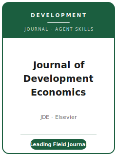

# 《发展经济学杂志》技能包（Journal of Development Economics Skills）

<p align="center">
  
</p>

[](LICENSE)
[](https://www.sciencedirect.com/journal/journal-of-development-economics)
[](https://www.sciencedirect.com/journal/journal-of-development-economics)
[](https://github.com/anthropics/claude-code)

[English](README.md) | 简体中文

面向 **《发展经济学杂志》（Journal of Development Economics, JDE）** 投稿的智能体（agent）技能包。JDE 是 **发展经济学领域的旗舰期刊**，由 **爱思唯尔（Elsevier）** 出版，现任 Editors-in-Chief 为 **A. Foster** 与 **K. Macours**。JDE 发表关于发展中国家经济与经济发展进程的理论与实证研究。

本仓库是有明确立场的，**不是**一个通用的经济学写作工具箱，而是 **专为 JDE 与发展经济学定制** 的技能栈：聚焦中低收入经济体的一阶（first-order）问题，在真实而嘈杂的田野环境中做可信识别（RCT / DID / IV / RDD），以福利相关的量纲呈现效应，配套详尽的在线附录，并准备一份 **在评审阶段即可被调取、强制要求的复制包**，托管于 Mendeley Data。

---

## JDE 是什么？为何需要专门的技能包？

JDE 的约束条件与综合性顶刊或方法类期刊不同：

| 约束          | JDE                                                            | 含义                                         |
|---------------|----------------------------------------------------------------|----------------------------------------------|
| 范围          | 发展中国家经济 / 经济发展进程                                   | 仅用中低收入国家数据的通用微观结果不对口      |
| 看重          | **一阶发展问题** + 可信识别                                     | 技术优先或纯描述性论文难以通过                |
| 识别          | RCT/田野实验、DID、IV、RDD——并为田野环境辩护                    | 仅靠 OLS + 控制变量不够                       |
| 出版方 / 系统 | **爱思唯尔**，经 **Editorial Manager** 投稿                     | 非 OUP/Editorial Express；单向匿名评审        |
| 评审模式      | **单向匿名**（审稿人知道作者身份）                              | 不要按双向盲审匿名化稿件                      |
| 费用          | 原稿 **50 美元不可退投稿费**；可选开放获取 APC 仅在录用后产生     | 投稿前预算并核验 live 付款页面                 |
| 录取难度      | 每年约 1300 篇投稿，约 1/4 送审，**录用率约 6-8%**              | 干净、完整、定位清晰的稿件很重要              |
| 复制政策      | **强制**；数据/代码托管于 **Mendeley Data**，**评审阶段即可调取** | 投稿前就要把复制包准备好                      |
| 投稿上限      | **每位作者 12 个月内不超过 3 篇**                               | 提前规划投稿节奏                              |
| 特色通道      | 预结果评审（Registered Reports）+ 仿 AER: Insights 短文通道     | 一开始就选对赛道                              |

官方 ScienceDirect 页面已于 **2026-06-20** 刷新到 [`resources/official-source-map.md`](resources/official-source-map.md)。投稿级建议前仍须重开 live 页面，因为费用、编辑名单、special issue 与政策措辞可能变化。

### 三条投稿通道

- **全长（标准）通道：** 无固定篇幅限制；要求详尽的在线附录。
- **短文（有限修改）通道：** 仿照 **AER: Insights**——正文 ≤ 6000 词，展品（表/图）≤ 5 个，在线附录 ≤ 20 页；送审稿通常在 **6-8 周** 内决定，采用 conditional accept / reject 的有限修改结构。
- **预结果评审（Registered Reports）：** **常设** 通道（与 **BITSS** 合作）——提交第一阶段方案（假设、流程、统计分析计划、功效分析、若有则含试点数据）≤ 60 页，摘要 ≤ 150 词；在 **结果未知前获得原则性接受**，之后再提交第二阶段稿件。

---

## 快速开始

### 方式 A — Claude Code 插件（推荐）

```bash
/plugin marketplace add https://github.com/brycewang-stanford/jde-skills
/plugin install jde-skills
/reload-plugins
```

### 方式 B — 手动复制

```bash
git clone https://github.com/brycewang-stanford/jde-skills.git
cd jde-skills

mkdir -p ~/.claude/skills && cp -R skills/jde-* ~/.claude/skills/
# 或
mkdir -p ~/.codex/skills && cp -R skills/jde-* ~/.codex/skills/
```

### 第一条提示词

```
用 jde-workflow 告诉我，我的 JDE 稿件下一步该用哪个技能。
```

---

## 默认工作流

```text
jde-topic-selection（选题）
        ▼
jde-literature-positioning（文献定位）
        ▼
jde-contribution-framing（贡献提炼）
        ▼
jde-identification-strategy（识别策略）
        ▼
jde-data-analysis（数据分析）
        ▼
jde-tables-figures（表与图）
        ▼
jde-writing-style（打磨）
        ▼
jde-replication-and-data-policy（复制与数据政策）
        ▼
jde-review-process（评审流程）
        ▼
jde-submission（投稿预检）
        ▼
jde-rebuttal（修回与回复）
```

`jde-workflow` 是路由器——根据你所处的阶段告诉你下一步用哪个技能。若研究设计是 **前瞻性的**，请尽早转入 `jde-review-process`，以使用预结果评审通道。

---

## 技能列表

| 技能                               | 用途                                                              |
|------------------------------------|-------------------------------------------------------------------|
| `jde-workflow`                     | 路由器——决定下一步调用哪个子技能                                   |
| `jde-topic-selection`              | 判断是否为一阶发展问题、是否对口                                   |
| `jde-literature-positioning`       | 在发展经济学前沿中确立贡献                                         |
| `jde-contribution-framing`         | 把发展含义说清楚、量纲与福利相关                                   |
| `jde-identification-strategy`      | 面向田野环境的可信因果设计（RCT / DID / IV / RDD）                |
| `jde-data-analysis`                | 估计、异质性、样本流失、测量、聚类推断                            |
| `jde-tables-figures`               | 以图为先、注释自洽的展品                                           |
| `jde-writing-style`                | 让问题与政策意义对发展领域读者清晰落地                            |
| `jde-replication-and-data-policy`  | 强制、评审即可调取的数据+代码复制包（Mendeley Data）             |
| `jde-review-process`               | 在全长 / 短文 / 预结果通道之间做选择                              |
| `jde-submission`                   | Editorial Manager 投稿预检                                         |
| `jde-rebuttal`                     | 修回回复策略（含短文通道单轮修改）                                |

### 资源

- [`resources/external_tools.md`](resources/external_tools.md) — 发展经济学数据源（LSMS / DHS / WDI / AEA RCT Registry）与可信设计田野工作的 Stata / R / Python 包
- [`resources/official-source-map.md`](resources/official-source-map.md) — 当前 JDE 流程事实背后的官方链接，2026-06-20 已刷新

---

## 本仓库不做什么

- 不替你写出可直接投稿的稿件
- 不模拟任何特定编辑或审稿人的口味
- 不冻结易变元数据（费用、编辑名单、APC、special issue、政策措辞）；真正投稿前必须重新核验 live 页面
- 不替你判断你的发展问题是否真的属于一阶问题——这是研究者自己的判断

---

## 相关链接

- [awesome-journal-skills](https://github.com/brycewang-stanford/awesome-journal-skills) — 期刊专属技能包索引
- [Journal of Development Economics（官方）](https://www.sciencedirect.com/journal/journal-of-development-economics) — 爱思唯尔 / ScienceDirect
- [JDE 预结果评审（BITSS）](https://www.bitss.org/publishing/jde/) — Registered Reports 通道

---

## 许可证

MIT
