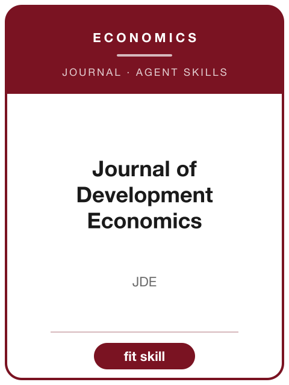

<!-- AJS-ROOT-JOURNAL-ENTRY -->
# Journal of Development Economics

> Publishes theoretical and empirical research on economic development across micro and macro aspects in low- and middle-income economies.

| At a glance | |
|---|---|
| **Field** | Development economics |
| **Publisher** | Elsevier |
| **Founded** | 1974 |
| **ISSN** | 0304-3878 (print) · 1872-6089 (online) |
| **Frequency** | Bimonthly |
| **Standing** | SSCI |
| **Official** | [sciencedirect.com](https://www.sciencedirect.com/journal/journal-of-development-economics) |
| **Checked** | 2026-06-17 |

**▶ Use the skill — [`journal-of-development-economics`](../English-SocialScience-Journal-Skills/skills/journal-of-development-economics/):** venue fit, framing, the method-and-evidence bar, house style, and desk-reject heuristics.

Part of the **[English Social-Science Journal Skills](../English-SocialScience-Journal-Skills/)** bundle. Always re-check the live author guidelines on the official site before submitting.

---

<!-- Machine-readable canonical pointer — do not remove or alter (validated by tools/audit_repo.py). -->

- Canonical skill: [English-SocialScience-Journal-Skills/skills/journal-of-development-economics/](../English-SocialScience-Journal-Skills/skills/journal-of-development-economics/)
- Skill name: `journal-of-development-economics`
- Bundle: [English-SocialScience-Journal-Skills/](../English-SocialScience-Journal-Skills/)

This folder intentionally does not contain a `SKILL.md`; the installable skill stays inside the bundle so plugin paths and skill counts remain stable.
