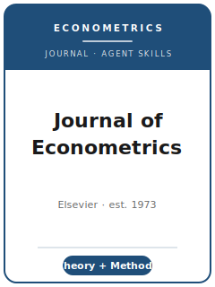

<p align="center">
  
</p>

<h1 align="center">Journal of Econometrics Skills (joe-skills)</h1>

<p align="center">
  An opinionated, twelve-skill agent stack for manuscripts targeted at the
  <a href="https://www.sciencedirect.com/journal/journal-of-econometrics"><b>Journal of Econometrics</b></a> (JoE) —
  the Elsevier flagship for <b>econometric methodology</b> (theory + applied methods).
</p>

<p align="center">
  <a href="LICENSE"></a>
  
  
</p>

> **English** | [简体中文](README.zh-CN.md)

## What this is

`joe-skills` is a Claude Code plugin: a bundle of twelve agent **skills** that encode how to take a paper from idea to acceptance at the *Journal of Econometrics* — a peer-reviewed Elsevier journal (founded 1973) for **substantive contributions to econometric methodology**: identification, estimation, testing, decision, and prediction problems in economic research, plus applications of econometric techniques. The center of gravity is a **new estimator, test, identification result, or asymptotic theory**, defended with proofs and **Monte Carlo evidence** — not a purely applied finding.

Each skill is tuned to JoE's actual norms, not a generic template. Co-Editors-in-Chief: **Michael Jansson** (UC Berkeley) and **Aureo de Paula** (UCL).

## Why JoE is different (and the skills reflect it)

| JoE reality | How the pack uses it |
|---|---|
| Self-hosted **Editorial Express** portal (db `je`), not Editorial Manager | `joe-submission`, `joe-workflow` route to the right portal (待核实 vs. ScienceDirect text) |
| **USD $75 nonrefundable fee**, proof-of-payment uploaded *before* submission | `joe-submission` preflight makes the fee a blocking step |
| **PDF-only**, ~40 pages (≥1.5 spacing, 11pt); **250-word** abstract | `joe-tables-figures`, `joe-writing-style`, `joe-submission` |
| **Single-anonymized** review; editor screen → ≥2 referees | `joe-review-process`, `joe-rebuttal` |
| Three tracks: **Regular / Annals / Themed** (Guest Associate Editors) | `joe-topic-selection`, `joe-review-process` |
| **elsarticle** LaTeX class; Elsevier **`[dataset]`** citations | `joe-writing-style`, `joe-replication-and-data-policy` |
| **No** mandatory central replication archive (encouraged, not mandated) | `joe-replication-and-data-policy` (待核实) |
| Honorific **"Fellow of the Journal of Econometrics"** (4+ articles) | context in `joe-workflow` |

## The twelve skills

| # | Skill | Use it when |
|---|---|---|
| 1 | `joe-workflow` | Deciding which skill to use next; sequencing the whole manuscript |
| 2 | `joe-topic-selection` | Is this a real methodological contribution, or an applied paper? |
| 3 | `joe-literature-positioning` | Locating the advance against the nearest estimator/test |
| 4 | `joe-identification-strategy` | Assumptions, regularity conditions, asymptotics, proof plan |
| 5 | `joe-data-analysis` | Monte Carlo design (size/power) + empirical illustration |
| 6 | `joe-contribution-framing` | Saying why the result matters to econometrics |
| 7 | `joe-tables-figures` | Size/power tables and theory-illustrating figures |
| 8 | `joe-writing-style` | 250-word abstract, contribution-first intro, legible proofs |
| 9 | `joe-replication-and-data-policy` | Reproducible code/data under Elsevier norms |
| 10 | `joe-review-process` | Single-anonymized review, tracks, what referees look for |
| 11 | `joe-submission` | Editorial Express preflight (fee, PDF, abstract, track) |
| 12 | `joe-rebuttal` | Response letter + revised manuscript after a revision request |

## Default order

`joe-topic-selection` → `joe-literature-positioning` → `joe-identification-strategy` → `joe-data-analysis` → `joe-contribution-framing` → `joe-tables-figures` → `joe-writing-style` → `joe-replication-and-data-policy` → `joe-review-process` → `joe-submission` → `joe-rebuttal`. Use `joe-workflow` any time to find the current bottleneck.

## Repository layout

```
Journal-of-Econometrics-Skills/
├── .claude-plugin/
│   ├── plugin.json
│   └── marketplace.json
├── assets/cover.svg
├── resources/
│   ├── official-source-map.md     # every fact → official URL (accessed 2026-06-01)
│   └── external_tools.md          # simulation/estimation tooling for methodology
├── skills/
│   ├── joe-workflow/SKILL.md
│   ├── joe-topic-selection/SKILL.md
│   ├── joe-literature-positioning/SKILL.md
│   ├── joe-identification-strategy/SKILL.md
│   ├── joe-data-analysis/SKILL.md
│   ├── joe-contribution-framing/SKILL.md
│   ├── joe-tables-figures/SKILL.md
│   ├── joe-writing-style/SKILL.md
│   ├── joe-replication-and-data-policy/SKILL.md
│   ├── joe-review-process/SKILL.md
│   ├── joe-submission/
│   │   ├── SKILL.md
│   │   └── templates/checklist.md
│   └── joe-rebuttal/SKILL.md
├── LICENSE
└── README.md / README.zh-CN.md
```

## A note on verification

Journal policies change, and several Elsevier/ScienceDirect pages return HTTP 403 to automated fetches. Facts captured indirectly are tagged **待核实** ("to be verified") in the skills and in [`resources/official-source-map.md`](resources/official-source-map.md). Re-confirm the fee, abstract/page limits, portal routing, editorial board, and data policy on the live official pages before relying on them.

## License

[MIT](LICENSE) © 2026 Bryce Wang. Not affiliated with or endorsed by Elsevier or the Journal of Econometrics.
