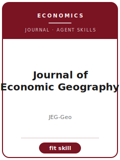

# Journal of Economic Geography Skills

<p align="center"></p>

[](LICENSE)
[](https://academic.oup.com/joeg)
[](https://academic.oup.com/joeg)

English | [简体中文](README.zh-CN.md)

Twelve agent skills for manuscripts targeted at **Journal of Economic Geography (JEG)**. The pack is tuned to economic geography, spatial economics, regional development, innovation clusters, trade, and place-based policy; it keeps the manuscript distinct from Journal of Urban Economics, Regional Studies, Economic Geography, and Journal of International Economics and emphasizes spatial economic argument that combines maps, mechanisms, and regional theory.

**Official basis checked 2026-06** (re-check volatile details before submission): see [`resources/official-source-map.md`](resources/official-source-map.md).

## Why a separate stack?

| JEG constraint | What it forces |
|-------------------------|----------------|
| Scope | The main claim must speak to economic geography, spatial economics, regional development, innovation clusters, trade, and place-based policy |
| Sibling boundary | The paper must explain why it belongs here rather than Journal of Urban Economics, Regional Studies, Economic Geography, and Journal of International Economics |
| Evidence standard | Designs, models, reviews, or qualitative evidence must match spatial economic argument that combines maps, mechanisms, and regional theory |
| Source discipline | Current process facts are cited or marked 待核实 |

## Quick Start

```text
/plugin marketplace add ./Journal-of-Economic-Geography-Skills
/plugin install journal-of-economic-geography-skills
```

Manual use: start with [`skills/jegeo-workflow/SKILL.md`](skills/jegeo-workflow/SKILL.md).

## Default Workflow

```text
jegeo-workflow → jegeo-topic-selection → jegeo-literature-positioning → jegeo-identification → jegeo-theory-model → jegeo-robustness → jegeo-tables-figures → jegeo-writing-style → jegeo-replication-package → jegeo-referee-strategy → jegeo-submission → jegeo-rebuttal
```

## Skills

| # | Skill | What it does |
|---|-------|--------------|
| 1 | [`jegeo-workflow`](skills/jegeo-workflow/SKILL.md) | Workflow Router for JEG manuscripts |
| 2 | [`jegeo-topic-selection`](skills/jegeo-topic-selection/SKILL.md) | Topic Selection for JEG manuscripts |
| 3 | [`jegeo-literature-positioning`](skills/jegeo-literature-positioning/SKILL.md) | Literature Positioning for JEG manuscripts |
| 4 | [`jegeo-identification`](skills/jegeo-identification/SKILL.md) | Identification Strategy for JEG manuscripts |
| 5 | [`jegeo-theory-model`](skills/jegeo-theory-model/SKILL.md) | Theory and Model Craft for JEG manuscripts |
| 6 | [`jegeo-robustness`](skills/jegeo-robustness/SKILL.md) | Robustness Strategy for JEG manuscripts |
| 7 | [`jegeo-tables-figures`](skills/jegeo-tables-figures/SKILL.md) | Tables and Figures for JEG manuscripts |
| 8 | [`jegeo-writing-style`](skills/jegeo-writing-style/SKILL.md) | Writing Style for JEG manuscripts |
| 9 | [`jegeo-replication-package`](skills/jegeo-replication-package/SKILL.md) | Replication Package for JEG manuscripts |
| 10 | [`jegeo-referee-strategy`](skills/jegeo-referee-strategy/SKILL.md) | Referee Strategy for JEG manuscripts |
| 11 | [`jegeo-submission`](skills/jegeo-submission/SKILL.md) | Submission Preflight for JEG manuscripts |
| 12 | [`jegeo-rebuttal`](skills/jegeo-rebuttal/SKILL.md) | Rebuttal Strategy for JEG manuscripts |

## Resources

- [`resources/README.md`](resources/README.md) — resource index
- [`resources/official-source-map.md`](resources/official-source-map.md) — official URLs and volatile checks
- [`resources/external_tools.md`](resources/external_tools.md) — databases, methods, and software aids
- [`resources/worked-examples/01-introduction.md`](resources/worked-examples/01-introduction.md) — fictional before/after introduction
- [`resources/exemplars/library.md`](resources/exemplars/library.md) — real-paper slots with source discipline
- [`resources/code/`](resources/code/) — empirical code kit where applicable

## Related Links

- https://academic.oup.com/joeg
- https://academic.oup.com/joeg/pages/General_Instructions

## License

MIT (c) 2026 Bryce Wang. See [LICENSE](LICENSE).
