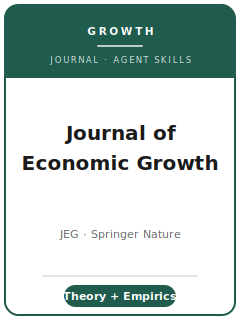

  

<h1 align="center">Journal of Economic Growth（经济增长杂志）— Agent Skills</h1>

  面向投稿 <strong>Journal of Economic Growth（JEG，经济增长杂志）</strong> 的、
  针对该刊定制的 Agent 技能包。JEG 是 Springer Nature 旗下专注于
  <strong>经济增长与动态宏观经济学</strong> 的专业期刊。

  <a href="README.md">English</a>

---

## 这是什么

十二个可组合的技能，覆盖一篇增长论文从选题到投稿、再到修回的全流程，每个技能都按
JEG 的真实规范调校，而非泛泛而谈。JEG **不是** 综合性经济学期刊：其范围限定于增长与
动态宏观经济学——新古典与内生增长、人力资本、生育率与人口转型、贸易与增长、金融发展
与增长、移民、技术进步、增长的政治经济学，以及世代交叠（OLG）模型。该刊 **同时发表
严谨的理论与扎实的实证**，因此这些技能在全程都会按论文类型分支处理。

主编为 **Oded Galor**（布朗大学与耶路撒冷希伯来大学），由 **Springer Nature** 出版
（创刊于 1996 年，季刊；ISSN 1381-4338 印刷版 / 1573-7020 电子版）。

## 技能中内置的关键期刊事实

- **投稿** 通过 Springer Nature 的 "Submit manuscript" 系统
  （`submission.nature.com/new-submission/10887/3`）——**不是** Editorial Express。
- **无投稿/处理费。** 混合出版期刊；可选开放获取（Open Choice）的 APC 为
  GBP 3,090 / USD 4,590 / EUR 3,590（截至 2026-06-01；会定期调整——请核实）。
- **首选 LaTeX**（Springer Nature 模板），**接受 Word (.docx)**。
  **每次投稿与修回都必须提供可编辑源文件。**
- **参考文献** 采用作者-年份正文引用，文献表用 **APA 第 7 版** 格式。
- **标题页** 必须包含摘要（**150-250 词**）、**4-6 个关键词**、**JEL 分类代码**、
  ORCID、通讯作者邮箱，以及 **Statements/Declarations（声明）** 部分。
- **官方未规定正文字数/篇幅上限。**
- 需提供 **数据可得性声明（Data Availability Statement）**（遵循 Springer Nature
  研究数据政策）。JEG **没有** AEA/Econometrica 式的强制代码存档或数据编辑制度
  （待核实——见 source map）。
- **作者贡献** 与 **利益冲突** 声明在投稿系统内填写；**大语言模型（LLM）不能作为作者**，
  使用须披露。
- **同行评审模式（单盲/双盲）官方未说明——待核实。**

> 任何无法在 Springer 官方页面确认的内容，都会在技能与
> [`resources/official-source-map.md`](resources/official-source-map.md) 中标记为
> **待核实**。引用前请重新核实易变项（APC、编辑、评审模式、字数上限）。

## 十二个技能

| 技能 | 用途 |
|------|------|
| `jeg-workflow` | 从选题到录用的全流程地图；调度其他技能 |
| `jeg-topic-selection` | 该问题是否属于 JEG 范围内的一阶 *增长* 问题？ |
| `jeg-literature-positioning` | 在增长文献的理论/实证两侧给论文定位 |
| `jeg-identification-strategy` | 双轨：实证因果设计 **或** 理论的假设/证明/普适性 |
| `jeg-data-analysis` | 跨国/面板增长估计；或理论论文的数值校准 |
| `jeg-tables-figures` | 收敛图、转移路径、增长回归表 |
| `jeg-contribution-framing` | 陈述对增长知识的边际贡献 |
| `jeg-writing-style` | JEG 风格：APA 7 作者-年份、摘要词数、JEL 代码 |
| `jeg-replication-and-data-policy` | Springer Nature 数据可得性声明；理论 vs 实证 |
| `jeg-review-process` | Springer Nature 编辑流程的预期 |
| `jeg-submission` | Springer Nature 投稿系统的投前自查 |
| `jeg-rebuttal` | R&R 阶段的答复审稿人策略 |

## 如何使用

让你的 Agent 读取相应的 `skills/jeg-<role>/SKILL.md`。建议先用 `jeg-workflow` 定位，
早期用 `jeg-topic-selection`，最后用 `jeg-submission`。每个技能自成一体，并标明其依赖的
JEG 专有事实。

## 资源

- [`resources/official-source-map.md`](resources/official-source-map.md) — 每个使用到的事实、其官方 URL、访问日期 2026-06-01，并标注 待核实。
- [`resources/external_tools.md`](resources/external_tools.md) — 增长实证 **与** 理论的数据源与软件。

## 许可证

MIT，见 [LICENSE](LICENSE)。本项目为独立辅助工具，与 Journal of Economic Growth 或
Springer Nature 无任何隶属、背书或出版关系。
