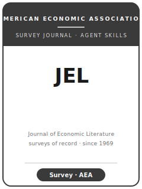

# Journal of Economic Literature Skills

<p align="center"></p>

[English](README.md) | 简体中文

面向 **Journal of Economic Literature（JEL）** 综述与评论文章的 12 个 agent skills。本包服务于 proposal-first 的综述工作流：判断领域是否值得系统综述、撰写 proposal、构建文献地图、形成组织框架、平衡不同学派与证据、设计综述表格、使用 JEL voice、处理分类代码、投稿与修改。

**官方依据核验日期：2026-06**：见 [`resources/official-source-map.md`](resources/official-source-map.md)。

## 快速开始

```
/plugin marketplace add ./Journal-of-Economic-Literature-Skills
/plugin install jel-skills
```

手动使用：先打开 [`skills/jel-workflow/SKILL.md`](skills/jel-workflow/SKILL.md)。

## 技能列表

| # | Skill | 作用 |
|---|-------|------|
| 1 | [`jel-workflow`](skills/jel-workflow/SKILL.md) | 路由 JEL 综述项目 |
| 2 | [`jel-topic-selection`](skills/jel-topic-selection/SKILL.md) | 判断领域是否达到 JEL 综述规模 |
| 3 | [`jel-proposal-and-commissioning`](skills/jel-proposal-and-commissioning/SKILL.md) | 在正式写作前打磨 proposal |
| 4 | [`jel-literature-synthesis`](skills/jel-literature-synthesis/SKILL.md) | 系统整理文献覆盖 |
| 5 | [`jel-organizing-framework`](skills/jel-organizing-framework/SKILL.md) | 把文献列表变成分析框架 |
| 6 | [`jel-comprehensiveness-and-balance`](skills/jel-comprehensiveness-and-balance/SKILL.md) | 平衡学派、证据与遗漏 |
| 7 | [`jel-tables-figures`](skills/jel-tables-figures/SKILL.md) | 设计综述表格与概念图 |
| 8 | [`jel-writing-style`](skills/jel-writing-style/SKILL.md) | 写出权威但可读的 JEL 文风 |
| 9 | [`jel-classification-system`](skills/jel-classification-system/SKILL.md) | 正确使用 JEL 代码与分类体系 |
| 10 | [`jel-editor-strategy`](skills/jel-editor-strategy/SKILL.md) | 处理编辑与审稿期待 |
| 11 | [`jel-submission`](skills/jel-submission/SKILL.md) | 运行 proposal / 投稿终检 |
| 12 | [`jel-revision`](skills/jel-revision/SKILL.md) | 根据编辑意见修改 |

## 资源

- [`resources/README.md`](resources/README.md) — 资源索引
- [`resources/official-source-map.md`](resources/official-source-map.md) — AEA/JEL 官方来源
- [`resources/external_tools.md`](resources/external_tools.md) — 文献检索与综述工具

## 许可

MIT (c) 2026 Bryce Wang。见 [LICENSE](LICENSE)。
