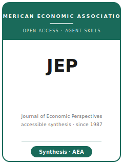

# Journal of Economic Perspectives Skills

<p align="center"></p>

[English](README.md) | 简体中文

面向 **Journal of Economic Perspectives（JEP）** 文章与 proposal 的 12 个 agent skills。本包针对可读、非技术化的经济学写作：判断主题是否有广泛 AEA 读者价值，撰写 proposal 或 symposium pitch，搭建叙事弧线，翻译技术证据，设计普通经济学读者能读懂的图表，保持平衡与客观，配合编辑打磨，完成投稿与修改。

**官方依据核验日期：2026-06**：见 [`resources/official-source-map.md`](resources/official-source-map.md)。

## 快速开始

```
/plugin marketplace add ./Journal-of-Economic-Perspectives-Skills
/plugin install jep-skills
```

手动使用：先打开 [`skills/jep-workflow/SKILL.md`](skills/jep-workflow/SKILL.md)。

## 技能列表

| # | Skill | 作用 |
|---|-------|------|
| 1 | [`jep-workflow`](skills/jep-workflow/SKILL.md) | 路由 JEP 文章或 proposal |
| 2 | [`jep-topic-selection`](skills/jep-topic-selection/SKILL.md) | 判断是否适合 JEP 广泛读者 |
| 3 | [`jep-proposal-and-symposium`](skills/jep-proposal-and-symposium/SKILL.md) | 起草 proposal 或 symposium pitch |
| 4 | [`jep-narrative-arc`](skills/jep-narrative-arc/SKILL.md) | 搭建解释性叙事弧线 |
| 5 | [`jep-accessibility-and-translation`](skills/jep-accessibility-and-translation/SKILL.md) | 把技术经济学翻译成可读文字 |
| 6 | [`jep-evidence-without-equations`](skills/jep-evidence-without-equations/SKILL.md) | 用少量公式呈现证据 |
| 7 | [`jep-exhibits-for-general-readers`](skills/jep-exhibits-for-general-readers/SKILL.md) | 设计给非专门读者看的图表 |
| 8 | [`jep-writing-style`](skills/jep-writing-style/SKILL.md) | 执行 JEP 文风 |
| 9 | [`jep-balance-and-objectivity`](skills/jep-balance-and-objectivity/SKILL.md) | 保持平衡与客观 |
| 10 | [`jep-editor-strategy`](skills/jep-editor-strategy/SKILL.md) | 配合编辑主导的打磨 |
| 11 | [`jep-submission`](skills/jep-submission/SKILL.md) | 运行 proposal / 投稿终检 |
| 12 | [`jep-revision`](skills/jep-revision/SKILL.md) | 为可读性与平衡性修改 |

## 资源

- [`resources/official-source-map.md`](resources/official-source-map.md) — AEA/JEP 官方来源表

## 许可

MIT (c) 2026 Bryce Wang。见 [LICENSE](LICENSE)。
