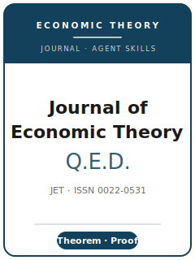

# Journal of Economic Theory Skills

<p align="center">
  
</p>

[](LICENSE)
[](https://www.sciencedirect.com/journal/journal-of-economic-theory)
[](https://www.sciencedirect.com/journal/journal-of-economic-theory)
[](https://github.com/anthropics/claude-code)

English | [简体中文](README.zh-CN.md)

Agent skill stack for manuscripts targeted at the **Journal of Economic Theory (JET)** — Elsevier's flagship general economic-theory venue (print ISSN 0022-0531, electronic 1095-7235), submitted via Elsevier Editorial Manager.

This repository is opinionated. It is **not** a generic economics-writing toolbox. It is a **JET-specific, theory-first** stack: the deciding criterion is a **rigorous, original theoretical contribution** in the theorem-proof tradition — mechanism design, information economics, decision theory, game theory, matching, market design, political economy, and finance / macro / monetary theory. Empirical, experimental, quantitative, or computational work belongs at JET **only when firmly grounded in theory**.

---

## Why a Separate JET Skill Stack?

JET's constraints differ materially from an empirical flagship (QJE) or an econometric-methods journal:

| Constraint            | JET                                                                  | Implication                                                       |
|-----------------------|----------------------------------------------------------------------|------------------------------------------------------------------|
| Core deliverable      | A **theorem / new model / characterization**                         | A coefficient or calibration with no new theory is off-fit        |
| Scope gate            | Theory-first; computation only **grounded in theory**                | Stand-alone empirical/computational papers are desk-rejected      |
| House style           | **Theorem-proof**, Elsevier `elsarticle` LaTeX                       | Narrative-empirical formatting reads as off-template              |
| Source files          | Editable **`.tex`** (PDF not accepted as source)                     | Submitting PDF source fails the format check                      |
| "Identification"      | **Assumptions, results, proof exposition, generality**               | There is no causal design — credibility is proof + minimal assumptions |
| References            | Elsevier style; **abstract references in full**; no personal comms   | Abbreviated abstract cites / personal communications are off-norm |
| Review                | **Single-anonymized**, **≥2 referees**, editors decide               | Referees verify proofs; reputation is visible (single-blind)      |
| Governance            | **"Lead Editor + Editors"** routing by field                         | Name the subfield so the right editor picks the paper up          |
| Data / replication    | **Encouraged, not required** (no JAE-Data-Archive analogue)          | No mandatory package; make any computation reproducible anyway    |
| AI use                | **Authors disclose** at submission; **referees/editors barred**       | Disclosure is a submission step, not optional                     |

Volatile specifics — the **current lead editor**, the **submission fee**, **length / abstract caps**, and the **single required reference style** — could not be confirmed against a reachable official source at build time and are marked **待核实** (to be verified). See [`resources/official-source-map.md`](resources/official-source-map.md).

> **Fee vs. APC, do not conflate:** JET appears to charge **no submission fee** (待核实), but it is a hybrid journal with a separate **open-access APC of USD 3,130** that applies only if you choose open access *after* acceptance.

---

## Quick Start

### Option A — Claude Code Plugin (recommended)

```bash
/plugin marketplace add https://github.com/brycewang-stanford/jet-skills
/plugin install jet-skills
/reload-plugins
```

### Option B — Manual Copy

```bash
git clone https://github.com/brycewang-stanford/jet-skills.git
cd jet-skills

mkdir -p ~/.claude/skills && cp -R skills/jet-* ~/.claude/skills/
# or
mkdir -p ~/.codex/skills && cp -R skills/jet-* ~/.codex/skills/
```

### First Prompt

```
Use jet-workflow to tell me which skill I should use next for my JET theory paper.
```

---

## Default Workflow

```text
jet-topic-selection            (is this a JET-scope theoretical contribution?)
        ▼
jet-literature-positioning     (stake the result against the theory frontier)
        ▼
jet-identification-strategy    (assumptions, results, proof architecture, generality)
        ▼
jet-contribution-framing       (state the theorem and why it matters)
        ▼
jet-data-analysis              (numerical examples / computation — only if any)
        ▼
jet-tables-figures             (schematic exhibits, notation discipline)
        ▼
jet-writing-style              (elsarticle theorem-proof prose; polish)
        ▼
jet-replication-and-data-policy (encouraged, not required; reproducible computation)
        ▼
jet-review-process             (what single-anonymized refereeing expects)
        ▼
jet-submission                 (Editorial Manager preflight; .tex; AI disclosure)
        ▼
jet-rebuttal                   (single-anonymized R&R response letter)
```

`jet-workflow` is the router — it tells you which skill to use next based on where you are.

---

## Skills

| Skill                            | Purpose                                                                       |
|----------------------------------|-------------------------------------------------------------------------------|
| `jet-workflow`                   | Router — decides which sub-skill to invoke next                               |
| `jet-topic-selection`            | Theory-first scope gate (original theoretical contribution)                   |
| `jet-literature-positioning`     | Theorem-relative delta against the closest existing result                    |
| `jet-identification-strategy`    | Assumptions, results, proof exposition, generality vs. tractability           |
| `jet-contribution-framing`       | Lead with the theorem; right-size the claim                                   |
| `jet-data-analysis`              | Numerical examples / computation, subordinate to theory (light)              |
| `jet-tables-figures`             | Schematic theory exhibits; notation discipline (light)                       |
| `jet-writing-style`              | Elsevier `elsarticle` theorem-proof house style                              |
| `jet-replication-and-data-policy`| Encouraged-not-required sharing; reproducible computation; AI disclosure      |
| `jet-review-process`             | Single-anonymized, ≥2 referees, editor-decides pipeline                       |
| `jet-submission`                 | Editorial Manager preflight (editable `.tex`, abstract refs, AI declaration)   |
| `jet-rebuttal`                   | R&R response strategy (correctness / generality / exposition)                 |

### Resources

- [`resources/external_tools.md`](resources/external_tools.md) — elsarticle/LaTeX toolchain, proof-checking and reproducible-computation aids for theory papers
- [`resources/official-source-map.md`](resources/official-source-map.md) — official JET URLs behind every fact, with `待核实` items flagged

---

## Differences vs. Other Stacks

| Dimension          | JET                                   | QJE (empirical flagship)          | Econometrica (methods)        |
|--------------------|---------------------------------------|-----------------------------------|-------------------------------|
| Lead with          | A theorem / characterization          | A big empirical-micro question    | A method / estimator          |
| "Identification"   | Assumptions + proof + generality      | Causal design (RCT/DID/IV/RDD)    | Estimator properties          |
| Data / replication | Encouraged, not required              | Required (QJE Dataverse)          | Required (data editor)        |
| House style        | elsarticle theorem-proof, `.tex`      | Author-date, single PDF           | Theorem-proof rigor           |
| Review             | Single-anonymized, ≥2 referees        | Double-blind                      | Varies                        |

---

## What This Repo Does Not Do

- It does not write a submittable proof or manuscript for you
- It does not check whether your theorem is correct — that is the author's and referees' job
- It does not assert volatile metadata (current lead editor, exact fee, length caps, single reference style) — these are marked `待核实`; verify on the official page
- It does not judge whether your contribution is genuinely original — that is the researcher's call

---

## Related

- [awesome-journal-skills](https://github.com/brycewang-stanford/awesome-journal-skills) — Index of journal-specific skill packs
- [Journal of Economic Theory (official)](https://www.sciencedirect.com/journal/journal-of-economic-theory) — Elsevier / ScienceDirect

---

## License

MIT
