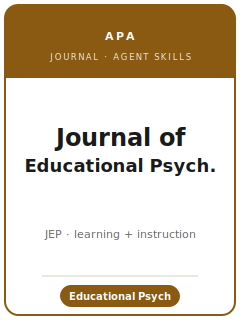

# 教育心理学杂志技能包（Journal of Educational Psychology Skills）

<p align="center">
  
</p>

[](LICENSE)
[](https://www.apa.org/pubs/journals/edu)
[](https://www.apa.org/pubs/journals/edu)
[](https://github.com/anthropics/claude-code)

[English](README.md) | 简体中文

面向 **《教育心理学杂志》（Journal of Educational Psychology，JEP）** 投稿的智能体技能栈。JEP 是
**美国心理学会（APA）旗下发表关于教育的原创、第一手心理学研究的旗舰期刊**，创刊于 **1910 年**，由
**APA** 出版（每年 8 期）。JEP 发表针对**各年龄段、各教育层级的学习与教学**的严谨心理学研究——动机与
投入、学业成就、阅读/数学/科学学习、评估、自我调节，以及在真实教育情境（学校、课堂、在线）中的干预。

本仓库是有立场的：它**不是**通用的教育写作工具箱，也**不是**改名换姓的社会科学技能包。它**专属于
JEP**：以**教育相关性 + 心理学理论**为门槛，强调**课堂/学校设计**（整群随机试验、嵌套结构、整群层面
的功效分析、学习构念的测量、生态效度）、采用**多层线性模型/结构方程模型/增长模型**并报告对教育有意义
的效应量、实行**匿名评审（masked review）**、在 **12,000 词**篇幅内遵循 **APA 第 7 版**，并落实 APA 的
透明度规范——**透明与开放（Transparency and Openness）**小节、**JARS** 报告标准，以及被鼓励的预注册。

---

## JEP 是什么，为何需要专门的技能栈？

它的约束既不同于一般心理学期刊，也不同于长篇幅教育期刊：

| 约束              | 《教育心理学杂志》                                                              | 含义                                                    |
|-------------------|--------------------------------------------------------------------------------|---------------------------------------------------------|
| 范围              | **关于学习/教学的原创、第一手心理学研究**；偶尔发表**极其重要**的元分析            | 既要有学习机制，也要有教育意义                            |
| 不在范围          | 单一测验/量表的信效度研究                                                        | 纯测量类论文应另投他刊                                    |
| 设计              | 学生**嵌套**于班级/学校；田野试验、准实验、纵向研究                              | 应在**随机化层面**进行功效与分析                          |
| 分析              | **多层/SEM/增长**模型；效应量 + 置信区间；机制检验                                | 对聚类数据用单层 OLS 是常见的拒稿原因                     |
| 篇幅              | 一般 **≤ 12,000 词**（不含参考文献/表/图/附录）                                  | 篇幅充足，但要物尽其用，而非综述                          |
| 摘要              | **≤ 250 词**                                                                    | 简洁、有信息含量                                          |
| 文风              | **APA 第 7 版**，双倍行距                                                        | 报告中须含效应量 + 置信区间                               |
| 评审              | **匿名评审**（作者与审稿人身份均隐去）                                            | 清除姓名、基金号、单位/校区、第一人称自引                  |
| 出版方 / 投稿门户 | **APA** / **Editorial Manager**（`editorialmanager.com/edu`）                    | 无投稿费（同行评审免费）                                  |
| 透明度            | **透明与开放**小节（数据 + 材料 + 代码 + DOI）                                    | 尽早准备存储与持久标识符                                  |
| 标准              | **JARS / JARS-REC**；**鼓励预注册**；**开放科学徽章**                            | 按研究设计逐项核对报告标准                                |

易变的具体信息（主编、确切词数/摘要词数、透明度措辞）会变化——未直接核实的条目在
[`resources/official-source-map.md`](resources/official-source-map.md) 中标注为 **待核实**。
**官方依据核于 2026-06；以官网为准。**

---

## 快速开始

### 方式 A — Claude Code 插件（推荐）

```bash
/plugin marketplace add https://github.com/brycewang-stanford/journal-of-educational-psychology-skills
/plugin install journal-of-educational-psychology-skills
/reload-plugins
```

### 方式 B — 手动复制

```bash
git clone https://github.com/brycewang-stanford/journal-of-educational-psychology-skills.git
cd journal-of-educational-psychology-skills

mkdir -p ~/.claude/skills && cp -R skills/jedpsych-* ~/.claude/skills/
# 或
mkdir -p ~/.codex/skills && cp -R skills/jedpsych-* ~/.codex/skills/
```

### 第一条提示

```
使用 jedpsych-workflow 告诉我，针对我的《教育心理学杂志》稿件，下一步应使用哪个技能。
```

---

## 默认工作流

```text
jedpsych-topic-selection
        ▼
jedpsych-theory-and-hypotheses
        ▼
jedpsych-literature-positioning
        ▼
jedpsych-study-design          （嵌套 + 整群层面功效；前瞻性研究先预注册）
        ▼
jedpsych-data-analysis         （多层/SEM/增长；效应量 + 置信区间；机制）
        ▼
jedpsych-tables-figures
        ▼
jedpsych-writing-style          （压缩至 12,000 词、APA 第 7 版、匿名）
        ▼
jedpsych-open-science-and-transparency
        ▼
jedpsych-review-process
        ▼
jedpsych-submission
        ▼
jedpsych-rebuttal
```

`jedpsych-workflow` 是路由器。对**前瞻性整群随机试验**，应尽早进入 `jedpsych-study-design` 与
`jedpsych-review-process`——针对嵌套结构的功效与分析计划应在**招募学校之前**确定。

---

## 技能列表

| 技能                                   | 用途                                                                          |
|----------------------------------------|-------------------------------------------------------------------------------|
| `jedpsych-workflow`                    | 路由器——决定下一步调用哪个子技能                                              |
| `jedpsych-topic-selection`             | 教育相关性 + 理论契合度；选择稿件类型                                          |
| `jedpsych-theory-and-hypotheses`       | 陈述学习机制，区分验证性与探索性假设                                          |
| `jedpsych-literature-positioning`      | 针对最接近的既有研究，定位一项精确的推进                                      |
| `jedpsych-study-design`                | 嵌套、整群层面功效、学习构念测量、生态效度                                    |
| `jedpsych-data-analysis`               | 多层/SEM/增长、效应量 + 置信区间、机制、JARS 披露                             |
| `jedpsych-tables-figures`              | 用于模型结果、中介与增长的 APA 第 7 版图表；匿名化                            |
| `jedpsych-writing-style`               | 在 12,000 词篇幅内的 APA 第 7 版；250 词摘要；匿名                            |
| `jedpsych-open-science-and-transparency` | 透明与开放小节、JARS、预注册、DOI                                          |
| `jedpsych-review-process`              | 匿名评审；以教育相关性、严谨性与透明度为评价因素                              |
| `jedpsych-submission`                  | Editorial Manager 投稿前检查（格式、匿名、透明度、JARS）                      |
| `jedpsych-rebuttal`                    | 面向多位审稿人 + 责任编辑的修回回应信策略                                     |

### 资源

- [`resources/external_tools.md`](resources/external_tools.md) —— 嵌套设计的功效（PowerUpR/`simr`/Optimal Design）、多层/SEM（`lme4`/`lavaan`/Mplus）、预注册（OSF/REES）、数据仓库（OSF/ICPSR/Dataverse/Zenodo）、JARS、`papaja`
- [`resources/code/`](resources/code/) —— 可运行的 R 骨架，用于整群设计诊断、多层/增长模型、中介分析与符合 JARS 的结果表
- [`resources/official-source-map.md`](resources/official-source-map.md) —— 每条事实背后的 APA 官方链接，含 待核实 标记
- [`resources/worked-examples/01-introduction.md`](resources/worked-examples/01-introduction.md) —— 按 JEP 文风改写的引言「修改前→修改后」（虚构）
- [`resources/exemplars/library.md`](resources/exemplars/library.md) —— 经网络核实的真实 JEP 论文，按 方法 × 主题 排列，附姊妹刊辨析

---

## 本仓库不做什么

- 不替你写出可直接投稿的稿件
- 不模拟任何特定编辑或审稿人的口味
- 不断言易变的元数据（现任主编、确切词数/摘要词数、透明度措辞）——请以官网为准；未核实项标注为 待核实
- 不替你判断你的发现是否足够具有教育重要性与严谨性——那是研究者的判断

---

## 与姊妹期刊的区别

| 期刊 | 出版方 | 定位 | JEP 的不同之处 |
|------|--------|------|----------------|
| **《教育心理学杂志》（JEP）** | APA | 关于学习/教学的**第一手心理学研究** | APA 教育心理学旗舰：理论 + 机制 + 严谨的嵌套设计 |
| 《美国教育研究杂志》（AERJ） | AERA | 广义教育研究（含质性、政策、社会情境） | JEP 更聚焦：带学习机制的*心理学*研究 |
| 《教育研究评论》（RER） | AERA | 仅**综述/综合** | JEP 发表第一手研究（元分析仅限极其重要者） |
| 《当代教育心理学》（CEP） | Elsevier | 教育心理学，常含测量/量表开发 | JEP 弱化单一量表验证；以机制驱动 |
| 《学习与教学》（Learning and Instruction） | EARLI/Elsevier | 学习与教学，欧洲基础强 | 范围有重叠；JEP 是采用 APA 文风的 APA 旗舰 |
| 《心理科学》（Psychological Science） | APS/SAGE | 短篇、面向广泛读者的实证心理学 | JEP 为长篇且专属教育，而非短报告 |

---

## 相关链接

- [awesome-journal-skills](https://github.com/brycewang-stanford/awesome-journal-skills) —— 期刊专属技能包索引
- [Journal of Educational Psychology（APA）](https://www.apa.org/pubs/journals/edu) —— 出版方、宗旨/范围、投稿指南
- [APA 期刊文章报告标准（JARS）](https://apastyle.apa.org/jars) —— 必须遵循的报告标准

---

## 许可

MIT
