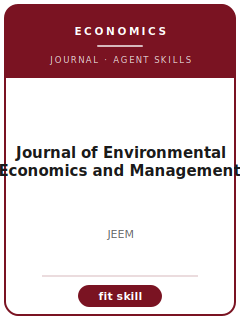

# Journal of Environmental Economics and Management Skills

<p align="center"></p>

[](LICENSE)
[](https://www.sciencedirect.com/journal/journal-of-environmental-economics-and-management)
[](https://www.sciencedirect.com/journal/journal-of-environmental-economics-and-management)

English | [简体中文](README.zh-CN.md)

Twelve agent skills for manuscripts targeted at **Journal of Environmental Economics and Management (JEEM)**. The pack is tuned to environmental economics, resource economics, climate policy, regulation, valuation, and natural-resource management; it keeps the manuscript distinct from Review of Environmental Economics and Policy, AEJ Economic Policy, Journal of Public Economics, and Nature Climate Change and emphasizes economic identification linked to environmental mechanisms and policy welfare.

**Official basis checked 2026-06** (re-check volatile details before submission): see [`resources/official-source-map.md`](resources/official-source-map.md).

## Why a separate stack?

| JEEM constraint | What it forces |
|-------------------------|----------------|
| Scope | The main claim must speak to environmental economics, resource economics, climate policy, regulation, valuation, and natural-resource management |
| Sibling boundary | The paper must explain why it belongs here rather than Review of Environmental Economics and Policy, AEJ Economic Policy, Journal of Public Economics, and Nature Climate Change |
| Evidence standard | Designs, models, reviews, or qualitative evidence must match economic identification linked to environmental mechanisms and policy welfare |
| Source discipline | Current process facts are cited or marked 待核实 |

## Quick Start

```text
/plugin marketplace add ./Journal-of-Environmental-Economics-and-Management-Skills
/plugin install jeem-skills
```

Manual use: start with [`skills/jeem-workflow/SKILL.md`](skills/jeem-workflow/SKILL.md).

## Default Workflow

```text
jeem-workflow → jeem-topic-selection → jeem-literature-positioning → jeem-identification → jeem-theory-model → jeem-robustness → jeem-tables-figures → jeem-writing-style → jeem-replication-package → jeem-referee-strategy → jeem-submission → jeem-rebuttal
```

## Skills

| # | Skill | What it does |
|---|-------|--------------|
| 1 | [`jeem-workflow`](skills/jeem-workflow/SKILL.md) | Workflow Router for JEEM manuscripts |
| 2 | [`jeem-topic-selection`](skills/jeem-topic-selection/SKILL.md) | Topic Selection for JEEM manuscripts |
| 3 | [`jeem-literature-positioning`](skills/jeem-literature-positioning/SKILL.md) | Literature Positioning for JEEM manuscripts |
| 4 | [`jeem-identification`](skills/jeem-identification/SKILL.md) | Identification Strategy for JEEM manuscripts |
| 5 | [`jeem-theory-model`](skills/jeem-theory-model/SKILL.md) | Theory and Model Craft for JEEM manuscripts |
| 6 | [`jeem-robustness`](skills/jeem-robustness/SKILL.md) | Robustness Strategy for JEEM manuscripts |
| 7 | [`jeem-tables-figures`](skills/jeem-tables-figures/SKILL.md) | Tables and Figures for JEEM manuscripts |
| 8 | [`jeem-writing-style`](skills/jeem-writing-style/SKILL.md) | Writing Style for JEEM manuscripts |
| 9 | [`jeem-replication-package`](skills/jeem-replication-package/SKILL.md) | Replication Package for JEEM manuscripts |
| 10 | [`jeem-referee-strategy`](skills/jeem-referee-strategy/SKILL.md) | Referee Strategy for JEEM manuscripts |
| 11 | [`jeem-submission`](skills/jeem-submission/SKILL.md) | Submission Preflight for JEEM manuscripts |
| 12 | [`jeem-rebuttal`](skills/jeem-rebuttal/SKILL.md) | Rebuttal Strategy for JEEM manuscripts |

## Resources

- [`resources/README.md`](resources/README.md) — resource index
- [`resources/official-source-map.md`](resources/official-source-map.md) — official URLs and volatile checks
- [`resources/external_tools.md`](resources/external_tools.md) — databases, methods, and software aids
- [`resources/worked-examples/01-introduction.md`](resources/worked-examples/01-introduction.md) — fictional before/after introduction
- [`resources/exemplars/library.md`](resources/exemplars/library.md) — real-paper slots with source discipline
- [`resources/code/`](resources/code/) — empirical code kit where applicable

## Related Links

- https://www.sciencedirect.com/journal/journal-of-environmental-economics-and-management
- https://www.elsevier.com/journals/journal-of-environmental-economics-and-management/0095-0696/guide-for-authors

## License

MIT (c) 2026 Bryce Wang. See [LICENSE](LICENSE).
