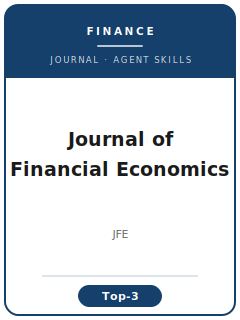

# JFE Skills

<p align="center">
  
</p>

[](LICENSE)
[](https://www.journals.elsevier.com/journal-of-financial-economics)
[](https://www.journals.elsevier.com/journal-of-financial-economics)
[](https://github.com/anthropics/claude-code)

[English](README.md) | 简体中文

面向 **Journal of Financial Economics (JFE)** 投稿的 Agent Skill 工具栈。JFE 由 Elsevier 出版，是公认的金融学"三大顶刊"之一，以**严苛的方法论、详尽的稳健性检验和可信的识别策略**著称，主打实证公司金融与资产定价。

本仓库刻意**不通用**——它不是泛化的"金融写作助手"，而是针对 JFE 编委与审稿口味的方法论沉淀，覆盖**选题契合、文献定位、识别策略、实证设计、稳健性、表格图形、Internet Appendix、写作风格、投稿、审稿应对、修改回复**等环节。

> JFE 的易变信息——现任编辑、确切的投稿费、影响因子，以及具体的数据可得性与双盲规则——会随时间变化。本工具栈只沉淀**长期稳定的规范**，具体数值请到期刊官网核实。

---

## 为什么要为 JFE 单独做一套 Skills？

虽然 JFE、JF、RFS 同为金融学三大顶刊，但 JFE 的约束维度与另两者**显著不同**：

| 维度          | Journal of Financial Economics                  | 隐含含义                                |
|-------------|------------------------------------------------|-------------------------------------|
| 学科定位       | 实证公司金融与资产定价（含支撑性理论）                   | 纯理论而实证薄弱的稿件更难发表              |
| 方法论门槛      | "螺丝钉级"的严谨，逐行审查                            | 测量或估计粗糙是致命伤                     |
| 识别策略       | 自然实验、IV、交叠 DID、RDD；内生性须明确处理            | "OLS + 控制变量"很难作为主结果              |
| 稳健性        | 详尽；须排除每一种替代解释                            | 结果脆弱是典型的拒稿理由                    |
| 推断（资产定价）  | 正确/聚类的标准误、样本外、多重检验纪律                  | 忽视多重检验的因子是危险信号                 |
| Internet Appendix | 期刊托管，篇幅深；证明与稳健性放在这里             | 附录单薄等于稳健性单薄                     |
| 篇幅 / 深度    | 通常比 JF 更长、稳健性更重                           | 需要完整且严苛的结构                       |
| 审稿流程       | 多轮高要求审稿；审稿人非常细致                         | 回复信的分量几乎与论文本身相当               |

通用的"科研写作"或"金融写作"Skill 包不会处理这些约束。

---

## 快速开始

### 方式 A —— Claude Code 插件（推荐）

```bash
/plugin marketplace add https://github.com/brycewang-stanford/jfe-skills
/plugin install jfe-skills
/reload-plugins
```

### 方式 B —— 手动拷贝

```bash
git clone https://github.com/brycewang-stanford/jfe-skills.git
cd jfe-skills

mkdir -p ~/.claude/skills && cp -R skills/jfe-* ~/.claude/skills/
# 或
mkdir -p ~/.codex/skills && cp -R skills/jfe-* ~/.codex/skills/
```

### 第一条 Prompt

```
用 jfe-workflow 告诉我这份 JFE 目标稿子下一步该用哪个 skill。
```

---

## 默认工作流

```text
jfe-topic-selection
        ▼
jfe-literature-positioning
        ▼
jfe-identification
        ▼
jfe-empirical-design
        ▼
jfe-robustness
        ▼
jfe-tables-figures
        ▼
jfe-internet-appendix
        ▼
jfe-writing-style       （polish）
        ▼
jfe-submission
        ▼
jfe-referee-strategy
        ▼
jfe-rebuttal
```

`jfe-workflow` 是路由器，会根据当前阶段告诉你下一个该用哪个 Skill。

---

## Skill 一览

| Skill                        | 用途                                          |
|------------------------------|---------------------------------------------|
| `jfe-workflow`               | 路由器：判断当前阶段，推荐下一个 skill              |
| `jfe-topic-selection`        | 选题契合与边际贡献检验                            |
| `jfe-literature-positioning` | 对标三大顶刊前沿做文献定位                         |
| `jfe-identification`         | 可信识别（自然实验、IV、交叠 DID、RDD）             |
| `jfe-empirical-design`       | 因子构建、Fama–MacBeth/GMM、聚类标准误、多重检验      |
| `jfe-robustness`             | JFE 招牌式的详尽稳健性检验                         |
| `jfe-tables-figures`         | 符合期刊风格、可独立阅读的表格与图形                 |
| `jfe-internet-appendix`      | 期刊托管附录：证明、稳健性、补充检验                 |
| `jfe-writing-style`          | 精确、以证据为先的行文，不过度宣称                   |
| `jfe-submission`             | 投稿前 preflight + 稿件模板                      |
| `jfe-referee-strategy`       | 预判并提前化解审稿人质疑                          |
| `jfe-rebuttal`               | 多轮高要求审稿的修改回复信结构                      |

### 附属资源

- [`skills/jfe-submission/templates/manuscript_template.md`](skills/jfe-submission/templates/manuscript_template.md) —— JFE 稿件结构骨架（摘要、变量定义表、表格与参考文献规范）
- [`skills/jfe-submission/templates/checklist.md`](skills/jfe-submission/templates/checklist.md) —— 投稿前 8 类自检清单
- [`resources/external_tools.md`](resources/external_tools.md) —— 金融数据资源（CRSP / Compustat / TAQ / IBES / Dealscan，经 WRDS 访问）+ Stata / R / Python 包速查

---

## 与 JF、RFS Skill 包的差异

| 维度        | Journal of Financial Economics  | Journal of Finance (JF) | Review of Financial Studies (RFS) |
|-----------|---------------------------------|-------------------------|-----------------------------------|
| 侧重        | 方法论严谨 + 稳健性                | 一个干净、思想领先的结果       | 理论 + 方法论深度                   |
| 典型篇幅      | 更长，稳健性更重                  | 通常更紧凑                  | 不定                              |
| Internet Appendix | 深，且被期望                | 使用                     | 使用                              |
| 最契合       | 经详尽压力测试的实证               | 单一决定性发现              | 方法/理论贡献                       |

选定目标期刊前，请到各刊官网核实其当前定位。

---

## 关于这个仓库不做什么

- 不替你写出可以直接投稿的稿件
- 不模拟某位具体编辑的偏好
- 不收录 JFE 的拒稿率、影响因子或当前投稿费——这些请到官网核实
- 不评估你的"贡献"是否真有原创性——这是研究者本人的判断

---

## 相关仓库

- [awesome-journal-skills](https://github.com/brycewang-stanford/awesome-journal-skills) —— 期刊 Skill 索引
- [Journal of Finance Skills](https://github.com/brycewang-stanford/journal-of-finance-skills) —— JF 投稿工具栈
- [Review of Financial Studies Skills](https://github.com/brycewang-stanford/rfs-skills) —— RFS 投稿工具栈

---

## License

MIT
