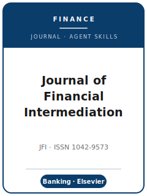

# 金融中介学刊技能包（Journal of Financial Intermediation Skills）

<p align="center">
  
</p>

[](LICENSE)
[](https://www.sciencedirect.com/journal/journal-of-financial-intermediation)
[](https://www.sciencedirect.com/journal/journal-of-financial-intermediation)
[](https://github.com/anthropics/claude-code)

[English](README.md) | 简体中文

面向 **Journal of Financial Intermediation（JFI，金融中介学刊）** 投稿的智能体技能栈。JFI 为
**Elsevier（爱思唯尔）** 旗下期刊（ISSN 1042-9573），聚焦 **银行、金融中介，以及金融机构与市场的经济学**，
同时发表 **理论** 与 **实证** 研究，涵盖银行、中介机构、公司金融、监管及相关金融经济学议题。

本仓库立场鲜明，**不是** 泛用的金融写作工具箱，而是围绕 JFI 真实流程构建的 **专用** 技能栈：投稿前需在
**Editorial Manager** 平台缴纳 **500 美元不可退还的投稿费** 方予审阅；实行 **积极的编辑直接拒稿（desk-reject）**
政策；采用 **单向匿名（single-blind / 单盲）** 评审，送审后通常至少一位专家审稿人，并只有很有限的一次 appeal 路径；投稿时可选
免费在 **SSRN** 发布预印本；采用 "your-paper-your-way" 宽松格式，**作者–年份（author–date）的 Elsevier 参考文献
格式** 在校样阶段统一套用；摘要不得超过 **250 词**，要求 **1-7 个英文关键词**，可提交 Highlights；遵循
Elsevier **Option C** 研究数据 deposit / citation / link-or-explain 规范；并要求 **强制披露生成式 AI 的使用**。

---

## 为什么需要独立的 JFI 技能栈？

JFI 的约束与综合性顶刊或方法类期刊有实质差异：

| 约束维度       | JFI 的要求                                                                | 含义                                                       |
|----------------|---------------------------------------------------------------------------|------------------------------------------------------------|
| 读者 / 范围    | 银行与金融中介领域；理论 **与** 实证并重                                   | 没有"中介机制"的论文属于选题不符                            |
| 投稿费         | **500 美元**，投稿前在 Editorial Manager 缴纳，直接拒稿后不退             | 须预先列入预算；不缴费编辑不予考虑                          |
| 初筛           | **积极直接拒稿**；送审后通常至少一位专家审稿人；一次 appeal 可被考虑       | 第一道初筛很关键，不能把 appeal 当常规修改路径               |
| 评审模式       | **单向匿名（单盲）**——审稿人可见作者身份                                  | 正文无需匿名化（不同于双盲期刊）                            |
| 预印本         | 投稿时可选免费在 **SSRN** 发布；不算重复发表                              | 可公开传播而不影响审稿结果                                  |
| 投稿元数据     | 摘要 **≤250 词**，**1-7 个英文关键词**，可选 Highlights                    | 初筛从简洁元数据开始，而不是从长摘要开始                    |
| 格式           | "your-paper-your-way"；**作者–年份** Elsevier 格式于校样阶段套用          | 投稿时任意一致格式即可；保持作者–年份字段干净              |
| 数据           | Elsevier **Option C**：deposit/cite/link 或解释不能共享；`[dataset]` 标签 | 无 JAE/AER 式专属存档，但数据共享计划必须明确               |
| AI 披露        | References 之前须设强制声明                                               | 未披露生成式 AI 使用即为合规问题                            |

泛用的"金融写作"技能包无法覆盖上述约束。费用、编辑名单、开放获取费用和 special call 都可能变化——
**请以官方页面为准**。当前官方依据已在 2026-06-20 刷新到来源地图。

---

## 快速开始

### 方式 A —— Claude Code 插件（推荐）

```bash
/plugin marketplace add https://github.com/brycewang-stanford/jfi-skills
/plugin install jfi-skills
/reload-plugins
```

### 方式 B —— 手动复制

```bash
git clone https://github.com/brycewang-stanford/jfi-skills.git
cd jfi-skills

mkdir -p ~/.claude/skills && cp -R skills/jfi-* ~/.claude/skills/
# 或
mkdir -p ~/.codex/skills && cp -R skills/jfi-* ~/.codex/skills/
```

### 第一条指令

```
用 jfi-workflow 告诉我，针对我的 JFI 稿件下一步该用哪个技能。
```

---

## 默认工作流

```text
jfi-topic-selection（选题）
        ▼
jfi-literature-positioning（文献定位）
        ▼
jfi-identification-strategy（识别策略 / 证明阐述）
        ▼
jfi-data-analysis（数据分析 / 数值示例）
        ▼
jfi-contribution-framing（贡献框定）
        ▼
jfi-tables-figures（表格与图）
        ▼
jfi-writing-style（行文打磨）
        ▼
jfi-replication-and-data-policy（复制与数据政策）
        ▼
jfi-review-process（评审流程认知）
        ▼
jfi-submission（投稿前检查）
        ▼
jfi-rebuttal（回应审稿）
```

`jfi-workflow` 是路由器，根据你所处阶段告诉你下一步用哪个技能。

---

## 技能清单

| 技能                                | 用途                                                                 |
|-------------------------------------|----------------------------------------------------------------------|
| `jfi-workflow`                      | 路由器——决定下一步调用哪个子技能                                     |
| `jfi-topic-selection`               | 银行 / 中介选题契合度；理论与实证的取向                              |
| `jfi-literature-positioning`        | 在金融中介前沿中明确贡献坐标                                          |
| `jfi-identification-strategy`       | 银行实证的因果设计；理论论文的假设与证明阐述                          |
| `jfi-data-analysis`                 | 银行 / 贷款层面面板分析；理论论文的数值示例                          |
| `jfi-contribution-framing`          | 框定机制与"为何中介重要"的论断                                        |
| `jfi-tables-figures`                | 编号图表与自洽注释                                                    |
| `jfi-writing-style`                 | 作者–年份 Elsevier 格式；编号章节；让机制清晰                        |
| `jfi-replication-and-data-policy`   | Elsevier Option C、数据声明、repository 链接、`[dataset]` 标签       |
| `jfi-review-process`                | 单盲、直接拒稿、单审稿人、有限申诉路径的现实                          |
| `jfi-submission`                    | Editorial Manager 投稿前检查 + 500 美元费用 + 摘要/关键词 + AI 披露 |
| `jfi-rebuttal`                      | 编辑与专家审稿人主导结果时的回应信策略                                |

### 资源

- [`resources/external_tools.md`](resources/external_tools.md) —— 银行 / 监管数据（Call Reports、FDIC、DealScan、HMDA）以及银行实证与理论工具的 Stata / R / Python 包
- [`resources/official-source-map.md`](resources/official-source-map.md) —— 每条当前流程事实背后的 JFI 官方链接，2026-06-20 已刷新

---

## 本仓库不做什么

- 不替你撰写可直接投稿的稿件
- 不模拟任何特定编辑或审稿人的口味
- 不冻结费用、编辑名单、APC 或 special call 等易变信息；投稿级建议前必须重新核验官方页面
- 不评判你的贡献是否真正原创——这是研究者自己的判断

---

## 维护说明

- 给出投稿级建议前必须重新打开 live author instructions（官方投稿指南）。
- 点名 Managing Editor 或 Co-Editor 前，必须重新核验 editorial-board 页面。
- fee、editor、data policy、review model 与 formatting rules 都可能变化。

---

## 相关项目

- [awesome-journal-skills](https://github.com/brycewang-stanford/awesome-journal-skills) —— 期刊专用技能包索引
- [Journal of Financial Intermediation 官网](https://www.sciencedirect.com/journal/journal-of-financial-intermediation) —— Elsevier

---

## 许可

MIT
