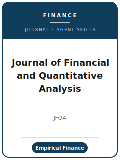

# Journal of Financial and Quantitative Analysis Skills

<p align="center">
  
</p>

[](LICENSE)
[](https://jfqa.org/)
[](https://www.cambridge.org/core/journals/journal-of-financial-and-quantitative-analysis)
[](https://github.com/anthropics/claude-code)

English | [简体中文](README.zh-CN.md)

Agent skill stack for manuscripts targeted at the **Journal of Financial and Quantitative Analysis (JFQA)** — a leading outlet for **empirical and quantitative financial economics**, published by **Cambridge University Press** on behalf of the **Michael G. Foster School of Business at the University of Washington**.

This repository is opinionated. It is **not** a generic finance-writing toolbox. It is a **JFQA-specific** stack built around the journal's actual scope and process: corporate finance, investments and asset pricing, capital and security markets, financial institutions, and finance-relevant quantitative methods — with credible research design, finance-standard exhibits, JFQA house formatting, and the mandatory **JFQA Code Sharing Policy** archive.

> Verify volatile specifics (editors, fee, refund, formatting, code policy, portal URL) on the official pages — they change. Facts not confirmable from an official source are flagged **待核实** in [`resources/official-source-map.md`](resources/official-source-map.md).

---

## Why a Separate JFQA Skill Stack?

JFQA imposes constraints that differ materially from a top economics flagship or a methods journal:

| Constraint              | JFQA                                                                          | Implication                                                        |
|-------------------------|-------------------------------------------------------------------------------|--------------------------------------------------------------------|
| Scope                   | Empirical & quantitative **finance** (corp fin, investments, markets, institutions) | An off-field or purely descriptive paper is off-fit                |
| Submission system       | **Editorial Manager** (separate account)                                       | Not ScholarOne / Editorial Express                                 |
| Fee                     | **$350**, credit card only; **$275 refunded** if not sent to a reviewer       | A desk reject still costs **$75** — budget for it                  |
| Review model            | **Double-anonymous**                                                           | Fully anonymize the manuscript and PDF metadata                    |
| Abstract                | One paragraph, **≤ 100 words**                                                 | Tighter than most finance/econ flagships — trim ruthlessly         |
| Formatting              | 8.5×11, 1-inch margins, 12-pt Times New Roman, double-spaced, searchable PDF   | Prescriptive; wrong layout is a strike                             |
| Selectivity             | Prints **< 9%** of 1,000+ annual submissions                                   | A clean, well-identified submission clears the first screen        |
| Resubmission rule       | Undisclosed prior rejection → desk reject **+ one-year ban**                   | Disclose any prior JFQA rejection in the cover letter              |
| Code/data policy        | **JFQA Code Sharing Policy**; **JFQA Dataverse** at Harvard Dataverse          | Mandatory at acceptance for post-2024 submissions; random verification |
| Leadership              | **Seven Managing Editors**, no single Editor-in-Chief                          | A Managing Editor is assigned per paper                            |

Generic "scientific writing" or "econ writing" packs do not address these constraints.

---

## Quick Start

### Option A — Claude Code Plugin (recommended)

```bash
/plugin marketplace add https://github.com/brycewang-stanford/jfqa-skills
/plugin install jfqa-skills
/reload-plugins
```

### Option B — Manual Copy

```bash
git clone https://github.com/brycewang-stanford/jfqa-skills.git
cd jfqa-skills

mkdir -p ~/.claude/skills && cp -R skills/jfqa-* ~/.claude/skills/
# or
mkdir -p ~/.codex/skills && cp -R skills/jfqa-* ~/.codex/skills/
```

### First Prompt

```
Use jfqa-workflow to tell me which skill I should use next for my JFQA manuscript.
```

---

## Default Workflow

```text
jfqa-topic-selection
        ▼
jfqa-literature-positioning
        ▼
jfqa-identification-strategy
        ▼
jfqa-data-analysis
        ▼
jfqa-contribution-framing
        ▼
jfqa-tables-figures
        ▼
jfqa-writing-style              (polish)
        ▼
jfqa-replication-and-data-policy
        ▼
jfqa-review-process
        ▼
jfqa-submission
        ▼
jfqa-rebuttal
```

`jfqa-workflow` is the router — it tells you which skill to use next based on where you are.

---

## Skills

| Skill                              | Purpose                                                                       |
|------------------------------------|-------------------------------------------------------------------------------|
| `jfqa-workflow`                    | Router — decides which sub-skill to invoke next                               |
| `jfqa-topic-selection`             | Scope fit for empirical/quantitative finance + the selectivity bar            |
| `jfqa-literature-positioning`      | Stake the contribution against the finance frontier (no standalone survey)    |
| `jfqa-identification-strategy`     | Credible finance design (sorts/FMB, panel FE, DID, IV, RDD, event study)      |
| `jfqa-data-analysis`               | Finance data construction, clustering, robustness, economic magnitudes        |
| `jfqa-contribution-framing`        | The strict ≤100-word abstract + the intro contribution                        |
| `jfqa-tables-figures`              | Finance-standard exhibits with self-contained notes                           |
| `jfqa-writing-style`               | Quantitative-finance prose + JFQA house formatting                            |
| `jfqa-replication-and-data-policy` | The JFQA Code Sharing Policy archive (JFQA Dataverse, raw/pseudo data)         |
| `jfqa-review-process`              | Double-anonymous review, the seven Managing Editors, fee/refund, odds         |
| `jfqa-submission`                  | Editorial Manager preflight + manuscript template                             |
| `jfqa-rebuttal`                    | R&R response-letter strategy                                                   |

### Resources

- [`skills/jfqa-submission/templates/manuscript_template.md`](skills/jfqa-submission/templates/manuscript_template.md) — JFQA manuscript skeleton (≤100-word abstract, intro arc, design, exhibits)
- [`skills/jfqa-submission/templates/checklist.md`](skills/jfqa-submission/templates/checklist.md) — 8-section pre-submission self-check
- [`resources/external_tools.md`](resources/external_tools.md) — finance data sources (CRSP / Compustat / TAQ / IBES / WRDS) + Stata / R / Python packages
- [`resources/official-source-map.md`](resources/official-source-map.md) — official JFQA URLs behind every fact, with **待核实** flags

---

## What This Repo Does Not Do

- It does not write a submittable manuscript for you.
- It does not simulate any specific Managing Editor's or referee's taste.
- It does not assert volatile metadata (current editors, exact fee, deposit rules) as permanent — verify on the official pages.
- It does not judge whether your finance contribution is genuinely original — that is the researcher's call.

---

## Related

- [awesome-journal-skills](https://github.com/brycewang-stanford/awesome-journal-skills) — Index of journal-specific skill packs
- [JFQA submissions (official)](https://jfqa.org/submissions/) — fee, formatting, resubmission rule
- [JFQA Code Sharing Policy (official)](https://jfqa.org/jfqa-code-sharing-policy/) — archive requirements
- [JFQA on Cambridge Core](https://www.cambridge.org/core/journals/journal-of-financial-and-quantitative-analysis) — author instructions, double-anonymous review

---

## License

MIT
