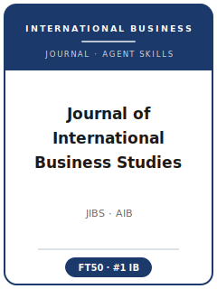

# Journal of International Business Studies (JIBS) Skills

<p align="center">
  
</p>

[](LICENSE)
[](https://link.springer.com/journal/41267)
[](https://www.aib.world/publications/journal-of-international-business-studies/)
[](https://github.com/anthropics/claude-code)

English | [简体中文](README.zh-CN.md)

Agent skill stack for manuscripts targeted at the **Journal of International Business Studies (JIBS)** — the flagship, #1-ranked *international-business* journal, established 1970 and published by Palgrave Macmillan (Springer Nature) on behalf of the **Academy of International Business (AIB)**, whose official journal it is.

This repository is opinionated. It is **not** a generic "management writing" toolbox. It is a **JIBS-specific** stack built around JIBS's defining bar: a manuscript must address a real-world **international-business phenomenon** and make an explicit, non-incremental contribution to **IB theory**, with **country and culture treated as levels of analysis**. It covers phenomenon-driven topic selection, cross-level theory development, positioning in the IB conversation, methodologically pluralistic design, cross-national measurement equivalence and validity, common-method-variance and (dynamic-)endogeneity rigor anchored to the JIBS "From the Editors" methods canon, IB contribution framing, JIBS Style Guide exhibits and prose, Springer Nature submission, double-blind review, the DART data-transparency regime, and multi-round R&R rebuttals.

> Durable norms first. Current platform, masthead, word limits, DART language, and optional OA APC were refreshed from official Springer/AIB pages on 2026-06-20. Always re-check the live JIBS submission-guidelines page and Style Guide before uploading.

---

## Why a Separate JIBS Skill Stack?

JIBS imposes constraints that differ materially from general-management or single-country journals:

| Constraint            | Journal of International Business Studies                              | Implication                                                       |
|-----------------------|-----------------------------------------------------------------------|-------------------------------------------------------------------|
| Discipline            | International business (MNEs, internationalization, cross-cultural mgmt, intl strategy/finance/econ, global political economy) | Single-country management papers are off-fit |
| Core bar              | A real IB **phenomenon** + explicit, non-incremental **IB-theory** contribution | Strong results with no IB theory advance read as off-fit         |
| Levels of analysis    | Country and culture are **levels**, not controls                       | A country dummy is not "international"                            |
| Method                | Paradigmatically/methodologically **pluralistic**; rigor is the gate   | No single mandated method, but demanding standards                |
| Measurement           | **Cross-national measurement equivalence** is first-order              | Pooling countries without invariance tests is punished           |
| Common-method variance| Active CMV gatekeeping; resubmit-with-checks is routine                 | Single-source same-respondent surveys are high-risk              |
| Endogeneity           | **Dynamic endogeneity** named for internationalization-as-process      | Process designs need an identification strategy                  |
| Methods canon         | ~28 "From the Editors" editorials as de facto standards                 | Reviewers cite them by name                                       |
| Transparency          | **DART** policy + Data Accessibility Statement                          | A DAS is required on acceptance                                  |
| Format                | JIBS Style Guide; article word target counts abstract/text/endnotes/references | Tables, figures, and online supplement can follow                |
| Process               | Springer Nature portal; double-blind; area-editor routing by IB subfield | First-round accepts are essentially unheard of                   |

Generic "scientific writing" or "social-science methods" packs do not address these constraints.

---

## Quick Start

### Option A — Claude Code Plugin (recommended)

```bash
/plugin marketplace add https://github.com/brycewang-stanford/jibs-skills
/plugin install jibs-skills
/reload-plugins
```

### Option B — Manual Copy

```bash
git clone https://github.com/brycewang-stanford/jibs-skills.git
cd jibs-skills

mkdir -p ~/.claude/skills && cp -R skills/jibs-* ~/.claude/skills/
# or
mkdir -p ~/.codex/skills && cp -R skills/jibs-* ~/.codex/skills/
```

### First Prompt

```
Use jibs-workflow to tell me which skill I should use next for my JIBS manuscript.
```

---

## Default Workflow

```text
jibs-topic-selection
        ▼
jibs-theory-development
        ▼
jibs-literature-positioning
        ▼
jibs-methods
        ▼
jibs-data-analysis
        ▼
jibs-contribution-framing
        ▼
jibs-tables-figures
        ▼
jibs-writing-style        (polish)
        ▼
jibs-submission
        ▼
jibs-review-process
        ▼
jibs-rebuttal
```

`jibs-workflow` is the router — it tells you which skill to use next based on where you are.

---

## Skills

| Skill                        | Purpose                                                                       |
|------------------------------|-------------------------------------------------------------------------------|
| `jibs-workflow`              | Router — decides which sub-skill to invoke next                               |
| `jibs-topic-selection`       | Phenomenon-driven question + JIBS fit test (country/culture as a level)        |
| `jibs-theory-development`    | Cross-level (country/culture → firm/individual) IB mechanism and hypotheses    |
| `jibs-literature-positioning`| Joining a live IB conversation; problematization over gap-spotting             |
| `jibs-methods`               | Matching a cross-country/multilevel design; designing in equivalence/CMV/endogeneity |
| `jibs-data-analysis`         | Measurement invariance, CMV, multilevel/dynamic-panel estimators, endogeneity  |
| `jibs-contribution-framing`  | Explicit, non-incremental IB-theory contribution + societal-impact framing     |
| `jibs-tables-figures`        | Country coverage, invariance summary, cross-level interaction plots (Style Guide) |
| `jibs-writing-style`         | Phenomenon-forward prose, disciplined cross-cultural terms, article/RN word budget |
| `jibs-submission`            | Springer Nature preflight: anonymization, DART/DAS, format, files              |
| `jibs-review-process`        | How JIBS desk-screen/double-blind/area-editor review works; reading a decision |
| `jibs-rebuttal`              | Multi-round R&R revision and point-by-point response letter                    |

### Resources

- [`resources/external_tools.md`](resources/external_tools.md) — cross-country data (Hofstede/GLOBE, World Bank/WGI, Orbis, SDC, fDi Markets) and analysis/measurement-equivalence software (Mplus / R lavaan + semTools / Stata / dynamic-panel GMM / fsQCA)
- [`resources/official-source-map.md`](resources/official-source-map.md) — official JIBS/AIB/Springer URLs behind every encoded current fact, refreshed 2026-06-20

---

## Differences vs. AMJ / SMJ / JWB

| Dimension          | JIBS                                   | AMJ                          | SMJ                          | JWB / MIR / IBR              |
|--------------------|----------------------------------------|------------------------------|------------------------------|------------------------------|
| Discipline         | **International business**             | General management           | Strategy / performance       | IB-adjacent                  |
| Core contribution  | IB **phenomenon + IB theory**          | Empirical **+** theory       | Competitive advantage        | Solid but narrower           |
| Country/culture    | Treated as a **level of analysis**     | Often a control              | Often a control              | Varies                       |
| Signature scrutiny | Measurement equivalence, CMV, (dynamic) endogeneity | CMB, endogeneity, validity | Endogeneity (archival)       | Varies                       |

If your study has no genuine cross-border, multi-country, or culture/country-as-level dimension, JIBS is likely the wrong venue.

---

## Related

- [awesome-journal-skills](https://github.com/brycewang-stanford/awesome-journal-skills) — index of journal-specific skill packs

---

## License

MIT
