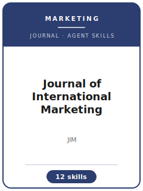

# Journal of International Marketing Skills

<p align="center"></p>

[](LICENSE)
[](https://www.ama.org/journal-of-international-marketing/)
[](https://journals.sagepub.com/home/jig)
[](https://journals.sagepub.com/author-instructions/jig)

English | [简体中文](README.zh-CN.md)

Twelve agent skills for manuscripts targeted at the **Journal of International Marketing (JIM)** — the American Marketing Association's specialist top journal for international marketing, published quarterly by SAGE. The pack is built around JIM's defining bar: the international dimension must be the **theoretical engine** of the paper, backed by multi-country evidence with **measurement-invariance** discipline and implications a border-crossing manager can act on. It keeps a manuscript distinct from JIBS, Journal of Marketing, and International Marketing Review, and engineers around JIM's known desk-reject patterns (single-country data with a token international label, culture as a post-hoc explanation, uninvariant cross-cultural scales).

**Official basis checked 2026-07-16** (re-check volatile details before submission): see [`resources/official-source-map.md`](resources/official-source-map.md).

## Why a separate stack?

| JIM constraint | What it forces |
|----------------|----------------|
| International-as-core scope | The border-crossing must generate the theory; the relabel test ("delete the country names") must break the pitch |
| Equivalence bar | Multi-country scales need translation protocols and a configural→metric→scalar invariance ladder before any comparison |
| Dual contribution | A theory delta for international marketing **and** a decision rule for firms operating across borders |
| Hard format caps | 50 formatted pages all-inclusive, 200-word third-person abstract, double-anonymized two-file split via ScholarOne |
| Source discipline | Volatile process facts are dated (checked 2026-07-16) or flagged "re-check on the official site" |

## Quick Start

```text
/plugin marketplace add ./Journal-of-International-Marketing-Skills
/plugin install jim-skills
```

Manual use: start with [`skills/jim-workflow/SKILL.md`](skills/jim-workflow/SKILL.md).

## Default Workflow

```text
jim-workflow → jim-topic-selection → jim-theory-development → jim-literature-positioning → jim-methods → jim-data-analysis → jim-contribution-framing → jim-tables-figures → jim-writing-style → jim-submission → jim-review-process → jim-rebuttal
```

## Skills

| # | Skill | What it does |
|---|-------|--------------|
| 1 | [`jim-workflow`](skills/jim-workflow/SKILL.md) | Routes to the right skill for the current stage of a JIM manuscript |
| 2 | [`jim-topic-selection`](skills/jim-topic-selection/SKILL.md) | Tests whether the international dimension is the theoretical core (relabel / two-country / manager tests) |
| 3 | [`jim-theory-development`](skills/jim-theory-development/SKILL.md) | Theorizes cross-national variation a priori — cultural/institutional lenses, levels of analysis, hypothesis craft |
| 4 | [`jim-literature-positioning`](skills/jim-literature-positioning/SKILL.md) | Locates the paper in the international-marketing canon and builds the positioning table |
| 5 | [`jim-methods`](skills/jim-methods/SKILL.md) | Designs multi-country studies — country selection, equivalence, invariance planning, export-panel identification |
| 6 | [`jim-data-analysis`](skills/jim-data-analysis/SKILL.md) | Runs the invariance ladder, multilevel/multi-group models, and formal country-difference tests |
| 7 | [`jim-contribution-framing`](skills/jim-contribution-framing/SKILL.md) | Frames the double contribution and defends against the "context extension" verdict |
| 8 | [`jim-tables-figures`](skills/jim-tables-figures/SKILL.md) | Builds the exhibit spine (invariance table, money exhibit) inside the 50-page cap |
| 9 | [`jim-writing-style`](skills/jim-writing-style/SKILL.md) | The 200-word abstract, intro architecture, and stereotype-free culture language in AMA voice |
| 10 | [`jim-submission`](skills/jim-submission/SKILL.md) | ScholarOne (ama_jim) preflight — two-file anonymized package, caps, declarations |
| 11 | [`jim-review-process`](skills/jim-review-process/SKILL.md) | The editorial pipeline, JIM-specific desk-reject triggers, and productive waiting |
| 12 | [`jim-rebuttal`](skills/jim-rebuttal/SKILL.md) | Decision-letter triage, new-country decisions, and response-letter craft |

## Resources

- [`resources/README.md`](resources/README.md) — resource index
- [`resources/official-source-map.md`](resources/official-source-map.md) — official AMA/SAGE URLs and volatile-fact ledger (checked 2026-07-16)
- [`resources/external_tools.md`](resources/external_tools.md) — country-level data, multi-country panels, invariance/multilevel software
- [`resources/exemplars/library.md`](resources/exemplars/library.md) — twelve canon papers, venue-labeled
- [`resources/worked-examples/01-introduction.md`](resources/worked-examples/01-introduction.md) — annotated JIM-shaped introduction (fictional)
- [`resources/code/`](resources/code/) — vendored empirical code kit (Stata + Python)

## Differences vs. sibling outlets

| Outlet | Center of gravity | JIM instead when |
|--------|-------------------|------------------|
| JIBS | international business theory broadly | the mechanism is a marketing mechanism (brands, customers, channels) |
| Journal of Marketing | broad marketing strategy | cross-national variation is the engine, not a robustness note |
| International Marketing Review | earlier-stage international marketing work | evidence meets top-tier bars (invariance, identification, multi-study) |
| Journal of World Business | MNE management/strategy | the outcome is a marketing outcome |

## Related Links

- https://www.ama.org/journal-of-international-marketing/
- https://journals.sagepub.com/home/jig
- https://journals.sagepub.com/author-instructions/jig
- https://mc.manuscriptcentral.com/ama_jim

## License

MIT (c) 2026 Bryce Wang. See [LICENSE](LICENSE).
