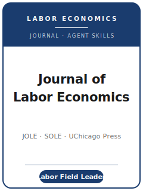

# 劳动经济学杂志技能包（Journal of Labor Economics Skills）

<p align="center">
  
</p>

[](LICENSE)
[](https://www.journals.uchicago.edu/journals/jole/about)
[](https://www.journals.uchicago.edu/journals/jole/about)
[](https://github.com/anthropics/claude-code)

[English](README.md) | 简体中文

面向 **《劳动经济学杂志》（Journal of Labor Economics, JOLE）** 投稿的 Agent 技能栈。JOLE 是一份覆盖国际劳动
经济学研究的、综合性、同行评审的 **季刊**，由 **芝加哥大学出版社（University of Chicago Press）** 为
**劳动经济学家学会（Society of Labor Economists, SOLE）** 出版。

JOLE 同时发表劳动力市场的理论与应用/实证研究，主题包括：工资与收入、就业与失业、人力资本与教育、劳动供给与
需求、家庭与户内经济学、歧视、工会、移民，以及劳动力市场制度与政策。本仓库是**有立场的**：它不是通用的经济学写作
工具箱，而是一套**专为 JOLE 定制**的技能栈，贴合该刊在劳动经济学领域实际的初筛、评审与出版方式。

---

## 为什么需要独立的 JOLE 技能栈？

JOLE 的约束与 Top-5 旗刊或双盲期刊有本质差异：

| 约束维度     | JOLE                                                                          | 含义                                                          |
|--------------|--------------------------------------------------------------------------------|---------------------------------------------------------------|
| 读者         | 劳动经济学领域内的**综合性**读者                                                | 问题须对广泛的劳动经济学者有意义，而非某个小众分支            |
| 投稿费       | **SOLE 会员 100 美元 / 非会员 175 美元**，自 2018 年 7 月 1 日起                 | 不可退还，即便被直接拒稿；未缴费前不发布决定                  |
| 评审模式     | **单盲**（审稿人匿名，作者具名）                                                | **请勿匿名化**——与双盲期刊正相反                              |
| 标题页       | 全部合著者姓名、机构、邮箱                                                      | 须在文首给出；参考文献**不**匿名                              |
| 摘要         | **100 词**                                                                     | 极短，字字计较                                                |
| 篇幅         | 一般 **≤ 20,000 词**，整页表格/图形按 **500 词** 计                              | 严格的字数经济，图表会占用字数额度                            |
| 参考文献     | **芝加哥作者—年份制**，正文内**先按时间、同年再按字母**排序，三位及以上作者用 "et al." | 纯字母排序的正文引用会显得不合规范                            |
| 投稿系统     | **Editorial Manager**（`editorialmanager.com/jole`）                            | 既非 Editorial Express，也非 ScholarOne                       |
| 数据政策     | 数据+程序+文档存入 **JOLE Dataverse**（采用 AER 政策，2009 年 2 月起）           | 实证论文须可复制方可发表                                      |
| 学会关系     | **SOLE** 官方期刊                                                               | 会员可享更低投稿费                                            |

通用的"科学写作"或"经济学写作"技能包无法覆盖这些约束。投稿入口提示、费用措辞、编辑名单与数据存档要求都可能变化，
因此上传前要按源映射做 live check。每条事实及其核验状态见
[`resources/official-source-map.md`](resources/official-source-map.md)。

---

## 快速开始

### 方式 A —— Claude Code 插件（推荐）

```bash
/plugin marketplace add https://github.com/brycewang-stanford/jole-skills
/plugin install jole-skills
/reload-plugins
```

### 方式 B —— 手动复制

```bash
git clone https://github.com/brycewang-stanford/jole-skills.git
cd jole-skills

mkdir -p ~/.claude/skills && cp -R skills/jole-* ~/.claude/skills/
# 或
mkdir -p ~/.codex/skills && cp -R skills/jole-* ~/.codex/skills/
```

### 第一条提示词

```
用 jole-workflow 告诉我，我的 JOLE 稿件下一步该用哪个技能。
```

---

## 默认工作流

```text
jole-topic-selection（选题）
        ▼
jole-literature-positioning（文献定位）
        ▼
jole-identification-strategy（识别策略）
        ▼
jole-data-analysis（数据分析）
        ▼
jole-contribution-framing（贡献框定）
        ▼
jole-tables-figures（表格与图形）
        ▼
jole-writing-style（润色）
        ▼
jole-replication-and-data-policy（复制与数据政策）
        ▼
jole-review-process（评审流程）
        ▼
jole-submission（投稿）
        ▼
jole-rebuttal（回应审稿）
```

`jole-workflow` 是路由器——它会根据你所处的阶段告诉你下一步该用哪个技能。

---

## 技能（共 12 个）

| 技能                                | 用途                                                                       |
|-------------------------------------|----------------------------------------------------------------------------|
| `jole-workflow`                     | 路由器——决定下一步调用哪个子技能                                            |
| `jole-topic-selection`              | 劳动力市场契合度 + "对广泛劳动经济学者有意义"的门槛                         |
| `jole-literature-positioning`       | 在劳动文献中锚定贡献（芝加哥作者—年份规范）                                 |
| `jole-identification-strategy`      | 可信的劳动识别策略（DID / IV / RDD / RCT / AKM）                            |
| `jole-data-analysis`                | 劳动实证规范：CPS/ACS/登记数据、工资分解、稳健性                            |
| `jole-contribution-framing`         | 面向劳动综合读者框定贡献                                                    |
| `jole-tables-figures`               | 在 20,000 词 / 每整页 500 词规则下的图表经济                                |
| `jole-writing-style`                | 文体风格 + 100 词摘要 + 芝加哥作者—年份制                                   |
| `jole-replication-and-data-policy`  | JOLE Dataverse 存档 + AER 数据政策（2009 年 2 月采用）                      |
| `jole-review-process`               | 单盲评审、投稿费、Editorial Manager、审稿人期待                             |
| `jole-submission`                   | Editorial Manager 投稿前检查（费用、标题页、100 词摘要、非匿名）            |
| `jole-rebuttal`                     | 面向劳动审稿人的 R&R 回复信策略                                             |

### 资源文件

- [`resources/external_tools.md`](resources/external_tools.md) —— 劳动数据来源（CPS/ACS/IPUMS、
  LEHD/QWI、NLSY/PSID、登记数据）+ Stata/R/Python 工具包（AKM、DID、RDD、Oaxaca、RIF）
- [`resources/official-source-map.md`](resources/official-source-map.md) —— 本技能包每条事实背后的官方
  JOLE 链接与核验状态

---

## 本仓库不做什么

- 不替你写出可直接投稿的稿件
- 不模拟任何具体编辑或审稿人的口味
- 不替代实时投稿界面；上传前仍需确认入口提示、费用、编辑冲突与数据政策措辞
- 不评判你的劳动经济学问题是否真正新颖——那是研究者自己的判断

---

## 相关链接

- [awesome-journal-skills](https://github.com/brycewang-stanford/awesome-journal-skills) —— 期刊专用技能包索引
- [Journal of Labor Economics（官方）](https://www.journals.uchicago.edu/journals/jole/about) —— 芝加哥大学出版社
- [劳动经济学家学会（SOLE）](https://www.sole-jole.org/) —— 期刊的主办学会

---

## 许可证

MIT
