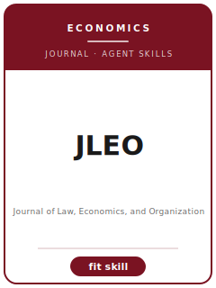

# Journal of Law, Economics, and Organization Skills

<p align="center"></p>

[English](README.md) | 简体中文

面向 **Journal of Law, Economics, and Organization（JLEO）** 投稿的 12 个 agent skills。本包围绕 law, economics, and organization with emphasis on contracts, institutions, governance, and organizational design 设计，帮助稿件区别于 Journal of Law and Economics, Journal of Legal Studies, Organization Science, and American Law and Economics Review，并强调 institutional-economics argument that integrates legal rules, governance, and organizational mechanisms。

**官方依据核验日期：2026-06**（投稿前需复核易变细节）：见 [`resources/official-source-map.md`](resources/official-source-map.md)。

## 为什么需要单独的技能栈？

| JLEO 约束 | 对稿件的要求 |
|-------------------|--------------|
| 范围 | 主张必须服务于 law, economics, and organization with emphasis on contracts, institutions, governance, and organizational design |
| 同门边界 | 说明为什么不是 Journal of Law and Economics, Journal of Legal Studies, Organization Science, and American Law and Economics Review |
| 证据标准 | 设计、模型、综述或质性证据必须匹配 institutional-economics argument that integrates legal rules, governance, and organizational mechanisms |
| 来源纪律 | 当前流程事实必须有来源，或明确标记 待核实 |

## 快速开始

```text
/plugin marketplace add ./Journal-of-Law-Economics-and-Organization-Skills
/plugin install jleo-skills
```

手动使用：先打开 [`skills/jleo-workflow/SKILL.md`](skills/jleo-workflow/SKILL.md)。

## 默认工作流

```text
jleo-workflow → jleo-topic-selection → jleo-literature-positioning → jleo-identification → jleo-theory-model → jleo-robustness → jleo-tables-figures → jleo-writing-style → jleo-replication-package → jleo-referee-strategy → jleo-submission → jleo-rebuttal
```

## 技能列表

| # | Skill | 作用 |
|---|-------|------|
| 1 | [`jleo-workflow`](skills/jleo-workflow/SKILL.md) | 面向 JLEO 稿件的 Workflow Router |
| 2 | [`jleo-topic-selection`](skills/jleo-topic-selection/SKILL.md) | 面向 JLEO 稿件的 Topic Selection |
| 3 | [`jleo-literature-positioning`](skills/jleo-literature-positioning/SKILL.md) | 面向 JLEO 稿件的 Literature Positioning |
| 4 | [`jleo-identification`](skills/jleo-identification/SKILL.md) | 面向 JLEO 稿件的 Identification Strategy |
| 5 | [`jleo-theory-model`](skills/jleo-theory-model/SKILL.md) | 面向 JLEO 稿件的 Theory and Model Craft |
| 6 | [`jleo-robustness`](skills/jleo-robustness/SKILL.md) | 面向 JLEO 稿件的 Robustness Strategy |
| 7 | [`jleo-tables-figures`](skills/jleo-tables-figures/SKILL.md) | 面向 JLEO 稿件的 Tables and Figures |
| 8 | [`jleo-writing-style`](skills/jleo-writing-style/SKILL.md) | 面向 JLEO 稿件的 Writing Style |
| 9 | [`jleo-replication-package`](skills/jleo-replication-package/SKILL.md) | 面向 JLEO 稿件的 Replication Package |
| 10 | [`jleo-referee-strategy`](skills/jleo-referee-strategy/SKILL.md) | 面向 JLEO 稿件的 Referee Strategy |
| 11 | [`jleo-submission`](skills/jleo-submission/SKILL.md) | 面向 JLEO 稿件的 Submission Preflight |
| 12 | [`jleo-rebuttal`](skills/jleo-rebuttal/SKILL.md) | 面向 JLEO 稿件的 Rebuttal Strategy |

## 资源

- [`resources/README.md`](resources/README.md) — 资源索引
- [`resources/official-source-map.md`](resources/official-source-map.md) — 官方 URL 与易变信息
- [`resources/external_tools.md`](resources/external_tools.md) — 数据库、方法与软件工具
- [`resources/worked-examples/01-introduction.md`](resources/worked-examples/01-introduction.md) — 虚构引言改写示例
- [`resources/exemplars/library.md`](resources/exemplars/library.md) — 真实论文槽位与来源纪律
- [`resources/code/`](resources/code/) — 适用时使用的实证代码脚手架

## 许可

MIT (c) 2026 Bryce Wang。见 [LICENSE](LICENSE)。
