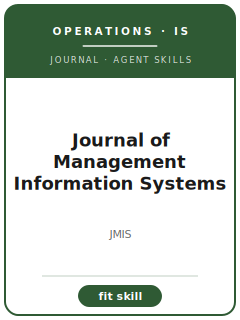

# Journal of Management Information Systems Skills

<p align="center"></p>

[English](README.md) | 简体中文

面向 **Journal of Management Information Systems（JMIS）** 投稿的 12 个 agent skills。本包围绕 information systems, digital transformation, platforms, analytics, IT governance, and organizational impacts of technology 设计，帮助稿件区别于 MIS Quarterly, Information Systems Research, Journal of the AIS, and Management Science，并强调 IS scholarship that connects technology mechanisms to organizational and managerial outcomes。

**官方依据核验日期：2026-06**（投稿前需复核易变细节）：见 [`resources/official-source-map.md`](resources/official-source-map.md)。

## 为什么需要单独的技能栈？

| JMIS 约束 | 对稿件的要求 |
|-------------------|--------------|
| 范围 | 主张必须服务于 information systems, digital transformation, platforms, analytics, IT governance, and organizational impacts of technology |
| 同门边界 | 说明为什么不是 MIS Quarterly, Information Systems Research, Journal of the AIS, and Management Science |
| 证据标准 | 设计、模型、综述或质性证据必须匹配 IS scholarship that connects technology mechanisms to organizational and managerial outcomes |
| 来源纪律 | 当前流程事实必须有来源，或明确标记 待核实 |

## 快速开始

```text
/plugin marketplace add ./Journal-of-Management-Information-Systems-Skills
/plugin install jmis-skills
```

手动使用：先打开 [`skills/jmis-workflow/SKILL.md`](skills/jmis-workflow/SKILL.md)。

## 默认工作流

```text
jmis-workflow → jmis-topic-selection → jmis-theory-development → jmis-literature-positioning → jmis-methods → jmis-data-analysis → jmis-contribution-framing → jmis-tables-figures → jmis-writing-style → jmis-submission → jmis-review-process → jmis-rebuttal
```

## 技能列表

| # | Skill | 作用 |
|---|-------|------|
| 1 | [`jmis-workflow`](skills/jmis-workflow/SKILL.md) | 面向 JMIS 稿件的 Workflow Router |
| 2 | [`jmis-topic-selection`](skills/jmis-topic-selection/SKILL.md) | 面向 JMIS 稿件的 Topic Selection |
| 3 | [`jmis-theory-development`](skills/jmis-theory-development/SKILL.md) | 面向 JMIS 稿件的 Theory Development |
| 4 | [`jmis-literature-positioning`](skills/jmis-literature-positioning/SKILL.md) | 面向 JMIS 稿件的 Literature Positioning |
| 5 | [`jmis-methods`](skills/jmis-methods/SKILL.md) | 面向 JMIS 稿件的 Methods |
| 6 | [`jmis-data-analysis`](skills/jmis-data-analysis/SKILL.md) | 面向 JMIS 稿件的 Data Analysis |
| 7 | [`jmis-contribution-framing`](skills/jmis-contribution-framing/SKILL.md) | 面向 JMIS 稿件的 Contribution Framing |
| 8 | [`jmis-tables-figures`](skills/jmis-tables-figures/SKILL.md) | 面向 JMIS 稿件的 Tables and Figures |
| 9 | [`jmis-writing-style`](skills/jmis-writing-style/SKILL.md) | 面向 JMIS 稿件的 Writing Style |
| 10 | [`jmis-submission`](skills/jmis-submission/SKILL.md) | 面向 JMIS 稿件的 Submission Preflight |
| 11 | [`jmis-review-process`](skills/jmis-review-process/SKILL.md) | 面向 JMIS 稿件的 Review Process |
| 12 | [`jmis-rebuttal`](skills/jmis-rebuttal/SKILL.md) | 面向 JMIS 稿件的 Rebuttal Strategy |

## 资源

- [`resources/README.md`](resources/README.md) — 资源索引
- [`resources/official-source-map.md`](resources/official-source-map.md) — 官方 URL 与易变信息
- [`resources/external_tools.md`](resources/external_tools.md) — 数据库、方法与软件工具
- [`resources/worked-examples/01-introduction.md`](resources/worked-examples/01-introduction.md) — 虚构引言改写示例
- [`resources/exemplars/library.md`](resources/exemplars/library.md) — 真实论文槽位与来源纪律
- [`resources/code/`](resources/code/) — 适用时使用的实证代码脚手架

## 许可

MIT (c) 2026 Bryce Wang。见 [LICENSE](LICENSE)。
