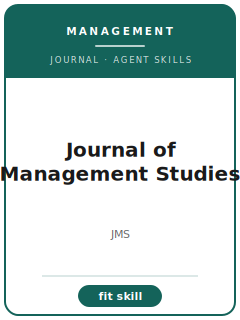

# Journal of Management Studies Skills

<p align="center"></p>

[English](README.md) | 简体中文

面向 **Journal of Management Studies（JMS）** 投稿的 12 个 agent skills。本包围绕 management and organization studies, strategy, entrepreneurship, innovation, OB, and critical perspectives 设计，帮助稿件区别于 Journal of Management, Organization Studies, AMJ, AMR, and Strategic Management Journal，并强调 conceptually rich management scholarship that makes theory travel beyond one setting。

**官方依据核验日期：2026-06**（投稿前需复核易变细节）：见 [`resources/official-source-map.md`](resources/official-source-map.md)。

## 为什么需要单独的技能栈？

| JMS 约束 | 对稿件的要求 |
|-------------------|--------------|
| 范围 | 主张必须服务于 management and organization studies, strategy, entrepreneurship, innovation, OB, and critical perspectives |
| 同门边界 | 说明为什么不是 Journal of Management, Organization Studies, AMJ, AMR, and Strategic Management Journal |
| 证据标准 | 设计、模型、综述或质性证据必须匹配 conceptually rich management scholarship that makes theory travel beyond one setting |
| 来源纪律 | 当前流程事实必须有来源，或明确标记 待核实 |

## 快速开始

```text
/plugin marketplace add ./Journal-of-Management-Studies-Skills
/plugin install jms-skills
```

手动使用：先打开 [`skills/jms-workflow/SKILL.md`](skills/jms-workflow/SKILL.md)。

## 默认工作流

```text
jms-workflow → jms-topic-selection → jms-theory-development → jms-literature-positioning → jms-methods → jms-data-analysis → jms-contribution-framing → jms-tables-figures → jms-writing-style → jms-submission → jms-review-process → jms-rebuttal
```

## 技能列表

| # | Skill | 作用 |
|---|-------|------|
| 1 | [`jms-workflow`](skills/jms-workflow/SKILL.md) | 面向 JMS 稿件的 Workflow Router |
| 2 | [`jms-topic-selection`](skills/jms-topic-selection/SKILL.md) | 面向 JMS 稿件的 Topic Selection |
| 3 | [`jms-theory-development`](skills/jms-theory-development/SKILL.md) | 面向 JMS 稿件的 Theory Development |
| 4 | [`jms-literature-positioning`](skills/jms-literature-positioning/SKILL.md) | 面向 JMS 稿件的 Literature Positioning |
| 5 | [`jms-methods`](skills/jms-methods/SKILL.md) | 面向 JMS 稿件的 Methods |
| 6 | [`jms-data-analysis`](skills/jms-data-analysis/SKILL.md) | 面向 JMS 稿件的 Data Analysis |
| 7 | [`jms-contribution-framing`](skills/jms-contribution-framing/SKILL.md) | 面向 JMS 稿件的 Contribution Framing |
| 8 | [`jms-tables-figures`](skills/jms-tables-figures/SKILL.md) | 面向 JMS 稿件的 Tables and Figures |
| 9 | [`jms-writing-style`](skills/jms-writing-style/SKILL.md) | 面向 JMS 稿件的 Writing Style |
| 10 | [`jms-submission`](skills/jms-submission/SKILL.md) | 面向 JMS 稿件的 Submission Preflight |
| 11 | [`jms-review-process`](skills/jms-review-process/SKILL.md) | 面向 JMS 稿件的 Review Process |
| 12 | [`jms-rebuttal`](skills/jms-rebuttal/SKILL.md) | 面向 JMS 稿件的 Rebuttal Strategy |

## 资源

- [`resources/README.md`](resources/README.md) — 资源索引
- [`resources/official-source-map.md`](resources/official-source-map.md) — 官方 URL 与易变信息
- [`resources/external_tools.md`](resources/external_tools.md) — 数据库、方法与软件工具
- [`resources/worked-examples/01-introduction.md`](resources/worked-examples/01-introduction.md) — 虚构引言改写示例
- [`resources/exemplars/library.md`](resources/exemplars/library.md) — 真实论文槽位与来源纪律
- [`resources/code/`](resources/code/) — 适用时使用的实证代码脚手架

## 许可

MIT (c) 2026 Bryce Wang。见 [LICENSE](LICENSE)。
