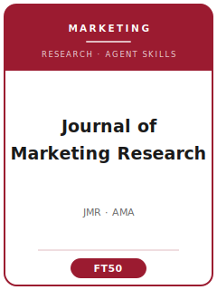

# 《营销研究杂志》(JMR) Skills

<p align="center">
  
</p>

[](LICENSE)
[](https://www.ama.org/journal-of-marketing-research/)
[](https://www.ama.org/journal-of-marketing-research/)
[](https://github.com/anthropics/claude-code)

[English](README.md) | 简体中文

面向 **《营销研究杂志》(Journal of Marketing Research, JMR)** 投稿的 Agent 技能栈 —— JMR 是美国市场营销协会 (AMA) 旗下、由 SAGE 出版的、最偏重方法与建模的旗舰营销期刊。

本仓库是有立场的。它**不是**通用的"营销写作"工具箱，而是围绕 JMR 的核心身份打造的 **JMR 专用**技能栈：一道**双重门槛** —— 既要方法上的严谨，又要有实质性/理论性的贡献；而且这本期刊**刻意地**在同一个刊物里同时容纳**行为实验**（实验室与田野）与**计量/结构式营销科学建模**两条方法论路线。覆盖范围包括选题、理论构建、文献定位、带识别意识的研究设计与分析、精确统计量的报告、贡献提炼、符合 AMA/SAGE 体例的图表、**50 页篇幅上限**及其 **以"W"为前缀的 Web Appendix（网络附录）**、ScholarOne 投稿、**双盲匿名**评审流程，以及多轮 R&R 答复。

> 仅描述持久规范。主编、版面费、确切页数限制及各项政策会变化 —— 请以 SAGE 作者须知与 AMA 投稿指南页面为准。**主编更替：** Rebecca Hamilton（乔治城大学）任期至 2026 年 6 月 30 日；Raphael Thomadsen 带领的新团队（圣路易斯华盛顿大学，2026–2029 任期）自 2026 年 4 月 1 日起已开始处理新稿件。

---

## 为什么需要单独的 JMR 技能栈？

相比纯理论的管理学期刊，或档案式的会计/金融期刊，JMR 的约束有本质差异：

| 约束维度       | 《营销研究杂志》(JMR)                                         | 含义                                                       |
|----------------|--------------------------------------------------------------|------------------------------------------------------------|
| 学科           | 营销全谱系，偏重方法与建模                                    | 纯管理者导向的框架更适合《Journal of Marketing》           |
| 方法跨度       | 行为实验**与**计量/结构式建模同处一刊                         | 技能栈必须同时服务两类文章，而非单一流派                    |
| 核心门槛       | **双重门槛**：方法严谨**且**实质性/理论性贡献                 | 巧方法无洞见、或有洞见但识别薄弱，都会被拒                  |
| 统计报告       | 强制报告**精确 p 值（三位小数）、标准误、效应量**             | 星号 /“p<.05” / 不报标准误都属不合规                       |
| 篇幅           | **50 页**全包含正文上限（Web Appendix 不计入）               | 把补充分析放进不限页数的 Web Appendix                      |
| Web Appendix   | 一等公民：单独 PDF，表/图以 **"W" 前缀** 标号                 | 可复现材料放在此处，标为“Table W1”                         |
| 透明度         | AMA 研究透明度政策；标题页须含**数据可得性声明**              | 应随时准备应编辑要求分享代码、量表、材料                    |
| 评审           | **双盲匿名**；达到 Revise/Accept 需两份独立评审              | 完整匿名；首轮直接录用几乎闻所未闻                          |
| 引用体例       | **AMA 作者-年份**（“Thorelli 1960”），参考文献不设上限       | 不是 APA 数字制；请把文献管理器配置为 AMA 体例             |

通用的"科研写作"或"社科方法"技能包无法覆盖这些约束。

---

## 快速开始

### 方式 A —— Claude Code 插件（推荐）

```bash
/plugin marketplace add https://github.com/brycewang-stanford/jmr-skills
/plugin install jmr-skills
/reload-plugins
```

### 方式 B —— 手动复制

```bash
git clone https://github.com/brycewang-stanford/jmr-skills.git
cd jmr-skills

mkdir -p ~/.claude/skills && cp -R skills/jmr-* ~/.claude/skills/
# 或
mkdir -p ~/.codex/skills && cp -R skills/jmr-* ~/.codex/skills/
```

### 第一条指令

```
用 jmr-workflow 告诉我，我这篇 JMR 稿子下一步该用哪个 skill。
```

---

## 默认工作流

```text
jmr-topic-selection（选题）
        ▼
jmr-theory-development（理论 / 模型机制）
        ▼
jmr-literature-positioning（文献定位）
        ▼
jmr-methods（实验设计 / 识别策略）
        ▼
jmr-data-analysis（精确统计、估计与复现）
        ▼
jmr-contribution-framing（清"双重门槛"）
        ▼
jmr-tables-figures（图表 / 正文 vs. Web Appendix）
        ▼
jmr-writing-style（文风打磨）
        ▼
jmr-submission（投稿前自检）
        ▼
jmr-review-process（理解评审流程）
        ▼
jmr-rebuttal（R&R 答复）
```

`jmr-workflow` 是路由器 —— 它根据你所处的阶段、以及你的文章属于**行为**、**建模/计量**还是**方法**贡献，告诉你下一步该用哪个 skill。

---

## 技能列表

| Skill                        | 用途                                                                          |
|------------------------------|-------------------------------------------------------------------------------|
| `jmr-workflow`               | 路由器 —— 决定下一步调用哪个子技能；区分行为/建模/方法三类文章                 |
| `jmr-topic-selection`        | 营销问题 + JMR 契合度判断（对比《Journal of Marketing》/《Marketing Science》/《JCR》）|
| `jmr-theory-development`     | 行为假设与过程证据，或建模原语/计量机制                                        |
| `jmr-literature-positioning` | 加入营销学术对话；在行为与建模两条流派间定位                                   |
| `jmr-methods`                | 实验设计（实验室/田野）或识别策略（IV/DiD/结构式）与论断匹配                   |
| `jmr-data-analysis`          | 精确 p 值、标准误、效应量；选对估计量；可复现分析                              |
| `jmr-contribution-framing`   | 清"双重门槛" —— 实质洞见加方法贡献                                            |
| `jmr-tables-figures`         | AMA 体例图表；正文 vs. 以"W"前缀的 Web Appendix 表/图                         |
| `jmr-writing-style`          | 第三人称摘要、AMA 作者-年份体例、精确统计量的写作约定                          |
| `jmr-submission`             | ScholarOne 投稿前自检：50 页上限、Web Appendix PDF、数据可得性声明、匿名化     |
| `jmr-review-process`         | JMR 双盲匿名、Coeditor 分流、两份评审的流程如何运作                            |
| `jmr-rebuttal`               | 多轮 R&R 修改与逐条答复信                                                      |

### 资源

- [`skills/jmr-submission/templates/checklist.md`](skills/jmr-submission/templates/checklist.md) —— 投稿前自检（50 页上限、Web Appendix、精确统计量、匿名化）
- [`resources/external_tools.md`](resources/external_tools.md) —— 行为类工具（Qualtrics / Prolific / PROCESS / G*Power）与建模类工具（NielsenIQ-IRI 扫描数据 / Stata reghdfe / R bayesm / Stan / BLP 式需求模型）
- [`resources/official-source-map.md`](resources/official-source-map.md) —— 每条已核实事实背后的 AMA/SAGE 官方 URL（访问于 2026-06-01）

---

## 与《Journal of Marketing》/《Marketing Science》/《JCR》的差异

| 维度       | JMR                              | Journal of Marketing (JM)  | Marketing Science          | Journal of Consumer Research (JCR) |
|------------|----------------------------------|----------------------------|----------------------------|------------------------------------|
| 框架       | 偏重方法与建模                   | 管理者导向 / 实质性        | 量化营销科学               | 消费者行为、跨学科                 |
| 方法       | 实验**与**建模同处一刊           | 常为实证 + 管理含义        | 建模 / 解析 / 计量         | 主要为行为实验                     |
| 核心门槛   | 双重：严谨**且**实质洞见         | 管理相关性 + 理论          | 建模贡献                   | 消费者洞见 + 理论                  |
| 最契合     | 严谨的营销发现或方法贡献         | 面向管理者的含义           | 结构式 / 解析模型          | 深度消费者行为理论                 |

如果你的文章纯属面向管理者、方法较轻，可考虑《Journal of Marketing》；纯解析模型可能更契合《Marketing Science》；深度消费心理学文章可能更契合《JCR》。

---

## 相关链接

- [awesome-journal-skills](https://github.com/brycewang-stanford/awesome-journal-skills) —— 期刊专用技能包索引
- [Academy-of-Management-Journal-Skills](https://github.com/brycewang-stanford) —— 《美国管理学会会刊》(AMJ)

---

## 许可证

MIT
