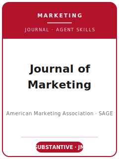

# 《营销学杂志》(Journal of Marketing, JM) Skills

<p align="center">
  
</p>

[](LICENSE)
[](https://www.ama.org/journal-of-marketing/)
[](https://www.ama.org/journal-of-marketing/)
[](https://github.com/anthropics/claude-code)

[English](README.md) | 简体中文

面向 **《营销学杂志》(Journal of Marketing, JM)** 投稿的 Agent 技能栈 —— JM 是美国营销协会 (American Marketing Association, AMA) 旗下面向**广义读者**、最顶级的**实质性 (substantive)** 营销学期刊，由 SAGE 代 AMA 出版发行。

本仓库是有立场的。它**不是**通用的"营销写作"工具箱，而是围绕 JM 核心标准打造的 **JM 专用**技能栈：发表"营销学科中最具影响力、引领思想的实质性研究"，并具备真实的**管理、政策与社会相关性**。覆盖范围包括：以现实营销现象为根基的选题、扎根真实现象的理论构建、文献定位、JM 的"大帐篷 (big tent)"/**实证优先 (empirics-first)** 研究方法、精确统计量报告与 JM Dataverse 复现、以管理相关性为核心的贡献提炼、符合 AMA 体例的图表与文风、ScholarOne (Sage Track) 投稿、双盲评审流程，以及多轮 R&R 答复。

> 仅描述持久规范。编辑名单、投稿入口提示、费用/OA 语言与透明性流程会变化——上传前请按 source map 对 JM/SAGE/AMA 官方页面做 live check。

---

## 为什么需要单独的 JM 技能栈？

相比偏理论驱动、偏建模、或纯消费者行为的营销期刊，JM 的约束有本质差异：

| 约束维度       | 《营销学杂志》(JM)                                                | 含义                                                       |
|----------------|------------------------------------------------------------------|------------------------------------------------------------|
| 核心标准       | 对重要现实营销问题的**实质性**洞见                                | 为方法而方法的新颖性不在收稿范围                            |
| 双重使命       | 学术**与**实践兼顾 —— 管理/政策/社会相关性是硬性要求              | 相关性是必需，而非客套段落                                  |
| 读者           | 学者、教育者、管理者、政策制定者、消费者、社会                    | 面向广义读者的"桥梁"定位，而非小众专家读物                  |
| 数据立场       | "大帐篷"：实验、田野、问卷、访谈、观察、二手数据；欢迎**实证优先** | 无单一方法被优待；由现象主导                                |
| 反增量主义     | 复制既有理论、或把已有发现套用到新情境，会被拒                    | 仅"新情境"不构成贡献                                        |
| 方法定位       | 方法服务于实质问题；对"不必要的复杂分析"予以反制                  | 为建模而建模请投 Marketing Science / JMR                   |
| 统计报告       | 须报告真实 p 值、标准误**和**效应量                              | "p < .05" 阈值写法不合规                                    |
| 篇幅           | 硬性 **50 页**上限，除网络附录外一切计入                          | 表、图、参考文献、印刷版附录均计入                          |
| 透明度         | 在有条件录用时向 **JM Dataverse** 提交复现包                      | 数据+代码（或定性材料）处理主编可见、评审人不可见           |
| 流程           | ScholarOne (Sage Track)；双盲；由处理主编决断                     | 稿件须完全匿名                                              |
| 费用           | 订阅发表路径无投稿费或发表费；可选 Sage Choice OA 可能收费          | 预算前以实时 SAGE/OA 提示为准                               |

通用的"科研写作"或"社科方法"技能包无法覆盖这些约束。

---

## 快速开始

### 方式 A —— Claude Code 插件（推荐）

```bash
/plugin marketplace add https://github.com/brycewang-stanford/jm-skills
/plugin install jm-skills
/reload-plugins
```

### 方式 B —— 手动复制

```bash
git clone https://github.com/brycewang-stanford/jm-skills.git
cd jm-skills

mkdir -p ~/.claude/skills && cp -R skills/jm-* ~/.claude/skills/
# 或
mkdir -p ~/.codex/skills && cp -R skills/jm-* ~/.codex/skills/
```

### 第一句提示词

```
用 jm-workflow 告诉我，我的 Journal of Marketing 稿件下一步该用哪个技能。
```

---

## 默认工作流

```text
jm-topic-selection
        ▼
jm-theory-development
        ▼
jm-literature-positioning
        ▼
jm-methods
        ▼
jm-data-analysis
        ▼
jm-contribution-framing
        ▼
jm-tables-figures
        ▼
jm-writing-style        (打磨)
        ▼
jm-submission
        ▼
jm-review-process
        ▼
jm-rebuttal
```

`jm-workflow` 是路由器 —— 根据你所处的阶段，告诉你下一步该用哪个技能。

---

## 技能清单

| 技能                        | 用途                                                                    |
|-----------------------------|-------------------------------------------------------------------------|
| `jm-workflow`               | 路由器 —— 决定下一步调用哪个子技能                                       |
| `jm-topic-selection`        | 实质性、具管理相关性的选题 + JM 契合度检验（vs. JMR / Marketing Science / JCR） |
| `jm-theory-development`     | 扎根真实营销现象的理论；实证优先的推理                                   |
| `jm-literature-positioning` | 加入实质性对话；规避"新情境"式增量                                       |
| `jm-methods`                | 让设计（实验/田野/问卷/二手/定性）匹配实质问题                           |
| `jm-data-analysis`          | 真实 p 值、标准误、效应量；识别策略；JM Dataverse 复现                   |
| `jm-contribution-framing`   | 明确的实质性 + 管理/政策/社会贡献                                        |
| `jm-tables-figures`         | 结果表、管理启示型图表、交互作用图（AMA 体例）                           |
| `jm-writing-style`          | 前置式实质性论证，AMA 作者-年份体例                                      |
| `jm-submission`             | ScholarOne (Sage Track) 投稿前检查：匿名化、50 页格式、文件             |
| `jm-review-process`         | JM 双盲评审/决策如何运作；读懂决定信                                     |
| `jm-rebuttal`               | 多轮 R&R 修改与逐条答复信                                                |

### 资源

- [`resources/external_tools.md`](resources/external_tools.md) —— 营销研究数据（NielsenIQ / Circana / Prolific / Qualtrics / Sawtooth / 田野实验合作方）与分析软件（R lavaan / PROCESS / Stata reghdfe / DiD / 选择模型）
- [`resources/official-source-map.md`](resources/official-source-map.md) —— 每条已核实事实背后的 AMA/SAGE/JM 官方链接（访问于 2026-06-20）与 live-check 项

---

## 与 JMR / Marketing Science / JCR 的区别

| 维度           | 《营销学杂志》(JM)                     | JMR                          | Marketing Science            | JCR                              |
|----------------|----------------------------------------|------------------------------|------------------------------|----------------------------------|
| 核心贡献       | **实质性** + 管理相关性                | 方法导向的实证严谨           | 分析/计量建模                | 跨学科消费者理论                 |
| 方法侧重       | "大帐篷"、实证优先                     | 测量、模型、方法             | 形式化/博弈论与结构模型      | 消费者行为实验/理论              |
| 读者           | 管理者、政策、社会 + 学者              | 营销研究者                   | 建模者、分析师               | 消费者研究者（广义社会科学）     |
| 所有者/出版方  | AMA / SAGE                            | AMA / SAGE                   | INFORMS                      | 牛津大学出版社 / ACR             |

若你的论文以建模或方法推进为核心、而非实质性营销洞见，请投 **Marketing Science** 或 **JMR**；若是跨学科消费者理论，请投 **JCR**。

---

## 相关

- [awesome-journal-skills](https://github.com/brycewang-stanford/awesome-journal-skills) —— 期刊专用技能包索引

---

## 许可证

MIT
