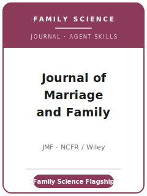

# Journal of Marriage and Family Skills

<p align="center">
  
</p>

[](LICENSE)
[](https://onlinelibrary.wiley.com/journal/17413737)
[](https://www.ncfr.org/jmf)
[](https://github.com/anthropics/claude-code)

English | [简体中文](README.zh-CN.md)

Agent skill stack for manuscripts targeted at the **Journal of Marriage and Family (JMF)** — the
**leading interdisciplinary journal of family science**, founded in **1939** and published by **Wiley**
for the **National Council on Family Relations (NCFR)**. JMF publishes research, theory, interpretation,
and critical discussion on **marriage, close relationships, and families**: family demography, marriage
and partnering, divorce and union dissolution, cohabitation and fertility, parenting and child
wellbeing, intergenerational and close relationships, gender, and family policy — drawing on
**sociology, psychology, demography, and family studies**, in quantitative, qualitative, and
multi-method designs alike.

This repository is opinionated. It is **not** a generic social-science writing toolbox and it is
**not** a political-science or economics pack repurposed for families. It is a **JMF-specific** stack:
a genuine **family-science contribution**, a framework drawn from the family literatures, designs that
respect the **unit of analysis** (individual, dyad, family, household, cohort) and the
**non-independence** of people who share a relationship, **double-blind** anonymous preparation, and
transparency built for the **restricted-use** datasets family research so often depends on.

---

## What Is JMF, and Why a Dedicated Stack?

JMF's constraints differ from a general sociology, psychology, or economics journal:

| Constraint            | JMF                                                                            | Implication                                                       |
|-----------------------|--------------------------------------------------------------------------------|-------------------------------------------------------------------|
| Scope                 | **Families and close relationships** — interdisciplinary family science        | The family/couple/parent–child relationship must be central       |
| Premium on            | A contribution to **how we understand families**, with theory and significance | A generic result where "family" is incidental is off-fit          |
| Disciplines           | **Sociology + psychology + demography + family studies**                       | Engage the family literatures across disciplines, not just one    |
| Methods               | Quantitative, qualitative, multi-method — judged on own terms                  | Match design and unit of analysis; respect non-independence       |
| Publisher / owner     | **Wiley** / **NCFR**                                                            | Submit via **Wiley Research Exchange** (migrated from ScholarOne) |
| Review model          | **Double-blind anonymous**                                                     | Anonymize fully; strip names, affiliations, acknowledgements      |
| Length                | Manuscript **≤ ~35 pages**; **Brief Report ≤ ~25** (incl. tables/figures)      | Page budget includes exhibits; use supplements                    |
| Abstract              | **Structured, ~200–225 words** (Objective/Background/Method/Results/etc.)      | Not a free-form paragraph; reviewers are invited on it            |
| Style                 | **Modified APA**; bias-free language                                           | Not generic Chicago; describe family forms precisely              |
| Transparency          | Replication-level detail + **data availability statement** (Wiley policy)      | Plan for restricted-use data: access path + synthetic data        |

The pack's venue facts are mapped to NCFR / Wiley sources in
[`resources/official-source-map.md`](resources/official-source-map.md). Before an actual upload,
live-check the official pages for volatile operational details such as the portal link, fees,
editor roster, file requirements, and any journal-specific policy updates.

### Two manuscript formats

- **Article** — full original study, developed framework and analysis; **≤ ~35 pages** including
  abstract, text, tables, and figures.
- **Brief Report** — one crisp, complete contribution; **≤ ~25 pages**. JMF explicitly welcomes brief
  reports for **replications, innovative designs, and important null findings**.

---

## Quick Start

### Option A — Claude Code Plugin (recommended)

```bash
/plugin marketplace add https://github.com/brycewang-stanford/jmf-skills
/plugin install jmf-skills
/reload-plugins
```

### Option B — Manual Copy

```bash
git clone https://github.com/brycewang-stanford/jmf-skills.git
cd jmf-skills

mkdir -p ~/.claude/skills && cp -R skills/jmf-* ~/.claude/skills/
# or
mkdir -p ~/.codex/skills && cp -R skills/jmf-* ~/.codex/skills/
```

### First Prompt

```
Use jmf-workflow to tell me which skill I should use next for my Journal of Marriage and Family manuscript.
```

---

## Default Workflow

```text
jmf-topic-selection
        ▼
jmf-literature-positioning
        ▼
jmf-theory-and-conceptual-framework
        ▼
jmf-research-design
        ▼
jmf-data-analysis
        ▼
jmf-tables-figures
        ▼
jmf-writing-style          (polish)
        ▼
jmf-transparency-and-data-policy
        ▼
jmf-review-process
        ▼
jmf-submission
        ▼
jmf-rebuttal
```

`jmf-workflow` is the router — it tells you which skill to use next based on where you are. If your
design is **prospective**, route to `jmf-research-design` early to lock a pre-analysis plan; if you are
reassessing a published finding or reporting an important null, consider the **Brief Report** format.

---

## Skills

| Skill                                  | Purpose                                                                       |
|----------------------------------------|-------------------------------------------------------------------------------|
| `jmf-workflow`                         | Router — decides which sub-skill to invoke next                               |
| `jmf-topic-selection`                  | Family-science fit across disciplines; article vs. brief report               |
| `jmf-literature-positioning`           | Engage the family literatures across sociology, psychology, demography        |
| `jmf-theory-and-conceptual-framework`  | Build a family-science framework (life course, family stress, exchange…)      |
| `jmf-research-design`                  | Longitudinal, dyadic, family-level, and demographic designs; address selection|
| `jmf-data-analysis`                    | Survey weights, non-independence, missing data, robustness, magnitude         |
| `jmf-tables-figures`                   | Self-contained, accessible exhibits in modified APA; manage the page budget   |
| `jmf-writing-style`                    | Modified APA; structured abstract; bias-free language; reach the field        |
| `jmf-transparency-and-data-policy`     | Replication detail, data availability statement, restricted-use data path     |
| `jmf-review-process`                   | Double-blind review, reviewer/editor roles, the R&R pathway                   |
| `jmf-submission`                       | Wiley Research Exchange preflight (anonymization, abstract, page limit)       |
| `jmf-rebuttal`                         | R&R response-letter strategy for multiple anonymous reviewers + editor        |

### Resources

- [`resources/external_tools.md`](resources/external_tools.md) — family-science data sources (PSID / NLSY / Add Health / Fragile Families / NSFG / HRS / pairfam / IPUMS) + R / Stata / Python dyadic, longitudinal, survival, and survey tooling
- [`resources/official-source-map.md`](resources/official-source-map.md) — official NCFR / Wiley URLs behind the pack's venue-specific facts

---

## What This Repo Does Not Do

- It does not write a submittable manuscript for you
- It does not simulate any specific editor's or reviewer's taste
- It does not replace a live final check of operational metadata (portal link, fees, current masthead, file requirements, policy wording)
- It does not decide whether your question is a genuine family-science contribution — that is the researcher's call

---

## Related

- [awesome-journal-skills](https://github.com/brycewang-stanford/awesome-journal-skills) — Index of journal-specific skill packs
- [Journal of Marriage and Family (Wiley Online Library)](https://onlinelibrary.wiley.com/journal/17413737) — publisher home
- [JMF at NCFR](https://www.ncfr.org/jmf) — owner, submission guidelines, style guide, reviewer policies

---

## License

MIT
