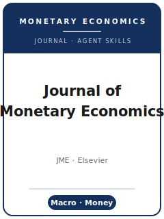

# 货币经济学杂志技能包（Journal of Monetary Economics Skills）

<p align="center">
  
</p>

[](LICENSE)
[](https://www.sciencedirect.com/journal/journal-of-monetary-economics)
[](https://www.sciencedirect.com/journal/journal-of-monetary-economics)
[](https://github.com/anthropics/claude-code)

[English](README.md) | 简体中文

面向投稿 **《货币经济学杂志》（Journal of Monetary Economics, JME）** 的智能体技能栈。JME 是 Elsevier 旗下广义货币经济学与宏观经济学的顶级期刊，覆盖货币理论与政策、中央银行、经济周期、增长、金融市场与中介、财政—货币互动、预期，以及货币与金融对总量经济的影响。JME 同时接受理论与实证研究，包括 DSGE / 定量宏观与应用政策分析，并且**每年有一期专门刊登 Carnegie-Rochester-NYU 公共政策会议系列（Conference Series on Public Policy）**（另有约每两年一期的瑞士国家银行 Gerzensee 研究中心宏观政策会议论文）。

本仓库是**有立场的**：它**不是**通用经济学写作工具箱，而是围绕 JME 真实约束打造的**专属**技能栈——预付投稿费、单向匿名评审、严格篇幅上限、独特的"一次定生死（up or out）"修改规则，以及 ScienceDirect / Mendeley Data 补充材料政策。

---

## 为什么需要一个独立的 JME 技能栈？

JME 的约束与通用 Top-5 期刊或方法类期刊有本质差异：

| 约束               | JME                                                                       | 含义                                                       |
|--------------------|---------------------------------------------------------------------------|-----------------------------------------------------------|
| 范围               | 广义货币经济学与宏观经济学                                                 | 没有总量含义的纯微观估计不契合                             |
| 模式               | 理论**与**实证（DSGE / 定量 / 应用政策）                                   | 干净的模型和可信识别的冲击都受欢迎                         |
| 投稿系统           | Elsevier **Editorial Manager**（`editorialmanager.com/monec/`）           | 并非通用经济学投稿门户                                     |
| 投稿费             | **350 美元**（全日制博士生 200 美元），**预付**；直接退稿可退还一半        | 付款后稿件方被受理                                         |
| 评审模式           | **单向匿名**（single-blind），**至少 2 名评审**                            | **不要**匿名化——评审知道你是谁                            |
| 首轮修改           | **"一次定生死"**——再投稿要么接收要么拒稿，没有第二轮 R&R                    | 唯一一次修改必须彻底回应所有意见                           |
| R&R 信号           | 仅在**约 50%** 最终发表概率时才邀请修改                                    | R&R 是强信号（但非保证）                                   |
| 篇幅上限（录用）   | 正文/参考文献/脚注 **≤ 40 页**，表格与图合计 **≤ 10 个**                     | 把稳健性放入在线补充材料（不计入上限）                     |
| 摘要               | **≤ 100 词**，且**不得**以 "This paper" 或 "We" 开头                       | 以发现或问题开篇                                           |
| 参考文献           | 作者—年份制；期刊名**全称不缩写**；列表置于附录之后、表图之前              | 编号制/缩写制会显得不合规范                                |
| 识别               | 识别出的冲击（高频、叙事、proxy-SVAR、局部投影）或基于模型                  | 没有外生性论证的原始政策利率变动无法过关                   |
| 数据政策           | 在 **ScienceDirect / Mendeley Data** 存放数据/代码/附录；需声明生成式 AI 使用 | 编辑可将提供材料作为发表条件                               |

期刊由 **S. Borağan Aruoba**（马里兰大学）与 **Eric Swanson**（加州大学欧文分校；在 Elsevier 主编访谈中被标识为主编 editor-in-chief）主持。通用"科学写作"或"经济学写作"技能包无法覆盖这些约束。易变的具体信息（编辑、费用、篇幅上限、政策措辞）会变动——请在期刊官方页面**核实**（见 [`resources/official-source-map.md`](resources/official-source-map.md)）。

---

## 快速开始

### 方式 A —— Claude Code 插件（推荐）

```bash
/plugin marketplace add https://github.com/brycewang-stanford/jme-skills
/plugin install jme-skills
/reload-plugins
```

### 方式 B —— 手动复制

```bash
git clone https://github.com/brycewang-stanford/jme-skills.git
cd jme-skills

mkdir -p ~/.claude/skills && cp -R skills/jme-* ~/.claude/skills/
# 或
mkdir -p ~/.codex/skills && cp -R skills/jme-* ~/.codex/skills/
```

### 第一条提示词

```
用 jme-workflow 告诉我，我的 JME 稿件下一步应该用哪个技能。
```

---

## 默认工作流

```text
jme-topic-selection           （选题与范围契合）
        ▼
jme-literature-positioning    （文献定位）
        ▼
jme-contribution-framing      （贡献凝练）
        ▼
jme-identification-strategy   （识别策略）
        ▼
jme-data-analysis             （定量/实证分析）
        ▼
jme-tables-figures            （表与图，≤10 上限）
        ▼
jme-writing-style             （JME 体例打磨）
        ▼
jme-replication-and-data-policy（复制与数据政策）
        ▼
jme-review-process            （评审流程）
        ▼
jme-submission                （投稿前自检）
        ▼
jme-rebuttal                  （"一次定生死"修改回复）
```

`jme-workflow` 是路由器——根据你所处阶段告诉你下一步用哪个技能。

---

## 技能列表

| 技能                              | 用途                                                                 |
|-----------------------------------|----------------------------------------------------------------------|
| `jme-workflow`                    | 路由器——决定下一步调用哪个子技能                                     |
| `jme-topic-selection`             | 货币—宏观范围契合 + 政策/概念价值门槛                                |
| `jme-literature-positioning`      | 在货币—宏观前沿上确立贡献                                            |
| `jme-contribution-framing`        | 凝练"新意 + 政策含义"以达到约 50% 的 R&R 门槛                        |
| `jme-identification-strategy`     | 可信的冲击/机制识别（高频、叙事、proxy-SVAR、局部投影、模型）        |
| `jme-data-analysis`               | VAR / SVAR / 局部投影 / DSGE 估计，脉冲响应、方差分解、稳健性        |
| `jme-tables-figures`              | 在 ≤10 上限内安排表图，其余放入在线补充材料                          |
| `jme-writing-style`               | JME 体例——100 词摘要、作者—年份制、行号、JEL 代码                   |
| `jme-replication-and-data-policy` | ScienceDirect / Mendeley 存放 + Elsevier 生成式 AI 声明              |
| `jme-review-process`              | 单向匿名、双评审、"一次定生死"、约 50% 门槛、费用机制                |
| `jme-submission`                  | Editorial Manager 投稿前自检（费用、40 页、行号、JEL 代码）          |
| `jme-rebuttal`                    | 唯一一次"一次定生死"R&R 回复信策略                                   |

### 资源

- [`resources/official-source-map.md`](resources/official-source-map.md) —— 本技能包每条事实背后的 JME / Elsevier 官方网址（访问日期 2026-06-01），未核实项标注 **待核实**
- [`resources/external_tools.md`](resources/external_tools.md) —— 宏观/货币数据源（FRED、BIS、ECB、实时数据）与软件（Dynare、MATLAB/Julia、Stata `lpirf`、R `lpirfs`/`vars`）用于 VAR/局部投影/DSGE

---

## 与其他顶刊的差异

| 维度       | JME                                  | 《经济学季刊》(QJE)               | Econometrica          |
|------------|--------------------------------------|----------------------------------|-----------------------|
| 开篇       | 货币/宏观冲击或机制                  | 一个大的实证微观问题             | 一个方法/定理         |
| 识别       | 高频冲击/叙事/SVAR/局部投影/模型     | 自然实验，图表先行               | 估计量性质            |
| 评审模式   | 单向匿名，"一次定生死"               | 双向匿名，少数几轮               | 单/双向匿名，较慢     |
| 篇幅       | 硬性 40 页 / ≤10 表图上限            | 无硬上限，海量附录               | 无硬上限              |
| 费用       | 预付 350 美元（博士生 200）          | 无投稿费                         | 有投稿费              |

---

## 本仓库不做什么

- 不替你写出可直接投稿的稿件
- 不模拟任何特定编辑或评审的口味
- 不断言易变元数据（现任编辑、确切费用、存放规则）——请在官方页面核实
- 不声称 JME 存在 AEA/Econometrica 式的强制复制验证关卡（此项为 **待核实**；已确认的政策是存放建议加编辑酌情要求）

---

## 相关项目

- [awesome-journal-skills](https://github.com/brycewang-stanford/awesome-journal-skills) —— 期刊专属技能包索引
- [Quarterly-Journal-of-Economics-Skills](https://github.com/brycewang-stanford/qje-skills) —— QJE 技能包
- [Journal of Monetary Economics（官方）](https://www.sciencedirect.com/journal/journal-of-monetary-economics) —— Elsevier / ScienceDirect

---

## 许可证

MIT
