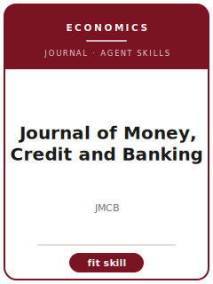

# Journal of Money, Credit and Banking Skills

<p align="center"></p>

[English](README.md) | 简体中文

面向 **Journal of Money, Credit and Banking（JMCB）** 投稿的 12 个 agent skills。本包围绕 monetary economics, banking, credit markets, financial intermediation, and macro-finance 设计，帮助稿件区别于 Journal of Monetary Economics, Review of Economic Dynamics, Journal of Finance, and Journal of Financial Intermediation，并强调 policy-relevant macro-finance evidence with transparent timing and institutional detail。

**官方依据核验日期：2026-06**（投稿前需复核易变细节）：见 [`resources/official-source-map.md`](resources/official-source-map.md)。

## 为什么需要单独的技能栈？

| JMCB 约束 | 对稿件的要求 |
|-------------------|--------------|
| 范围 | 主张必须服务于 monetary economics, banking, credit markets, financial intermediation, and macro-finance |
| 同门边界 | 说明为什么不是 Journal of Monetary Economics, Review of Economic Dynamics, Journal of Finance, and Journal of Financial Intermediation |
| 证据标准 | 设计、模型、综述或质性证据必须匹配 policy-relevant macro-finance evidence with transparent timing and institutional detail |
| 来源纪律 | 当前流程事实必须有来源，或明确标记 待核实 |

## 快速开始

```text
/plugin marketplace add ./Journal-of-Money-Credit-and-Banking-Skills
/plugin install jmcb-skills
```

手动使用：先打开 [`skills/jmcb-workflow/SKILL.md`](skills/jmcb-workflow/SKILL.md)。

## 默认工作流

```text
jmcb-workflow → jmcb-topic-selection → jmcb-literature-positioning → jmcb-identification → jmcb-empirical-design → jmcb-robustness → jmcb-tables-figures → jmcb-internet-appendix → jmcb-writing-style → jmcb-submission → jmcb-referee-strategy → jmcb-rebuttal
```

## 技能列表

| # | Skill | 作用 |
|---|-------|------|
| 1 | [`jmcb-workflow`](skills/jmcb-workflow/SKILL.md) | 面向 JMCB 稿件的 Workflow Router |
| 2 | [`jmcb-topic-selection`](skills/jmcb-topic-selection/SKILL.md) | 面向 JMCB 稿件的 Topic Selection |
| 3 | [`jmcb-literature-positioning`](skills/jmcb-literature-positioning/SKILL.md) | 面向 JMCB 稿件的 Literature Positioning |
| 4 | [`jmcb-identification`](skills/jmcb-identification/SKILL.md) | 面向 JMCB 稿件的 Identification Strategy |
| 5 | [`jmcb-empirical-design`](skills/jmcb-empirical-design/SKILL.md) | 面向 JMCB 稿件的 Empirical Design |
| 6 | [`jmcb-robustness`](skills/jmcb-robustness/SKILL.md) | 面向 JMCB 稿件的 Robustness Strategy |
| 7 | [`jmcb-tables-figures`](skills/jmcb-tables-figures/SKILL.md) | 面向 JMCB 稿件的 Tables and Figures |
| 8 | [`jmcb-internet-appendix`](skills/jmcb-internet-appendix/SKILL.md) | 面向 JMCB 稿件的 Internet Appendix |
| 9 | [`jmcb-writing-style`](skills/jmcb-writing-style/SKILL.md) | 面向 JMCB 稿件的 Writing Style |
| 10 | [`jmcb-submission`](skills/jmcb-submission/SKILL.md) | 面向 JMCB 稿件的 Submission Preflight |
| 11 | [`jmcb-referee-strategy`](skills/jmcb-referee-strategy/SKILL.md) | 面向 JMCB 稿件的 Referee Strategy |
| 12 | [`jmcb-rebuttal`](skills/jmcb-rebuttal/SKILL.md) | 面向 JMCB 稿件的 Rebuttal Strategy |

## 资源

- [`resources/README.md`](resources/README.md) — 资源索引
- [`resources/official-source-map.md`](resources/official-source-map.md) — 官方 URL 与易变信息
- [`resources/external_tools.md`](resources/external_tools.md) — 数据库、方法与软件工具
- [`resources/worked-examples/01-introduction.md`](resources/worked-examples/01-introduction.md) — 虚构引言改写示例
- [`resources/exemplars/library.md`](resources/exemplars/library.md) — 真实论文槽位与来源纪律
- [`resources/code/`](resources/code/) — 适用时使用的实证代码脚手架

## 许可

MIT (c) 2026 Bryce Wang。见 [LICENSE](LICENSE)。
