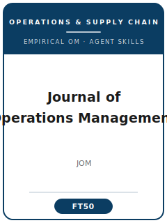

# 《运营管理杂志》(JOM) Skills

<p align="center">
  
</p>

[](LICENSE)
[](https://www.ascm.org/making-an-impact/research/journal-operations-management/jom/)
[](https://en.wikipedia.org/wiki/Journal_of_Operations_Management)
[](https://github.com/anthropics/claude-code)

[English](README.md) | 简体中文

面向 **《运营管理杂志》(Journal of Operations Management, JOM)** 投稿的 Agent 技能栈 —— JOM 是*原创、实证*的运营与供应链管理研究的旗舰期刊，由 **Wiley 代表供应链管理协会 (ASCM，前身为 APICS) 出版**。

本仓库是有立场的。它**不是**通用的"运营"或"供应链写作"工具箱，**也不**面向分析型 OR/优化研究。它是围绕 JOM 核心标准打造的 **JOM 专用**技能栈：一项*实证*研究，且**运营必须是研究问题的核心，而不只是研究的情境** ——"是观察使研究成为实证 (it is the observation that renders the research empirical)"。覆盖范围包括：以运营为核心的选题、先验的 OM 理论构建、面向 OM/SCM 学术对话的文献定位、实证设计（问卷、档案/二手数据、田野、案例、实验、干预式研究）、数据分析与效度、兼顾学术与实践的双重贡献提炼、符合 APA 体例的图表与文风、通过 Wiley ReX 的"按 Department 路由 + 投稿信协议 + 必备清单"投稿、非对称的双盲评审流程，以及多轮 R&R 答复。

> 仅描述持久规范。共同主编、Department 名单、版面费、APC、摘要字数限制及确切篇幅规则会变化 —— 请务必以 ASCM/JOM 官方页面、Wiley JOM 作者指南与当前作者资源页面为准。未在权威页面确认的事项，在 [`resources/official-source-map.md`](resources/official-source-map.md) 中标记为 **待核实**。

---

## 为什么需要单独的 JOM 技能栈？

相比分析型 OM 期刊与通用管理/经济学期刊，JOM 的约束有本质差异：

| 约束维度       | 《运营管理杂志》(JOM)                                          | 含义                                                          |
|----------------|---------------------------------------------------------------|---------------------------------------------------------------|
| 学科           | 实证的运营与供应链管理                                         | 运营必须是问题的*核心*，而非情境                              |
| 实证强制       | 只接受以观察为根基的研究                                       | **不发表纯分析模型或优化技术**（→ OR/工业工程/分析型 OM 期刊）|
| 方法           | 问卷、档案/二手、田野、案例、实验、**干预式研究 (IBR)**        | 设计必须在所主张的运营层级上进行观察                          |
| 理论           | 实证强度**与**有意义的 OM 理论贡献兼备                         | 只有现象、没有理论的"技术报告"会被拒                          |
| 效度           | 测量效度、CMB 处理、内生性、方法核查                           | 专门的 **Empirical Research Methods** Department 审查来稿     |
| 路由           | **12 个 Department** 之一；投稿信须指定 2 个（1 个首选）       | 路由错误的框架会被视为不契合                                  |
| 投稿信         | 须推荐**≥3 名 Associate Editor 与 ≥3 名 ERB 评审**，且无利益冲突 | 要求异常明确 —— 必须照做                                     |
| 评审           | **非对称**双盲（主编/DE 可见作者身份；评审/AE 不可见）         | 稿件须彻底匿名                                                |
| 体例           | ~40 页；双倍行距、单栏、12 号字；**APA**；必备清单             | 过长稿件会被退回精简                                          |
| 学术诚信       | iThenticate/CrossCheck；单一来源 <~1%，整体 <15%（否则须说明） | 比单一全局阈值更严                                            |
| 读者           | 学者**与** ASCM 实务界                                         | 实践相关性须具体、落到运营层面                                |

通用的"科研写作"、"社科方法"或分析型 OM 技能包无法覆盖这些约束。

---

## 快速开始

### 方式 A —— Claude Code 插件（推荐）

```bash
/plugin marketplace add https://github.com/brycewang-stanford/jom-skills
/plugin install jom-skills
/reload-plugins
```

### 方式 B —— 手动复制

```bash
git clone https://github.com/brycewang-stanford/jom-skills.git
cd jom-skills

mkdir -p ~/.claude/skills && cp -R skills/jom-* ~/.claude/skills/
# 或
mkdir -p ~/.codex/skills && cp -R skills/jom-* ~/.codex/skills/
```

### 第一条指令

```
用 jom-workflow 告诉我，我这篇 JOM 稿子下一步该用哪个 skill。
```

---

## 默认工作流

```text
jom-topic-selection（选题）
        ▼
jom-theory-development（理论与假设）
        ▼
jom-literature-positioning（文献定位）
        ▼
jom-methods（实证设计）
        ▼
jom-data-analysis（数据分析与效度）
        ▼
jom-contribution-framing（贡献提炼）
        ▼
jom-tables-figures（图表）
        ▼
jom-writing-style（文风打磨）
        ▼
jom-submission（投稿前自检）
        ▼
jom-review-process（理解评审流程）
        ▼
jom-rebuttal（R&R 答复）
```

`jom-workflow` 是路由器 —— 它根据你当前所处的阶段告诉你下一步该用哪个 skill。

---

## 技能列表

| Skill                       | 用途                                                                       |
|-----------------------------|----------------------------------------------------------------------------|
| `jom-workflow`              | 路由器 —— 决定下一步调用哪个子技能                                          |
| `jom-topic-selection`       | "运营是否为核心" + 实证契合度判断；在 12 个 Department 中选择               |
| `jom-theory-development`    | 先验的 OM 机制（运营/行为/组织）与假设                                      |
| `jom-literature-positioning`| 加入 OM/SCM 学术对话；与分析型 OM 区分                                      |
| `jom-methods`               | 把问卷/档案/田野/案例/实验/IBR 与运营问题匹配                               |
| `jom-data-analysis`         | 测量、CMB、内生性、SEM/HLM/面板/计数/生存；为方法核查做准备                 |
| `jom-contribution-framing`  | 以运营为核心、兼顾学术与实践的双重贡献                                      |
| `jom-tables-figures`        | 描述/相关/结果表、交互作用与过程图（APA 体例）                             |
| `jom-writing-style`         | 运营论点前置、双重读者、APA、篇幅与相似度规则                              |
| `jom-submission`            | Wiley ReX 投稿前自检：Department、投稿信协议、清单、匿名化                  |
| `jom-review-process`        | Department 路由、非对称双盲评审、方法核查                                   |
| `jom-rebuttal`              | 多轮 R&R 修改与逐条答复信                                                   |

### 资源

- [`skills/jom-submission/templates/cover_letter_template.md`](skills/jom-submission/templates/cover_letter_template.md) —— 含 Department + 评审推荐 + 披露协议的 JOM 投稿信
- [`skills/jom-submission/templates/checklist.md`](skills/jom-submission/templates/checklist.md) —— 10 类投稿前自检（必备清单）
- [`resources/external_tools.md`](resources/external_tools.md) —— 实证 OM 数据源（Compustat / Panjiva / FactSet Revere / Qualtrics / Prolific / IMSS-GMRG-HPM）与分析软件（Mplus / R lavaan / Stata reghdfe 与 csdid / NVivo）
- [`resources/official-source-map.md`](resources/official-source-map.md) —— 每条期刊事实及其官方 URL 与访问日期；未核实项标记为 **待核实**

---

## JOM 不发表什么

JOM 明确**不**发表纯分析模型或优化技术 ——"这些属于运筹学、工业工程或分析型 OM 期刊"。

| 如果你的文章是……                              | 应改投                                                  |
|-----------------------------------------------|---------------------------------------------------------|
| 纯优化 / 排队 / 分析模型                       | *Operations Research*、*M&SOM*、*Management Science*(OM) |
| 没有实证观察的仿真                             | 分析型/工业工程类期刊                                   |
| 以运营为核心 + 有理论的实证 OM                 | **《运营管理杂志》(JOM)** ✅                             |

如果研究没有**观察**作为根基，JOM 就不是合适的去处。

---

## 相关链接

- [awesome-journal-skills](https://github.com/brycewang-stanford/awesome-journal-skills) —— 期刊专用技能包索引

---

## 许可证

MIT
