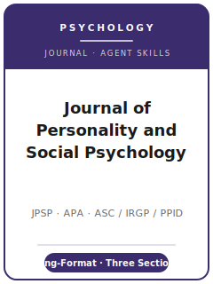

# Journal of Personality and Social Psychology Skills

<p align="center">
  
</p>

[](LICENSE)
[](https://www.apa.org/pubs/journals/psp)
[](https://www.apa.org/pubs/journals/psp)
[](https://github.com/anthropics/claude-code)

English | [简体中文](README.zh-CN.md)

Agent skill stack for manuscripts targeted at the **Journal of Personality and Social Psychology
(JPSP)** — the **American Psychological Association's flagship long-format journal** in personality and
social psychology, established in **1965**. JPSP is not a short-report outlet: it publishes
**theory-driven, multi-study** papers and is organized into **three independently edited sections**,
each with its own editor and submission stream.

This repository is opinionated. It is **not** a generic psychology-writing toolbox and it is **not**
the Psychological Science pack with the names swapped — the two journals are **opposite** in format.
It is a **JPSP-specific** stack: choose the right **section** first, then build a coherent multi-study
package with **JARS** reporting, **APA 7th-edition** style, **TOP Level 2** transparency, **masked**
review, and **section-specific** length and study constraints.

---

## What Is JPSP, and Why a Dedicated Stack?

JPSP's constraints differ sharply from a short-report journal:

| Constraint            | JPSP                                                                          | Implication                                                       |
|-----------------------|-------------------------------------------------------------------------------|------------------------------------------------------------------|
| Publisher             | **American Psychological Association (APA)**                                   | Submitted via APA **Editorial Manager**, **per section**         |
| Structure             | **Three sections**, separately edited                                         | Pick **ASC / IRGP / PPID** before anything else                  |
| Format                | **Long-format, multi-study** theory papers                                    | A single small study rarely fits; build a package                |
| Review model          | **Masked** review (both directions)                                           | Anonymize the manuscript                                         |
| Abstract              | **≤ 250 words**                                                               | Longer than many journals' 150-word caps                         |
| Section length        | ASC intro+discussion **≤ 3,500 words**; IRGP **≤ 5,000 words & ≤ 5 studies** in main text; PPID "as succinctly as possible" | Section rules differ — check yours |
| Style / reporting     | **APA 7th edition** + **JARS** (Journal Article Reporting Standards)           | Structured, standardized reporting                               |
| Transparency          | **TOP Guidelines Level 2** (requirement); data/code/materials + preregistration disclosure | Disclose and deposit to a trusted repository           |
| Registered Reports    | **Published**; open-science **badges not offered**                            | Use the format, not the badge                                    |
| Fee                   | **No submission fee** stated                                                  | Verify any open-access APC                                       |

The **three sections**:

- **ASC** — *Attitudes and Social Cognition*
- **IRGP** — *Interpersonal Relations and Group Processes*
- **PPID** — *Personality Processes and Individual Differences*

Each section has its own editor and Editorial Manager portal. Volatile specifics (section editors and
terms, exact per-section length/study rules, fee/APC, policy wording) change — items not directly
confirmed are marked **待核实** in
[`resources/official-source-map.md`](resources/official-source-map.md). **Verify on the official APA
page for your section.**

---

## Quick Start

### Option A — Claude Code Plugin (recommended)

```bash
/plugin marketplace add https://github.com/brycewang-stanford/jpsp-skills
/plugin install jpsp-skills
/reload-plugins
```

### Option B — Manual Copy

```bash
git clone https://github.com/brycewang-stanford/jpsp-skills.git
cd jpsp-skills

mkdir -p ~/.claude/skills && cp -R skills/jpsp-* ~/.claude/skills/
# or
mkdir -p ~/.codex/skills && cp -R skills/jpsp-* ~/.codex/skills/
```

### First Prompt

```
Use jpsp-workflow to tell me which skill I should use next for my JPSP manuscript.
```

---

## Default Workflow

```text
jpsp-topic-selection          (choose ASC / IRGP / PPID first)
        ▼
jpsp-literature-positioning
        ▼
jpsp-theory-and-hypotheses
        ▼
jpsp-study-design             (multi-study package; power; preregistration)
        ▼
jpsp-data-analysis            (JARS; effect sizes; internal meta-analysis)
        ▼
jpsp-tables-figures
        ▼
jpsp-writing-style            (long-format APA 7th polish)
        ▼
jpsp-open-science-and-transparency
        ▼
jpsp-review-process
        ▼
jpsp-submission
        ▼
jpsp-rebuttal
```

`jpsp-workflow` is the router — it tells you which skill to use next based on where you are. The first
real decision is **which section** the paper belongs to, because length rules, editor, and review
stream all follow from it.

---

## Skills

| Skill                                  | Purpose                                                                       |
|----------------------------------------|-------------------------------------------------------------------------------|
| `jpsp-workflow`                        | Router — decides which sub-skill to invoke next                               |
| `jpsp-topic-selection`                 | Choose ASC / IRGP / PPID and test JPSP fit                                    |
| `jpsp-literature-positioning`          | Position the paper in personality / social psychology                         |
| `jpsp-theory-and-hypotheses`           | Build the theory and hypothesis architecture                                  |
| `jpsp-study-design`                    | Design a coherent multi-study package (power, preregistration)                |
| `jpsp-data-analysis`                   | Analyze studies, robustness, and internal meta-analysis; JARS reporting       |
| `jpsp-tables-figures`                  | APA 7th / JARS-ready exhibits                                                  |
| `jpsp-writing-style`                   | Long-format APA 7th prose; the ≤ 250-word abstract; section length rules      |
| `jpsp-open-science-and-transparency`   | TOP Level 2: repositories, data/materials, preregistration, JARS              |
| `jpsp-review-process`                  | Masked, per-section review and decisions                                      |
| `jpsp-submission`                      | Section-specific Editorial Manager preflight                                  |
| `jpsp-rebuttal`                        | Respond to R&R / accept-with-revision across reviewers + section editor       |

### Resources

- [`resources/external_tools.md`](resources/external_tools.md) — psychology design, analysis, meta-analysis, preregistration, repository, and APA-style tools
- [`resources/official-source-map.md`](resources/official-source-map.md) — official APA / JARS / TOP and per-section URLs behind every fact, with 待核实 markers

---

## What This Repo Does Not Do

- It does not write a submittable manuscript for you
- It does not simulate any specific editor's or reviewer's taste
- It does not assert volatile metadata (section editors and terms, exact length/study rules, fee/APC, policy wording) — verify on the official APA page; unverified items are marked 待核实
- It does not decide which section your paper belongs to or whether the multi-study package is strong enough — that is the researcher's call

---

## Related

- [awesome-journal-skills](https://github.com/brycewang-stanford/awesome-journal-skills) — Index of journal-specific skill packs
- [Journal of Personality and Social Psychology (APA)](https://www.apa.org/pubs/journals/psp) — owner, sections, submission guidelines
- [APA JARS](https://apastyle.apa.org/jars) · [TOP Guidelines](https://www.cos.io/initiatives/top-guidelines) — reporting standards and transparency

---

## License

MIT
