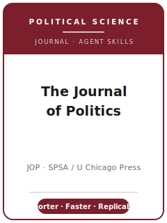

# 政治学杂志（JOP）技能包

<p align="center">
  
</p>

[](LICENSE)
[](https://www.journals.uchicago.edu/journals/jop/about)
[](https://spsa.net/about-spsa/journal-of-politics/)
[](https://github.com/anthropics/claude-code)

[English](README.md) | 简体中文

面向 **《政治学杂志》（The Journal of Politics, JOP）** 投稿的 Agent 技能栈。JOP 是一份领先的
**综合性（general-interest）** 政治学期刊，创刊于 **1939 年**，由 **芝加哥大学出版社** 为
**南部政治学会（Southern Political Science Association, SPSA）** 出版。它是美国历史最悠久的区域性
政治学期刊，长期位列学科顶级综合刊之一。JOP 发表 **理论创新、方法多元** 的研究，覆盖 **所有子领域**：
美国政治、比较政治、形式理论、国际关系、方法论、政治理论、公共行政与公共政策。

本仓库是**有主见的**。它**不是**通用社会科学写作工具箱，**也不是**把 APSR 或 AJPS 包改个名字套用过来。
它是 **JOP 专属** 技能栈，围绕 JOP 区别于其学科级同侪的两点运作机制构建：以**页数预算**而非词数计篇幅
——**研究论文 ≤ 35 页**、**短文 ≤ 10 页**，双倍行距、12 号字，且**含**正文、脚注、参考文献与图表；
以及一项**“接受以可复现为前提”**的数据政策——在**条件接受**阶段会指派一名 **JOP 复现分析师**，在发表前
评估你存入 **JOP Dataverse** 的材料。

---

## JOP 是什么，为何需要专属技能栈？

JOP 的约束既不同于剑桥/APSA 的旗舰刊，也不同于 Wiley/MPSA 的偏定量领域刊：

| 约束 | JOP | 含义 |
|------|-----|------|
| 所有者 / 出版方 | **SPSA** / **芝加哥大学出版社**（2015 年 1 月起出版） | 通过 **Editorial Manager** 投稿（`editorialmanager.com/jop`） |
| 范围 | **综合性**，覆盖所有子领域；理论与方法“宽广而包容” | 经验、形式、定性与规范研究均欢迎 |
| **篇幅计法** | **按页而非按词**——研究论文 **≤ 35 页**、短文 **≤ 10 页** | 从第一天就要规划页数；按词数的习惯会误导你 |
| 计页规则 | 双倍行距、**12 号字**、一英寸页边距；**含**正文、脚注、参考文献、图表 | 密集参考文献与大表会直接吃页数 |
| 在线附录 | **≤ 25 页**，单独文件，**不计入** 35 页 | 把稳健性网格与推导移出正文 |
| 评审模式 | **双盲** | 稿件匿名化；上传匿名版供评审 |
| 摘要 | **≤ 150 词**，4–5 个关键词 | 问题 + 方法 + 发现；摘要内不含引用 |
| **数据政策** | **接受以可复现为前提**；条件接受时指派 **JOP 复现分析师** | 分析时就建可重跑的材料包；不可复现即被拒 |
| 体例 | **JOP 体例指南**（自有作者—年份体例） | 选一种并保持一致；非泛用的 APSA/Chicago |

易变的具体信息（编辑与任期、确切页/摘要上限、费用/APC、投稿类别、政策措辞）会变化。
[`resources/official-source-map.md`](resources/official-source-map.md) 已在 2026-06-20 刷新，并区分
SPSA/Dataverse 的直接证据与芝加哥大学出版社官方搜索片段中的规则；**投稿前仍要打开官方实时页面复核。**

### 值得内化的三大差异

- **按页，不按词。** APSR 与 AJPS 限**词**；JOP 限**页**（35 / 10，双倍行距 12 号）。同一篇论文可能过了
  词数关却仍然超页——要为“页”规划图表与参考文献，溢出部分移入 **≤ 25 页的在线附录**。
- **更短、更快（口碑）。** JOP 以篇幅更紧、评审高效著称。**短文（≤ 10 页）** 通道用于单一而锋利的贡献；
  把“快”当作定性常态而非保证的时钟。
- **有复现分析师，不只是存档。** JOP **接受以可复现为前提**，并在条件接受时指派 **JOP 复现分析师** 在
  发表前核查材料——这区别于 APSR 由编辑部复现、AJPS 由外部第三方核验。不可复现的论文会被拒。

### 两种投稿类别

- **研究论文（Research Article）**——完整原创研究，**≤ 35 页**，含正文、脚注、参考文献与图表，另配
  **≤ 25 页在线附录** 承载支撑材料。
- **短文（Short Article）**——单一、聚焦的贡献，**≤ 10 页**（同样的计入口径）。不是注水的研究论文；
  除非当前 JOP 投稿类别菜单这样称呼，否则不要把它写成独立的“Letters”通道。

---

## 快速开始

### 方式 A — Claude Code 插件（推荐）

```bash
/plugin marketplace add https://github.com/brycewang-stanford/jop-skills
/plugin install jop-skills
/reload-plugins
```

### 方式 B — 手动复制

```bash
git clone https://github.com/brycewang-stanford/jop-skills.git
cd jop-skills

mkdir -p ~/.claude/skills && cp -R skills/jop-* ~/.claude/skills/
# 或
mkdir -p ~/.codex/skills && cp -R skills/jop-* ~/.codex/skills/
```

### 第一条提示

```
用 jop-workflow 告诉我，我的 JOP 稿件下一步该用哪个技能。
```

---

## 默认工作流

```text
jop-topic-selection
        ▼
jop-literature-positioning
        ▼
jop-theory-building
        ▼
jop-research-design
        ▼
jop-data-analysis
        ▼
jop-tables-figures
        ▼
jop-writing-style          （压进页数预算）
        ▼
jop-replication-and-data-policy
        ▼
jop-review-process
        ▼
jop-submission
        ▼
jop-rebuttal
```

`jop-workflow` 是路由器——根据你所处阶段告诉你下一步用哪个技能。请在**分析阶段**就启动
`jop-replication-and-data-policy`，而非等到接受：**JOP 复现分析师** 会在条件接受时重跑你的材料包，
临近截止时无法补救一套未脚本化的分析。请尽早决定 **研究论文还是短文**，因为**页数预算**决定正文能承载多少。

---

## 技能列表

| 技能 | 用途 |
|------|------|
| `jop-workflow` | 路由器——决定下一步调用哪个子技能 |
| `jop-topic-selection` | 跨子领域的综合性契合；在研究论文与短文间取舍 |
| `jop-literature-positioning` | 在保持双盲的前提下确立宽广贡献 |
| `jop-theory-building` | 把论证（形式/经验/规范）打造成贡献 |
| `jop-research-design` | 为设计辩护——因果推断、实验、形式化、定性 |
| `jop-data-analysis` | 分析规范、不确定性、稳健性、从第一行起可复现 |
| `jop-tables-figures` | 自洽、由代码重生成、且尊重页数预算的图表 |
| `jop-writing-style` | JOP 体例指南；把论文压进 35 / 10 页 |
| `jop-replication-and-data-policy` | 面向 JOP Dataverse 的可重跑材料包 + 复现分析师（标志性） |
| `jop-review-process` | 双盲评审、桌面筛查、以可复现为前提的接受 |
| `jop-submission` | Editorial Manager 投稿前检查（匿名、页数、附录 ≤ 25 页、摘要） |
| `jop-rebuttal` | 面向多位评审 + 编辑的 R&R 回应信，保持匿名 |

### 资源

- [`resources/external_tools.md`](resources/external_tools.md) — 政治学数据源（ANES / CES / V-Dem / CSES / COW / ACLED / MARPOR）+ R / Stata / Python 与定性/CAQDAS 工具，以及页数预算与复现材料包约定
- [`resources/official-source-map.md`](resources/official-source-map.md) — 易变流程事实背后的 芝加哥大学出版社 / SPSA / Harvard Dataverse 官方 URL，2026-06-20 已刷新

---

## 本仓库不做什么

- 不替你写出可直接投稿的稿件
- 不模拟任何特定编辑或评审人的口味
- 不冻结易变元数据（现任编辑与任期、确切页/摘要上限、费用/APC、投稿类别、政策措辞）——上传前请以官方实时页面为准
- 不替你跑通或通过复现分析师的核查——那是 JOP 分析师的工作；本包只负责准备可重跑的材料包

---

## 相关

- [awesome-journal-skills](https://github.com/brycewang-stanford/awesome-journal-skills) — 期刊专属技能包索引
- [The Journal of Politics（芝加哥大学出版社）](https://www.journals.uchicago.edu/journals/jop/about) — 出版方主页、投稿指南、政策
- [SPSA 上的 Journal of Politics](https://spsa.net/about-spsa/journal-of-politics/) — 所有者、范围、编辑团队

---

## 许可

MIT
