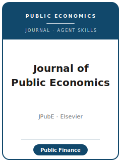

# 《公共经济学杂志》(JPubE) Skills

<p align="center">
  
</p>

[](LICENSE)
[](https://www.sciencedirect.com/journal/journal-of-public-economics)
[](https://www.sciencedirect.com/journal/journal-of-public-economics)
[](https://github.com/anthropics/claude-code)

[English](README.md) | 简体中文

面向 **Journal of Public Economics（JPubE，《公共经济学杂志》）** 投稿的 Agent Skill 工具栈。JPubE 是 Elsevier（爱思唯尔）旗下**公共经济学 / 公共财政**领域的旗舰刊，由 **Tony Atkinson 于 1972 年创办**，现由 **Nathaniel Hendren（MIT）** 与 **Wojciech Kopczuk（哥伦比亚大学）** 编辑。

本仓库刻意**不通用**——它不是泛化的"经济学写作助手"，而是面向 JPubE 编委口味的方法论沉淀：聚焦**政府的经济角色**（税收、公共支出、社会保险、再分配、外部性、公共品、财政政策），用现代理论与定量方法作答，强调由政策引致的可信识别（bunching、RKD、改革 DID、IV、RDD）、行政/登记数据、充分统计量或 MVPF 福利映射、图形优先的呈现，以及可复现的复制包，面向**国际读者**。

---

## 为什么要为 JPubE 单独做一套 Skills？

JPubE 的约束维度与"免费的综合性顶刊"或方法类期刊**显著不同**：

| 维度 | JPubE | 隐含含义 |
|------|-------|---------|
| 范围 | 政府的经济角色（税收 / 转移支付 / 保险 / 公共品） | 仅加了税收控制变量的劳动/IO 文章可能不契合 |
| 看重 | 一个政策相关参数 + 福利解释 | 没有福利落点的裸系数显得单薄 |
| 识别门槛 | bunching / RKD / RDD / 改革 DID / 政策 IV，且设计可见 | OLS + 控制变量易被拒 |
| 评审模式 | **单向匿名**（审稿人匿名；**作者身份公开**），≥ 2 名审稿人 | 不要为"盲审"而抹去作者名 |
| 投稿费 | **165 美元**（学生 82.5 美元；经 Elsevier 转稿则免） | 需预算——不同于免费的综合刊 |
| 摘要 | 最多 **250 词** | 300 词摘要不合规 |
| 短文通道 | **≤ 6,000 词**，最多 **5 个图表** | 聚焦结果可走加速通道 |
| 参考文献 | 作者—年份（name-and-year） | 编号/脚注式引用显得不合规 |
| 源文件 | 可编辑的 Word（单栏）或 LaTeX `.tex`（双栏仅限 LaTeX） | 仅交 PDF 不合规 |
| 研究数据 | Elsevier **Option C**：存档、引用并链接数据，或说明为何不能共享 | 受限公共数据需要精确的数据获取声明 |
| 预印本 | 投稿时可选在 **SSRN** 公开，对结果无影响 | 是免费传播选项，而非策略杠杆 |
| 流程 | **Editorial Manager**；需声明 AI 使用；每篇**仅一次申诉** | 申诉只用于明确错误 |

通用的"科研写作"包不会处理这些约束。本包已把期刊事实映射到
[`resources/official-source-map.md`](resources/official-source-map.md) 中的 ScienceDirect / Elsevier 官方页面；真正上传前仍需现场检查费用、必填字段与数据政策措辞。

---

## 快速开始

### 方式 A —— Claude Code 插件（推荐）

```bash
/plugin marketplace add https://github.com/brycewang-stanford/jpube-skills
/plugin install jpube-skills
/reload-plugins
```

### 方式 B —— 手动拷贝

```bash
git clone https://github.com/brycewang-stanford/jpube-skills.git
cd jpube-skills

mkdir -p ~/.claude/skills && cp -R skills/jpube-* ~/.claude/skills/
# 或
mkdir -p ~/.codex/skills && cp -R skills/jpube-* ~/.codex/skills/
```

### 第一条 Prompt

```
用 jpube-workflow 告诉我这份 JPubE 目标稿子下一步该用哪个 skill。
```

---

## 默认工作流

```text
jpube-topic-selection
        ▼
jpube-contribution-framing
        ▼
jpube-literature-positioning
        ▼
jpube-identification-strategy
        ▼
jpube-data-analysis
        ▼
jpube-tables-figures
        ▼
jpube-writing-style          （polish）
        ▼
jpube-replication-and-data-policy
        ▼
jpube-review-process
        ▼
jpube-submission
        ▼
jpube-rebuttal
```

`jpube-workflow` 是路由器，会根据当前阶段告诉你下一个该用哪个 Skill。

---

## Skill 一览

| Skill | 用途 |
|-------|------|
| `jpube-workflow` | 路由器：判断当前阶段，推荐下一个 skill |
| `jpube-topic-selection` | 政府角色契合度 + 政策意义门槛 |
| `jpube-contribution-framing` | 把贡献框定为政策参数 / 福利结论 |
| `jpube-literature-positioning` | 对照公共财政前沿确立贡献 |
| `jpube-identification-strategy` | 政策引致的可信设计（bunching / RKD / RDD / 改革 DID / IV） |
| `jpube-data-analysis` | 行政/登记数据、弹性、MVPF / 充分统计量 |
| `jpube-tables-figures` | 图形优先的设计型图表、自洽注释 |
| `jpube-writing-style` | 250 词摘要、author-date、福利语言转译 |
| `jpube-replication-and-data-policy` | Elsevier 研究数据框架 + 可复现复制包 |
| `jpube-review-process` | 单向匿名评审、Editorial Manager、SSRN、申诉 |
| `jpube-submission` | Editorial Manager 投稿前 preflight + 165 美元费用 |
| `jpube-rebuttal` | 修改回复信与"仅一次申诉"策略 |

### 附属资源

- [`resources/official-source-map.md`](resources/official-source-map.md) —— 本包期刊专属事实背后的 JPubE/Elsevier 官方 URL
- [`resources/external_tools.md`](resources/external_tools.md) —— 数据资源（IRS/SOI、LEHD、SSA、CMS、各国登记数据、TAXSIM）+ 面向 bunching、RKD、DID、IV 的 Stata/R/Python 包

---

## 关于这个仓库不做什么

- 不替你写出可以直接投稿的稿件
- 不模拟任何特定编辑或审稿人的偏好
- 不替代最终上传前对操作性元数据（费用、上传字段、APC 选项、当前编辑名单、政策措辞）的现场检查
- 不把受限行政数据当作可直接共享的数据；它会转向精确的数据获取声明与代码包

---

## 相关仓库

- [awesome-journal-skills](https://github.com/brycewang-stanford/awesome-journal-skills) —— 期刊 Skill 索引
- [Journal of Public Economics（官网）](https://www.sciencedirect.com/journal/journal-of-public-economics) —— Elsevier / ScienceDirect

---

## License

MIT
