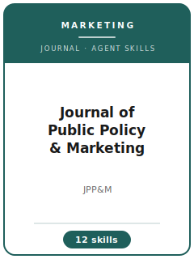

# Journal of Public Policy & Marketing Skills

<p align="center"></p>

[](LICENSE)
[](https://www.ama.org/journal-of-public-policy-and-marketing/)
[](https://journals.sagepub.com/home/ppo)
[](https://www.ama.org/journal-of-public-policy-and-marketing/)

English | [简体中文](README.zh-CN.md)

Twelve agent skills for manuscripts targeted at the **Journal of Public Policy & Marketing (JPP&M)** — the AMA journal at the intersection of marketing, public policy, and consumer/societal welfare. The pack is built around JPP&M's hard policy-relevance bar: every paper must join a live policy conversation (consumer protection, warnings and labeling, privacy and data policy, public-health marketing, sustainability, financial well-being, vulnerable consumers, marketplace equity) and close the loop with implications a named regulator, NGO, or regulated marketer can act on.

**Official basis checked 2026-07-16** (re-check volatile details before submission): see [`resources/official-source-map.md`](resources/official-source-map.md).

## Why a separate stack?

| JPP&M constraint | What it forces |
|------------------|----------------|
| Policy Contribution Statement (≤300 words, required, desk-screened) | The policy conversation, the advance, and the actionable stakeholders must be nameable before writing |
| Methodological pluralism with a counterfactual bar | Experiments need mandatable stimuli; evaluations need credible DiD/RDD/synthetic-control comparisons |
| Dual audience (marketing academics + policy readers) | Estimates reported in decision units; exhibits readable by an agency analyst |
| 50-page all-inclusive cap, double-anonymized, SageTrack | Exhibit economy, two-file split, and a strict anonymization sweep |
| Evidence-not-advocacy norm | Recommendation strength calibrated to identification strength; trade-offs stated |

## Quick Start

```text
/plugin marketplace add ./Journal-of-Public-Policy-and-Marketing-Skills
/plugin install jppm-skills
```

Manual use: start with [`skills/jppm-workflow/SKILL.md`](skills/jppm-workflow/SKILL.md).

## Default Workflow

```text
jppm-workflow → jppm-topic-selection → jppm-theory-development → jppm-literature-positioning → jppm-methods → jppm-data-analysis → jppm-contribution-framing → jppm-tables-figures → jppm-writing-style → jppm-submission → jppm-review-process → jppm-rebuttal
```

## Skills

| # | Skill | What it does |
|---|-------|--------------|
| 1 | [`jppm-workflow`](skills/jppm-workflow/SKILL.md) | Routes to the right skill by manuscript symptom and paper archetype |
| 2 | [`jppm-topic-selection`](skills/jppm-topic-selection/SKILL.md) | Tests whether the question is policy-first and picks the outlet |
| 3 | [`jppm-theory-development`](skills/jppm-theory-development/SKILL.md) | Builds the theory of the policy lever across consumer, firm, and regulator |
| 4 | [`jppm-literature-positioning`](skills/jppm-literature-positioning/SKILL.md) | Positions against the JPP&M canon and the regulatory record |
| 5 | [`jppm-methods`](skills/jppm-methods/SKILL.md) | Designs policy-realistic experiments and counterfactual evaluations |
| 6 | [`jppm-data-analysis`](skills/jppm-data-analysis/SKILL.md) | Estimates DiD/RDD/experimental effects in decision units, with the diagnostics |
| 7 | [`jppm-contribution-framing`](skills/jppm-contribution-framing/SKILL.md) | Writes the Policy Contribution Statement and regulator-actionable implications |
| 8 | [`jppm-tables-figures`](skills/jppm-tables-figures/SKILL.md) | Builds dual-audience exhibits under the 50-page cap |
| 9 | [`jppm-writing-style`](skills/jppm-writing-style/SKILL.md) | Policy-problem-led prose, 200-word abstract, evidence-not-advocacy voice |
| 10 | [`jppm-submission`](skills/jppm-submission/SKILL.md) | SageTrack preflight: files, anonymization, statements, page count |
| 11 | [`jppm-review-process`](skills/jppm-review-process/SKILL.md) | Reads the desk screen, mixed reviewer pool, and decision letters |
| 12 | [`jppm-rebuttal`](skills/jppm-rebuttal/SKILL.md) | Converts R&R demands into work and writes the response letter |

## Resources

- [`resources/README.md`](resources/README.md) — resource index
- [`resources/official-source-map.md`](resources/official-source-map.md) — official URLs and volatile checks (checked 2026-07-16)
- [`resources/external_tools.md`](resources/external_tools.md) — regulatory records, evaluation data, software
- [`resources/exemplars/library.md`](resources/exemplars/library.md) — canonical marketing-and-policy papers with guardrails
- [`resources/worked-examples/01-introduction.md`](resources/worked-examples/01-introduction.md) — annotated JPP&M-style introduction
- [`resources/code/`](resources/code/) — vendored empirical code kit (DiD/IV/RDD pipeline)

## Differences vs. sibling packs

| vs. | Key difference |
|-----|----------------|
| JCP / JCR packs | Headline is the policy decision, not the psychological mechanism |
| JM / JMR packs | Stakeholder is the regulator and consumer welfare, not firm performance |
| Marketing Science pack | Evidence serves a rulemaking, not a modeling contribution |
| Econ-journal packs | The marketing side of the exchange (persuasion, firm response, consumer inference) is the analytic core |

## Related Links

- https://www.ama.org/journal-of-public-policy-and-marketing/
- https://journals.sagepub.com/home/ppo
- https://www.ama.org/submission-guidelines-american-marketing-association-journals/
- https://mc.manuscriptcentral.com/ama_jppm

## License

MIT (c) 2026 Bryce Wang. See [LICENSE](LICENSE).
