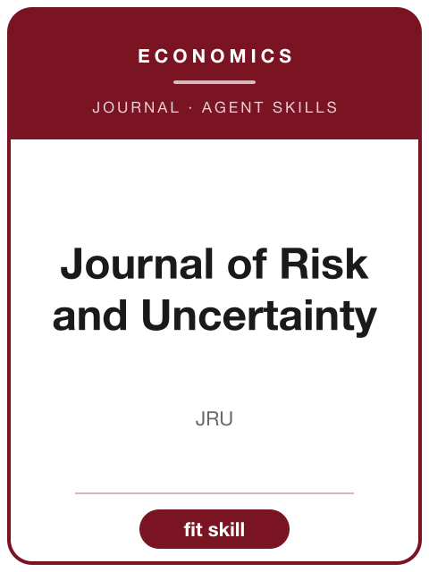

<!-- AJS-ROOT-JOURNAL-ENTRY -->
# Journal of Risk and Uncertainty

> Publishes empirical, experimental, and theoretical research on risk-bearing behavior and decision making under uncertainty.

| At a glance | |
|---|---|
| **Field** | Economics (decision under uncertainty) |
| **Publisher** | Springer |
| **Founded** | 1988 |
| **ISSN** | 0895-5646 (print) · 1573-0476 (online) |
| **Frequency** | Bimonthly |
| **Standing** | SSCI |
| **Official** | [link.springer.com](https://link.springer.com/journal/11166) |
| **Checked** | 2026-06-17 |

**▶ Use the skill — [`journal-of-risk-and-uncertainty`](../English-SocialScience-Journal-Skills/skills/journal-of-risk-and-uncertainty/):** venue fit, framing, the method-and-evidence bar, house style, and desk-reject heuristics.

Part of the **[English Social-Science Journal Skills](../English-SocialScience-Journal-Skills/)** bundle. Always re-check the live author guidelines on the official site before submitting.

---

<!-- Machine-readable canonical pointer — do not remove or alter (validated by tools/audit_repo.py). -->

- Canonical skill: [English-SocialScience-Journal-Skills/skills/journal-of-risk-and-uncertainty/](../English-SocialScience-Journal-Skills/skills/journal-of-risk-and-uncertainty/)
- Skill name: `journal-of-risk-and-uncertainty`
- Bundle: [English-SocialScience-Journal-Skills/](../English-SocialScience-Journal-Skills/)

This folder intentionally does not contain a `SKILL.md`; the installable skill stays inside the bundle so plugin paths and skill counts remain stable.
