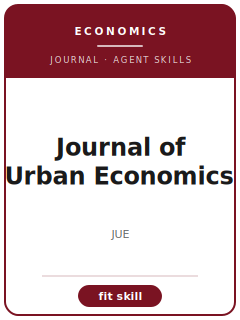

# Journal of Urban Economics Skills

<p align="center"></p>

[](LICENSE)
[](https://www.sciencedirect.com/journal/journal-of-urban-economics)
[](https://www.sciencedirect.com/journal/journal-of-urban-economics)

English | [简体中文](README.zh-CN.md)

Twelve agent skills for manuscripts targeted at **Journal of Urban Economics (JUE)**. The pack is tuned to urban economics, spatial equilibrium, housing, transport, local public finance, and neighborhood sorting; it keeps the manuscript distinct from Journal of Public Economics, Journal of Economic Geography, Regional Science and Urban Economics, and AEJ Applied and emphasizes spatially grounded evidence with clear maps, mechanisms, and equilibrium caveats.

**Official basis checked 2026-06** (re-check volatile details before submission): see [`resources/official-source-map.md`](resources/official-source-map.md).

## Why a separate stack?

| JUE constraint | What it forces |
|-------------------------|----------------|
| Scope | The main claim must speak to urban economics, spatial equilibrium, housing, transport, local public finance, and neighborhood sorting |
| Sibling boundary | The paper must explain why it belongs here rather than Journal of Public Economics, Journal of Economic Geography, Regional Science and Urban Economics, and AEJ Applied |
| Evidence standard | Designs, models, reviews, or qualitative evidence must match spatially grounded evidence with clear maps, mechanisms, and equilibrium caveats |
| Source discipline | Current process facts are cited or marked 待核实 |

## Quick Start

```text
/plugin marketplace add ./Journal-of-Urban-Economics-Skills
/plugin install jue-skills
```

Manual use: start with [`skills/jue-workflow/SKILL.md`](skills/jue-workflow/SKILL.md).

## Default Workflow

```text
jue-workflow → jue-topic-selection → jue-literature-positioning → jue-identification → jue-theory-model → jue-robustness → jue-tables-figures → jue-writing-style → jue-replication-package → jue-referee-strategy → jue-submission → jue-rebuttal
```

## Skills

| # | Skill | What it does |
|---|-------|--------------|
| 1 | [`jue-workflow`](skills/jue-workflow/SKILL.md) | Workflow Router for JUE manuscripts |
| 2 | [`jue-topic-selection`](skills/jue-topic-selection/SKILL.md) | Topic Selection for JUE manuscripts |
| 3 | [`jue-literature-positioning`](skills/jue-literature-positioning/SKILL.md) | Literature Positioning for JUE manuscripts |
| 4 | [`jue-identification`](skills/jue-identification/SKILL.md) | Identification Strategy for JUE manuscripts |
| 5 | [`jue-theory-model`](skills/jue-theory-model/SKILL.md) | Theory and Model Craft for JUE manuscripts |
| 6 | [`jue-robustness`](skills/jue-robustness/SKILL.md) | Robustness Strategy for JUE manuscripts |
| 7 | [`jue-tables-figures`](skills/jue-tables-figures/SKILL.md) | Tables and Figures for JUE manuscripts |
| 8 | [`jue-writing-style`](skills/jue-writing-style/SKILL.md) | Writing Style for JUE manuscripts |
| 9 | [`jue-replication-package`](skills/jue-replication-package/SKILL.md) | Replication Package for JUE manuscripts |
| 10 | [`jue-referee-strategy`](skills/jue-referee-strategy/SKILL.md) | Referee Strategy for JUE manuscripts |
| 11 | [`jue-submission`](skills/jue-submission/SKILL.md) | Submission Preflight for JUE manuscripts |
| 12 | [`jue-rebuttal`](skills/jue-rebuttal/SKILL.md) | Rebuttal Strategy for JUE manuscripts |

## Resources

- [`resources/README.md`](resources/README.md) — resource index
- [`resources/official-source-map.md`](resources/official-source-map.md) — official URLs and volatile checks
- [`resources/external_tools.md`](resources/external_tools.md) — databases, methods, and software aids
- [`resources/worked-examples/01-introduction.md`](resources/worked-examples/01-introduction.md) — fictional before/after introduction
- [`resources/exemplars/library.md`](resources/exemplars/library.md) — real-paper slots with source discipline
- [`resources/code/`](resources/code/) — empirical code kit where applicable

## Related Links

- https://www.sciencedirect.com/journal/journal-of-urban-economics
- https://www.elsevier.com/journals/journal-of-urban-economics/0094-1190/guide-for-authors

## License

MIT (c) 2026 Bryce Wang. See [LICENSE](LICENSE).
