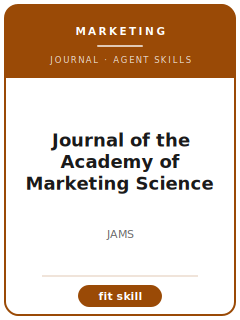

# Journal of the Academy of Marketing Science Skills

<p align="center"></p>

[](LICENSE)
[](https://link.springer.com/journal/11747)
[](https://link.springer.com/journal/11747)

English | [简体中文](README.zh-CN.md)

Twelve agent skills for manuscripts targeted at **Journal of the Academy of Marketing Science (JAMS)**. The pack is tuned to marketing strategy, consumer behavior, channels, branding, innovation, and marketing theory; it keeps the manuscript distinct from Journal of Marketing, Journal of Marketing Research, Marketing Science, and Journal of Consumer Research and emphasizes marketing scholarship with clear managerial implications and theory contribution.

**Official basis checked 2026-06** (re-check volatile details before submission): see [`resources/official-source-map.md`](resources/official-source-map.md).

## Why a separate stack?

| JAMS constraint | What it forces |
|-------------------------|----------------|
| Scope | The main claim must speak to marketing strategy, consumer behavior, channels, branding, innovation, and marketing theory |
| Sibling boundary | The paper must explain why it belongs here rather than Journal of Marketing, Journal of Marketing Research, Marketing Science, and Journal of Consumer Research |
| Evidence standard | Designs, models, reviews, or qualitative evidence must match marketing scholarship with clear managerial implications and theory contribution |
| Source discipline | Current process facts are cited or marked 待核实 |

## Quick Start

```text
/plugin marketplace add ./Journal-of-the-Academy-of-Marketing-Science-Skills
/plugin install jams-skills
```

Manual use: start with [`skills/jams-workflow/SKILL.md`](skills/jams-workflow/SKILL.md).

## Default Workflow

```text
jams-workflow → jams-topic-selection → jams-theory-development → jams-literature-positioning → jams-methods → jams-data-analysis → jams-contribution-framing → jams-tables-figures → jams-writing-style → jams-submission → jams-review-process → jams-rebuttal
```

## Skills

| # | Skill | What it does |
|---|-------|--------------|
| 1 | [`jams-workflow`](skills/jams-workflow/SKILL.md) | Workflow Router for JAMS manuscripts |
| 2 | [`jams-topic-selection`](skills/jams-topic-selection/SKILL.md) | Topic Selection for JAMS manuscripts |
| 3 | [`jams-theory-development`](skills/jams-theory-development/SKILL.md) | Theory Development for JAMS manuscripts |
| 4 | [`jams-literature-positioning`](skills/jams-literature-positioning/SKILL.md) | Literature Positioning for JAMS manuscripts |
| 5 | [`jams-methods`](skills/jams-methods/SKILL.md) | Methods for JAMS manuscripts |
| 6 | [`jams-data-analysis`](skills/jams-data-analysis/SKILL.md) | Data Analysis for JAMS manuscripts |
| 7 | [`jams-contribution-framing`](skills/jams-contribution-framing/SKILL.md) | Contribution Framing for JAMS manuscripts |
| 8 | [`jams-tables-figures`](skills/jams-tables-figures/SKILL.md) | Tables and Figures for JAMS manuscripts |
| 9 | [`jams-writing-style`](skills/jams-writing-style/SKILL.md) | Writing Style for JAMS manuscripts |
| 10 | [`jams-submission`](skills/jams-submission/SKILL.md) | Submission Preflight for JAMS manuscripts |
| 11 | [`jams-review-process`](skills/jams-review-process/SKILL.md) | Review Process for JAMS manuscripts |
| 12 | [`jams-rebuttal`](skills/jams-rebuttal/SKILL.md) | Rebuttal Strategy for JAMS manuscripts |

## Resources

- [`resources/README.md`](resources/README.md) — resource index
- [`resources/official-source-map.md`](resources/official-source-map.md) — official URLs and volatile checks
- [`resources/external_tools.md`](resources/external_tools.md) — databases, methods, and software aids
- [`resources/worked-examples/01-introduction.md`](resources/worked-examples/01-introduction.md) — fictional before/after introduction
- [`resources/exemplars/library.md`](resources/exemplars/library.md) — real-paper slots with source discipline
- [`resources/code/`](resources/code/) — empirical code kit where applicable

## Related Links

- https://link.springer.com/journal/11747
- https://www.springer.com/journal/11747/submission-guidelines

## License

MIT (c) 2026 Bryce Wang. See [LICENSE](LICENSE).
