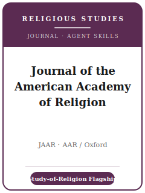

# Journal of the American Academy of Religion Skills

<p align="center">
  
</p>

[](LICENSE)
[](https://academic.oup.com/jaar)
[](https://aarweb.org/)
[](https://github.com/anthropics/claude-code)

English | [简体中文](README.zh-CN.md)

Agent skill stack for manuscripts targeted at the **Journal of the American Academy of Religion
(JAAR)** — the **flagship journal of religious studies** and the official journal of the **American
Academy of Religion (AAR)**, the largest scholarly society for the academic study of religion,
published by **Oxford University Press**. JAAR publishes top scholarship across the **full range of
world religious traditions** and **the methodologies** by which religion is studied.

This repository is opinionated. It is **not** a generic humanities toolbox and it is **not** a
social-science pack relabeled — JAAR has **no datasets, statistics, or replication policy**. It is a
**JAAR-specific** stack for the academic study of religion: an argument of **broad and fundamental
interest to the study of religion**, careful handling of **primary texts and traditions**,
**method-conscious and reflexive** (non-confessional) scholarship, and JAAR's distinctive **in-text
author-date** citation style.

---

## What Is JAAR, and Why a Dedicated Stack?

JAAR's constraints differ from a specialist religion journal and from any social-science venue:

| Constraint            | JAAR                                                                          | Implication                                                       |
|-----------------------|-------------------------------------------------------------------------------|------------------------------------------------------------------|
| Owner / publisher     | **American Academy of Religion (AAR)** / **Oxford University Press**           | Submitted via **ScholarOne** (`mc.manuscriptcentral.com/jaarel`)  |
| Framing gate          | Must speak to **broad and fundamental interest to the study of religion**      | Subfield-only papers are **returned to reframe before review**   |
| Premium on            | An essay that **"has a point"** — analysis with a contestable thesis           | Description / survey is off-fit                                  |
| Methods               | Textual, historical, philosophical, comparative, ethnographic — and **studies of method itself** | Method-conscious, reflexive, **non-confessional**     |
| Review model          | **Double-blind (double-anonymous)**                                            | Anonymized main document + separate title page                   |
| Selectivity           | **~90% rejection** (~8 articles/issue, ~32/year)                               | Field-level significance is non-negotiable                       |
| Length                | **~8,000–12,000 words** including references and footnotes                      | Notes count; reserve them for substance                          |
| Abstract              | **≤ 150 words**                                                               | Concise statement of problem, argument, contribution             |
| Citations             | **In-text author-date** (NOT footnote citations); CMOS as fallback             | Footnotes are for substantive remarks only                       |
| Book reviews          | **Commissioned only** (no unsolicited; none from graduate students)            | Not an entry point                                               |

Volatile specifics (editors and term, exact length, CMOS edition, OA APC) change — items not directly
confirmed are marked **待核实** in [`resources/official-source-map.md`](resources/official-source-map.md).
**Verify on the official journal page.**

---

## Quick Start

### Option A — Claude Code Plugin (recommended)

```bash
/plugin marketplace add https://github.com/brycewang-stanford/jaar-skills
/plugin install jaar-skills
/reload-plugins
```

### Option B — Manual Copy

```bash
git clone https://github.com/brycewang-stanford/jaar-skills.git
cd jaar-skills

mkdir -p ~/.claude/skills && cp -R skills/jaar-* ~/.claude/skills/
# or
mkdir -p ~/.codex/skills && cp -R skills/jaar-* ~/.codex/skills/
```

### First Prompt

```
Use jaar-workflow to tell me which skill I should use next for my JAAR manuscript.
```

---

## Default Workflow

```text
jaar-topic-selection          (reframe for broad significance here)
        ▼
jaar-scholarly-positioning
        ▼
jaar-argument-development
        ▼
jaar-sources-and-evidence
        ▼
jaar-theory-and-method
        ▼
jaar-structure-and-exposition
        ▼
jaar-writing-style            (polish)
        ▼
jaar-citation-and-style       (in-text author-date)
        ▼
jaar-review-process
        ▼
jaar-submission
        ▼
jaar-revision-and-response
```

`jaar-workflow` is the router — it tells you which skill to use next based on where you are. The first
gate is always the **reframing test**: state what your article teaches the study of religion as a whole.

---

## Skills

| Skill                          | Purpose                                                                       |
|--------------------------------|-------------------------------------------------------------------------------|
| `jaar-workflow`                | Router — decides which sub-skill to invoke next                               |
| `jaar-topic-selection`         | Fit + reframing to broad, fundamental interest to the study of religion       |
| `jaar-scholarly-positioning`   | Locate the intervention across traditions and methods                         |
| `jaar-argument-development`    | Build a thesis-driven argument that "has a point"                             |
| `jaar-sources-and-evidence`    | Rigorous primary-source, textual, and fieldwork evidence                      |
| `jaar-theory-and-method`       | Method-conscious, reflexive, non-confessional framing; responsible comparison |
| `jaar-structure-and-exposition`| Architecture of a humanities essay within the word budget                     |
| `jaar-writing-style`           | Clear, analytic prose; gender-neutral, serial comma, italicized foreign terms |
| `jaar-citation-and-style`      | **In-text author-date** citations; CMOS fallback; year-keyed reference list   |
| `jaar-review-process`          | Editor pre-screen, double-blind review, ~90% rejection, timeline              |
| `jaar-submission`              | ScholarOne preflight (anonymized doc + title page, framing, abstract)         |
| `jaar-revision-and-response`   | Response to readers' reports across traditions/methods                        |

### Resources

- [`resources/external_tools.md`](resources/external_tools.md) — primary-source databases (ATLA / TLG / CBETA / Sefaria…), languages/transliteration, theory-and-method references, and reference managers
- [`resources/official-source-map.md`](resources/official-source-map.md) — official AAR / OUP URLs behind every fact, with 待核实 markers

---

## What This Repo Does Not Do

- It does not write a submittable article for you
- It does not simulate any specific editor's or reader's taste
- It does not assert volatile metadata (current editors and term, exact length, CMOS edition, OA APC) — verify on the official page; unverified items are marked 待核实
- It does not decide whether your work is of broad and fundamental interest to the study of religion — that is the scholar's call

---

## Related

- [awesome-journal-skills](https://github.com/brycewang-stanford/awesome-journal-skills) — Index of journal-specific skill packs
- [Journal of the American Academy of Religion (Oxford)](https://academic.oup.com/jaar) — author guidelines, style sheet, policies
- [American Academy of Religion (AAR)](https://aarweb.org/) — owner, the scholarly society for the study of religion

---

## License

MIT
