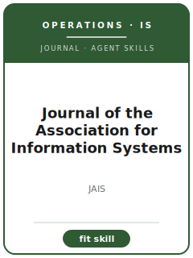

# Journal of the Association for Information Systems Skills

<p align="center"></p>

[](LICENSE)
[](https://aisel.aisnet.org/jais/)
[](https://aisel.aisnet.org/jais/)

English | [简体中文](README.zh-CN.md)

Twelve agent skills for manuscripts targeted at **Journal of the Association for Information Systems (JAIS)**. The pack is tuned to information systems theory, digital innovation, sociotechnical systems, methods, and cumulative IS scholarship; it keeps the manuscript distinct from MIS Quarterly, Information Systems Research, JMIS, and Management Science and emphasizes theory-forward IS research with method fit and clear community contribution.

**Official basis checked 2026-06** (re-check volatile details before submission): see [`resources/official-source-map.md`](resources/official-source-map.md).

## Why a separate stack?

| JAIS constraint | What it forces |
|-------------------------|----------------|
| Scope | The main claim must speak to information systems theory, digital innovation, sociotechnical systems, methods, and cumulative IS scholarship |
| Sibling boundary | The paper must explain why it belongs here rather than MIS Quarterly, Information Systems Research, JMIS, and Management Science |
| Evidence standard | Designs, models, reviews, or qualitative evidence must match theory-forward IS research with method fit and clear community contribution |
| Source discipline | Current process facts are cited or marked 待核实 |

## Quick Start

```text
/plugin marketplace add ./Journal-of-the-Association-for-Information-Systems-Skills
/plugin install jais-skills
```

Manual use: start with [`skills/jais-workflow/SKILL.md`](skills/jais-workflow/SKILL.md).

## Default Workflow

```text
jais-workflow → jais-topic-selection → jais-theory-development → jais-literature-positioning → jais-methods → jais-data-analysis → jais-contribution-framing → jais-tables-figures → jais-writing-style → jais-submission → jais-review-process → jais-rebuttal
```

## Skills

| # | Skill | What it does |
|---|-------|--------------|
| 1 | [`jais-workflow`](skills/jais-workflow/SKILL.md) | Workflow Router for JAIS manuscripts |
| 2 | [`jais-topic-selection`](skills/jais-topic-selection/SKILL.md) | Topic Selection for JAIS manuscripts |
| 3 | [`jais-theory-development`](skills/jais-theory-development/SKILL.md) | Theory Development for JAIS manuscripts |
| 4 | [`jais-literature-positioning`](skills/jais-literature-positioning/SKILL.md) | Literature Positioning for JAIS manuscripts |
| 5 | [`jais-methods`](skills/jais-methods/SKILL.md) | Methods for JAIS manuscripts |
| 6 | [`jais-data-analysis`](skills/jais-data-analysis/SKILL.md) | Data Analysis for JAIS manuscripts |
| 7 | [`jais-contribution-framing`](skills/jais-contribution-framing/SKILL.md) | Contribution Framing for JAIS manuscripts |
| 8 | [`jais-tables-figures`](skills/jais-tables-figures/SKILL.md) | Tables and Figures for JAIS manuscripts |
| 9 | [`jais-writing-style`](skills/jais-writing-style/SKILL.md) | Writing Style for JAIS manuscripts |
| 10 | [`jais-submission`](skills/jais-submission/SKILL.md) | Submission Preflight for JAIS manuscripts |
| 11 | [`jais-review-process`](skills/jais-review-process/SKILL.md) | Review Process for JAIS manuscripts |
| 12 | [`jais-rebuttal`](skills/jais-rebuttal/SKILL.md) | Rebuttal Strategy for JAIS manuscripts |

## Resources

- [`resources/README.md`](resources/README.md) — resource index
- [`resources/official-source-map.md`](resources/official-source-map.md) — official URLs and volatile checks
- [`resources/external_tools.md`](resources/external_tools.md) — databases, methods, and software aids
- [`resources/worked-examples/01-introduction.md`](resources/worked-examples/01-introduction.md) — fictional before/after introduction
- [`resources/exemplars/library.md`](resources/exemplars/library.md) — real-paper slots with source discipline
- [`resources/code/`](resources/code/) — empirical code kit where applicable

## Related Links

- https://aisel.aisnet.org/jais/
- https://aisel.aisnet.org/jais/policies.html

## License

MIT (c) 2026 Bryce Wang. See [LICENSE](LICENSE).
