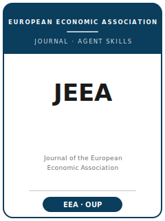

# Journal of the European Economic Association Skills

<p align="center"></p>

English | [简体中文](README.zh-CN.md)

Twelve agent skills for manuscripts targeted at the **Journal of the European Economic Association
(JEEA)** — the **general-interest journal of the European Economic Association (EEA)**, published
by **Oxford University Press**. JEEA publishes high-quality work across **all** fields of economics — micro
and macro theory, applied econometrics, applied micro, finance, development, and public — judged at a strong
general-interest **theory-and-empirics** bar for a global economics audience.
The pack routes a manuscript from venue fit and a sharp question, through credible identification (empirical
**or** theory/structural), theory-model craft, robustness, exhibits, and writing, into the **DCAS data-and-code
policy** — the replication package the **JEEA Data Editor verifies before formal acceptance**, posted to the
JEEA Zenodo community — and on through single-blind submission and the R&R rebuttal.

**Official basis checked 2026-06-20**: EEA submission, fee, and data-editor pages; Oxford Academic
About, Author Guidelines, and Editorial Board pages; the DCAS endorsement; and the JEEA Zenodo
community. Sources are in [`resources/official-source-map.md`](resources/official-source-map.md).

## Why a separate stack?

| JEEA constraint | What it forces on the manuscript |
|-----------------|----------------------------------|
| General-interest, field-agnostic | The lesson must travel beyond the subfield; subfield-only depth is off-fit |
| Theory **and** empirics at a high bar | A credible empirical design **or** a disciplined model — execution gates acceptance |
| EEA membership gate | The submitting author must be an EEA member to submit *and* to resubmit |
| Submission fee (€100, eff. Feb 2026) | Paid through the EEA membership profile; waived if the submitting author and all coauthors are LMIC-based |
| Single-blind review, co-editor-led | Referees see the authors; the co-editor desk-rejects on general-interest fit |
| DCAS data & code policy | JEEA Data Editor verifies replication **before** formal acceptance; package on the JEEA Zenodo community |
| House presentation | Report standard errors / confidence sets; online appendix; alt text for figures in final files |

## Quick Start

**As a Claude Code plugin** — point your marketplace at this directory and enable the plugin:

```
/plugin marketplace add ./Journal-of-the-European-Economic-Association-Skills
/plugin install jeea-skills
```

**Manually** — each skill is a self-contained `SKILL.md` under `skills/`. Open `skills/jeea-workflow/SKILL.md`
first; it routes you to the right skill for your current stage.

## Default Workflow

```
jeea-topic-selection → jeea-literature-positioning → jeea-identification → jeea-theory-model
   → jeea-robustness → jeea-tables-figures → jeea-writing-style → jeea-replication-package
   → jeea-referee-strategy → jeea-submission → jeea-rebuttal
                         (jeea-workflow routes among all of the above)
```

## Skills

| # | Skill | What it does |
|---|-------|--------------|
| 1 | [`jeea-workflow`](skills/jeea-workflow/SKILL.md) | Router — diagnose the current bottleneck and route to the right skill |
| 2 | [`jeea-topic-selection`](skills/jeea-topic-selection/SKILL.md) | Decide JEEA vs The Economic Journal / EER / a field journal / top-5; test general-interest fit |
| 3 | [`jeea-literature-positioning`](skills/jeea-literature-positioning/SKILL.md) | Stake the marginal contribution against the frontier for a general reader |
| 4 | [`jeea-identification`](skills/jeea-identification/SKILL.md) | Stress-test identification — empirical design **or** theory/structural |
| 5 | [`jeea-theory-model`](skills/jeea-theory-model/SKILL.md) | Discipline the model; make assumptions, generality, and results legible |
| 6 | [`jeea-robustness`](skills/jeea-robustness/SKILL.md) | Show the headline survives specification, sample, inference, assumptions |
| 7 | [`jeea-tables-figures`](skills/jeea-tables-figures/SKILL.md) | Make the main result legible in one exhibit; no significance asterisks |
| 8 | [`jeea-writing-style`](skills/jeea-writing-style/SKILL.md) | Land the question and result-with-uncertainty in the first paragraph |
| 9 | [`jeea-replication-package`](skills/jeea-replication-package/SKILL.md) | Build the DCAS package for the JEEA Data Editor check |
| 10 | [`jeea-referee-strategy`](skills/jeea-referee-strategy/SKILL.md) | Pre-empt the objections this paper invites; beat desk rejection |
| 11 | [`jeea-submission`](skills/jeea-submission/SKILL.md) | Final preflight: membership, fee, format, data policy, declarations |
| 12 | [`jeea-rebuttal`](skills/jeea-rebuttal/SKILL.md) | Draft the response-to-referees letter and revision plan |

## Resources

- [`resources/README.md`](resources/README.md) — capability-layer index
- [`resources/official-source-map.md`](resources/official-source-map.md) — official EEA / OUP URLs behind every fact
- [`resources/external_tools.md`](resources/external_tools.md) — data sources, software, packages
- [`resources/worked-examples/01-introduction.md`](resources/worked-examples/01-introduction.md) — a before→after JEEA introduction (fictional)
- [`resources/exemplars/library.md`](resources/exemplars/library.md) — real, web-verified JEEA papers by method × topic
- [`resources/code/`](resources/code/) — reproducible Stata + Python causal-inference skeleton

## Differences vs. sibling journals

| Journal | Niche | This pack's positioning |
|---------|-------|-------------------------|
| **JEEA** | EEA general-interest theory + empirics | The target of this pack |
| **The Economic Journal (RES)** | Broad European general-interest outlet | JEEA carries the EEA association venue identity at a strong theory+empirics bar |
| **European Economic Review (EER)** | Broad-scope European journal | JEEA aims higher on the general-interest novelty bar |
| **Top-5 (AER / QJE / JPE / Ecma / REStud)** | Agenda-setting general interest | JEEA is a strong European general-interest home below that bar |

## Related

- European Economic Association: https://eeassoc.org/
- JEEA on Oxford Academic: https://academic.oup.com/jeea
- DCAS (Data and Code Availability Standard): https://datacodestandard.org/

## License

MIT © 2026 Bryce Wang. See [LICENSE](LICENSE).
